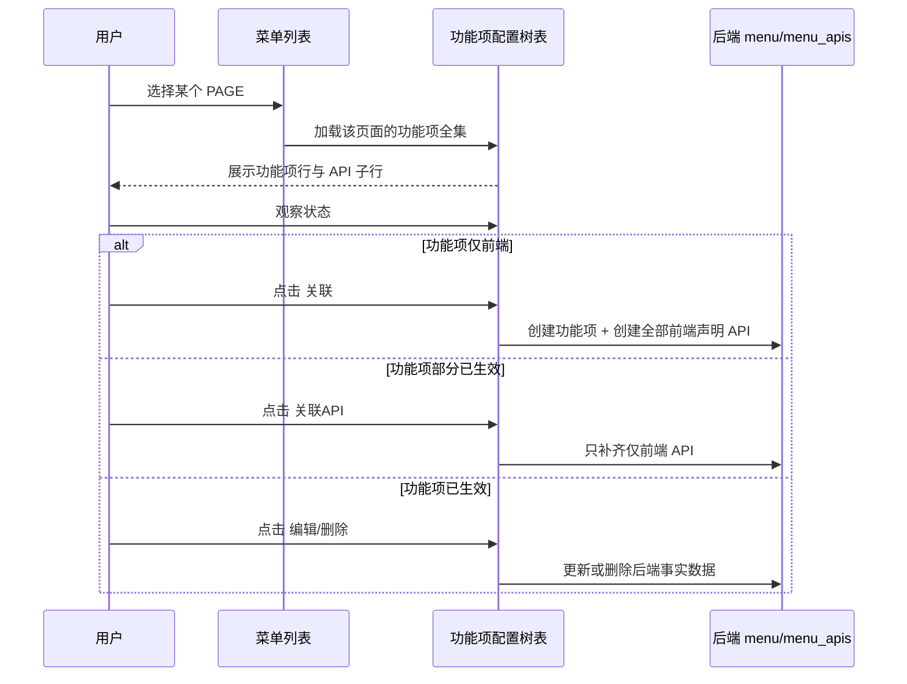
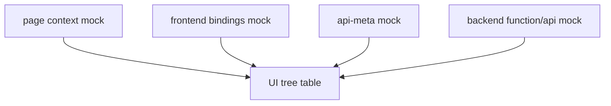

# 2026-04-02 菜单管理 FUNCTION 面板 UI 设计

## 文档目的

本文件用于定义菜单管理中 `FUNCTION` 类型节点的 UI 设计方案。

设计目标不是修改权限模型本身，而是在已确定的最终模型基础上，为“菜单列表 + 功能项配置”的现有双栏结构提供一版：

- 用户心智负担更小
- 信息密度更高
- 前端声明与后端生效关系更清楚
- 便于后续直接进入 UI 开发与 mock 验证

本设计基于以下文档结论：

- [2026-04-02-permission-api-gateway-registry-final-design.md](F:/Documents/Repertory/Sieyuan/nebula/docs/plans/2026-04-02-permission-api-gateway-registry-final-design.md)

---

## 设计目标

### 目标 1：不破坏现有双栏结构

保留当前整体页面结构：

- 左侧：`菜单列表`
- 右侧：`功能项配置`

本次只优化右侧 `FUNCTION` 工作区的表达方式，不改整体页面框架。

### 目标 2：以“生效状态”而不是“前后端字段对账”组织信息

用户真正关心的是：

- 当前页面有哪些功能项
- 哪些功能项已经生效
- 哪些 API 已经生效
- 哪些还没有生效，需要点击关联

所以 UI 需要从“展示很多前后端字段”转向“围绕生效状态组织操作”。

### 目标 3：前端声明与后端生效明确区分，但仍放在同一张工作视图里

本次不采用“前端声明区 / 后端生效区”上下分栏。

因为用户最终操作的心智更接近：

- 看到当前页面的功能项全集
- 通过状态知道哪些已生效、哪些未生效
- 直接对当前项执行“关联 / 关联API / 编辑 / 删除”

所以前端声明和后端生效应通过状态表达，而不是通过布局切分。

### 目标 4：字段尽量少，但状态和操作必须准确

删除冗余字段，保留真正支撑用户决策的信息。

---

## 当前 UI 的主要问题

### 问题 1：冗余概念太多

当前 FUNCTION 相关 UI 同时暴露了很多概念：

- 关联权限标识
- 组件路径
- 路由路径
- 完整路由路径
- API 路径
- 前端网关方法
- 前后端双规状态

这些概念并不都服务于用户的主任务。

### 问题 2：字段偏“研发对账”，不是“用户操作”

例如：

- 组件路径
- 路由路径
- 完整路由路径
- 前端网关方法

这些对研发排查很有帮助，但在菜单管理 FUNCTION 主流程里，不是用户最关心的操作信息。

### 问题 3：功能项和 API 的操作意图没有统一收口

功能项级别和 API 级别都存在：

- 关联
- 编辑
- 删除

但当前界面没有把它们和状态强绑定，容易造成：

- 用户不确定什么时候点“关联”
- 不知道“关联”和“关联API”的区别

### 问题 4：前端声明和后端生效的关系没有被简化

用户真正需要的是一句话：

- `仅前端`：前端声明了，但后端还没生效
- `仅后端`：后端有，但当前前端版本没声明
- `关联`：前后端统一，真正受权限管理约束

如果 UI 不能围绕这三种状态简洁组织，就会持续增加理解成本。

---

## 最终交互结论

### 保留现有双栏结构

不改：

- 左侧 `菜单列表`
- 右侧 `功能项配置`

### 保留右侧“功能项父行 + API 子行”的树表结构

不改成新的分区式工作台。  
继续沿用一棵树，但优化列语义和状态语义。

### 同一表格，不同类型行按列位显示不同内容

这是本次 UI 设计的核心。

同一张树表共用一套列骨架，但父行和子行按类型渲染不同内容。

---

## 树表布局设计

### 列位设计

统一保留 5 列：

1. 主信息
2. 状态
3. 补充信息
4. 数量/方法
5. 操作

### 功能项行渲染

功能项行显示为：

- 主信息：`名称`
- 状态：`功能项状态`
- 补充信息：`perm`
- 数量/方法：`生效API数 / 前端声明API数`
- 操作：`关联 / 编辑 / 关联API / 删除`

### API 行渲染

API 行显示为：

- 主信息：`描述`
- 状态：`API状态`
- 补充信息：`apiUrl`
- 数量/方法：`apiMethod`
- 操作：`关联 / 编辑 / 删除`

### 树表草图

```text
┌ 主信息 ┬ 状态 ┬ 补充信息 ┬ 数量/方法 ┬ 操作 ┐
│ 新建租户 │ 关联 │ sys:tenant:create │ 1/1 │ 编辑 │
│ 删除租户 │ 仅前端 │ sys:tenant:delete │ 0/1 │ 关联 │
│ 管理项目 │ 关联 │ security:tenant:projectsLoad │ 1/2 │ 关联API 编辑 删除 │
│   获取项目列表 │ 关联 │ /tenant/projects │ POST │ 编辑 删除 │
│   保存项目分配 │ 仅前端 │ /tenant/assignProjects │ POST │ 关联 │
└────────────────────────────────────────────┘
```

### 为什么不拆两套表

因为用户在这张树里要做的是统一决策：

- 这个功能项是否生效
- 这个功能项下哪些 API 已生效
- 我下一步应该点哪个按钮

同一张树表能让这三个问题在一屏内完成。

---

## 状态设计

### 功能项状态与 API 状态统一使用 3 个状态

保留现有最小状态集：

- `仅前端`
- `仅后端`
- `关联`

不引入：

- 未关联
- 部分关联
- 待关联

这些状态词虽然技术上可表达，但会增加用户理解成本。

### 状态语义

#### `仅前端`

当前前端源码中的声明，表示当前版本需要使用该功能项或该 API。  
后端尚未生效。

#### `仅后端`

后端存储的生效事实源，表示其他版本的前端源码可能使用了该功能项或该 API。  
当前前端版本未声明。

#### `关联`

既是当前前端源码中的声明，又是后端存储的生效事实源。  
前后端统一，该功能项或该 API 才真正受权限管理的约束。

### 状态列悬浮说明

建议在“状态”列标题上提供 tooltip：

```text
仅前端：当前前端源码中的声明，表示当前版本需要使用该api；
仅后端：后端存储的生效事实源，表示其他版本的前端源码可能使用了该api；
关联：既是当前前端源码中的声明，又是后端存储的生效事实源。前后端统一，该api才会受权限管理的约束。
```

### 功能项“部分关联”的表达方式

不单独新增状态词。  
而是通过：

`生效API数 > 0 && 生效API数 < 前端声明API数`

这个条件来触发按钮与引导，而不在 UI 上新增新的状态名。

---

## 操作设计

### 功能项级操作规则

#### 场景 1：功能项状态为 `仅前端`

只提供：

- `关联`

不提供：

- `编辑`
- `删除`
- `关联API`

原因：

- 后端 `menu/menu_apis` 还没有该功能项的事实数据
- `关联` 应该一次性把当前前端声明的 `perm` 及其底下所有 `apis` 全部关联到后端
- 不能只新增功能项而不带 API

#### 场景 2：功能项已存在后端数据，且 `生效API数 > 0 && 生效API数 < 前端声明API数`

提供：

- `关联API`
- `编辑`
- `删除`

不提供：

- `关联`

原因：

- 该功能项在后端已存在
- 当前问题不是“创建功能项”，而是“补齐缺失 API”

#### 场景 3：功能项状态为 `关联`，且全部 API 已生效

提供：

- `编辑`
- `删除`

#### 场景 4：功能项状态为 `仅后端`

默认提供：

- `编辑`
- `删除`

不提供：

- `关联`
- `关联API`

原因：

- 当前前端版本未声明该功能项
- 不能让用户误以为可以把它“重新关联为当前前端声明”

### API 级操作规则

#### API 状态为 `仅前端`

提供：

- `关联`

#### API 状态为 `关联`

提供：

- `编辑`
- `删除`

#### API 状态为 `仅后端`

提供：

- `编辑`
- `删除`

### 操作语义定义

#### `关联`

功能项级：

- 创建后端 FUNCTION 节点
- 一并创建当前前端声明的全部 API 生效项

API 级：

- 只新增当前 API 单项的后端生效记录

#### `关联API`

- 仅用于功能项级
- 只补齐当前功能项下仍为 `仅前端` 的 API 子项
- 不重复创建功能项本身

#### `编辑`

- 只允许修改后端 `menu/menu_apis` 中用户可编辑的数据
- 不允许修改前端声明
- 不允许修改前端源码中的 `perm/apiKey/gatewayAction` 契约
- API 级编辑建议通过弹窗完成，而不是行内编辑

#### `删除`

- 删除后端 `menu/menu_apis` 中对应的生效数据
- 用于清理废弃的 `perm` 与 `apis`
- 不影响前端声明本身

---

## 字段设计

### 右侧树表主字段

#### 保留字段

功能项行保留：

- 名称
- 状态
- perm
- 生效API数 / 前端声明API数
- 操作

API 行保留：

- 描述
- 状态
- apiUrl
- apiMethod
- 操作

### 不进入主表的字段

以下字段从主表移除：

- 组件路径
- 路由路径
- 完整路由路径
- 微服务
- 功能项级大段 `apiPath`
- 前端网关方法

原因：

- 它们不直接支持“是否生效 / 如何生效”的决策
- 会明显降低表格信息密度
- 很多值在当前页面上下文里是重复的

### 可作为二级信息保留的字段

以下字段若需保留，可放在：

- hover 说明
- 详情抽屉
- 调试模式

例如：

- `gatewayAction`
- `apiKeys`
- 来源版本说明

这些字段不进入主表，但建议在 API 编辑弹窗中完整展示，兼顾：

- 用户查看详情
- 研发调试链路
- 不污染主表信息密度

---

## API 编辑弹窗设计

### 为什么 API 编辑更适合弹窗

API 子项虽然在主表里只需要高密度展示关键字段，但在实际操作时，用户和研发都可能需要查看更多上下文：

- 这个 API 对应哪个前端声明
- 它归属哪个 `perm`
- 它由哪个 `gatewayAction` 兼容消费
- 当前它是仅前端、仅后端还是关联

如果把这些信息都塞回主表，会重新拉高阅读成本。  
因此 API 编辑建议改为弹窗模式：

- 主表只负责浏览和做操作入口
- 弹窗负责展示完整属性与可编辑字段

### API 弹窗目标

弹窗需要同时满足两类目标：

1. 用户编辑后端可修改字段
2. 研发或高级用户能方便查看完整链路做调试

### API 弹窗分区

建议弹窗分为两块：

#### 1. 基础编辑区

用户可编辑字段：

- 描述
- 后端状态
- 后端可维护的 API 字段

用户不可编辑但应显示字段：

- `apiUrl`
- `apiMethod`
- 当前状态

#### 2. 前端声明链路区

该区域只读，以“链路条”的形式展示前端声明上下文。

建议格式：

```text
(路由) Apex/tenant  -->  (权限标识) sys:tenant:edit  -->  (API) tenant/edit  -->  (前端网关方法) edit
```

或者更标准地渲染为：

```text
路由：Apex/tenant
  > 权限标识：sys:tenant:edit
  > API：tenant/edit
  > 前端网关方法：edit
```

### 为什么用链路条形式

因为这条信息本质上是在回答：

“这个后端生效 API，在当前前端版本里是怎么被声明、怎么被消费的？”

链路条能比表单字段更自然地表达“从页面到权限到 API 到网关方法”的串联关系。

### API 弹窗草图

```text
┌──────────── API 编辑 ────────────┐
│ 前端声明链路                      │
│ (路由) Apex/tenant  -->  (权限标识) sys:tenant:edit  -->  (API) tenant/edit  -->  (前端网关方法) edit │
├───────────────────────────────┤
│ 基础信息                          │
│ 状态： [关联]                     │
│ API路径： tenant/edit             │
│ 方法： POST                       │
│ 描述： [ 编辑租户 ]                │
├───────────────────────────────┤
│ 操作： [保存] [删除] [取消]         │
└───────────────────────────────┘
```

### 弹窗中的字段边界

#### 只读展示

- 路由
- `perm`
- `apiUrl`
- `apiMethod`
- `gatewayAction`
- 当前前端声明来源

#### 可编辑

- 描述

#### 不可在弹窗中编辑

- 前端声明本身
- `perm`
- `gatewayAction`
- 页面到权限的绑定关系

### 与主表的关系

主表负责：

- 快速浏览
- 状态判断
- 操作入口

弹窗负责：

- 详细查看
- 编辑后端事实字段
- 调试链路确认

---

## 用户交互流程

### 主流程



### 用户主心智

用户在操作时只需要回答两个问题：

1. 当前这个功能项 / API 是不是已经生效
2. 如果没生效，我应该点 `关联` 还是 `关联API`

不需要再理解：

- 前后端双列 diff
- 为什么组件路径和路由路径出现在功能项表里
- 为什么同一个表里反复看到前端网关方法

---

## Mock 数据设计

为了保证 UI 开发完成后可以直接验证用户交互体验，本设计要求先构造一组覆盖关键场景的 mock 数据。

### Mock 的目标

不是只验证“能渲染”，而是验证：

- 状态表达是否清晰
- `关联 / 关联API / 编辑 / 删除` 是否符合用户预期
- 多版本前端声明与后端事实源共存时，UI 是否仍然直观

### Mock 需要覆盖的核心场景

#### 场景 1：功能项仅前端

用于验证：

- 功能项只显示 `关联`
- 点击后会一次性关联该功能项及其全部前端声明 API

示例：

```text
perm: sys:tenant:create
功能项状态: 仅前端
apis:
  create -> 仅前端
```

#### 场景 2：功能项已存在后端，API 部分关联

用于验证：

- 功能项不显示 `关联`
- 显示 `关联API`
- API 行里“仅前端”的子项可单独关联

示例：

```text
perm: security:tenant:projectsLoad
功能项状态: 关联
生效API数/前端声明API数: 1/2
apis:
  getProjects -> 关联
  assignProjects -> 仅前端
```

#### 场景 3：功能项仅后端

用于验证：

- 用户能看见历史/其他版本遗留的生效事实
- 当前前端版本不把它误判成可直接关联项

示例：

```text
perm: sys:tenant:legacyExport
功能项状态: 仅后端
apis:
  exportLegacy -> 仅后端
```

#### 场景 4：同一个 `gatewayAction` 对应多个 API 版本

用于验证：

- 前端当前版本只声明当前版本 API
- 后端保留多个版本 API 能力
- UI 状态表达仍然清晰

示例：

```text
perm: system:edit
前端声明:
  apiKeys = [edit2]
api-meta:
  edit1 -> gatewayAction: edit
  edit2 -> gatewayAction: edit
后端生效:
  edit1 -> 仅后端
  edit2 -> 关联
```

这个场景非常重要，因为它覆盖了：

- 不同 API 使用相同网关方法
- 后端维护多个版本
- 前端只声明当前版本

#### 场景 5：页面消费权限版本差异

用于验证：

- 当前页面只展示当前前端版本实际消费的 `perm`
- 其他版本遗留 `perm` 通过 `仅后端` 保留可见性

示例：

```text
当前前端版本 page -> [system:edit, system:delete]
后端仍存在:
  system:edit
  system:delete
  system:approve(仅后端)
```

#### 场景 6：功能项完全已生效

用于验证：

- 功能项只显示 `编辑 / 删除`
- API 全部为 `关联`

#### 场景 7：API 描述、名称等可编辑字段

用于验证：

- 编辑行为只改后端可编辑数据
- 不影响前端声明

### Mock 数据组织建议

建议 mock 分三层组织：

1. 页面上下文
   - 当前 page
   - 当前版本声明的 perms

2. 前端声明
   - `bindings`
   - `api-meta`

3. 后端事实
   - function rows
   - api rows

### Mock 渲染图



### Mock 验证项清单

UI 开发完成后，至少要用 mock 手动验证以下体验：

1. 用户是否一眼能看懂 `仅前端 / 仅后端 / 关联`
2. 用户是否能自然理解 `关联` 和 `关联API` 的区别
3. 功能项与 API 父子行的信息层次是否清晰
4. 被精简掉的字段是否真的不影响决策
5. 多版本 API 共用同一 `gatewayAction` 时是否仍然可理解
6. 删除和编辑是否明确只作用于后端事实源

---

## 设计结论

这版 UI 设计的最终结论是：

1. 不修改外层“菜单列表 + 功能项配置”的双栏结构。
2. 右侧继续使用“功能项父行 + API 子行”的统一树表。
3. 用同一张表格、不同类型行按列位显示不同内容。
4. 保留最小状态集：`仅前端 / 仅后端 / 关联`。
5. 通过按钮规则，而不是额外状态词，表达“是否需要关联全部 / 关联API”。
6. 大幅精简组件路径、路由路径、网关方法等冗余字段。
7. 在 UI 开发前先设计覆盖关键场景的 mock 数据，以便开发后立即验证交互体验。

---

## 后续建议

建议按以下顺序推进：

1. 先确认这份 UI 设计文档
2. 基于该文档补一份 mock 数据设计稿
3. UI 开发按 mock 先做静态交互
4. 静态交互确认后再接入真实数据链路
5. 最后再收敛实现细节与测试
