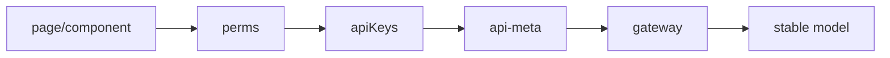
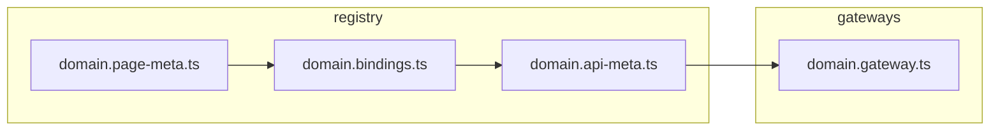
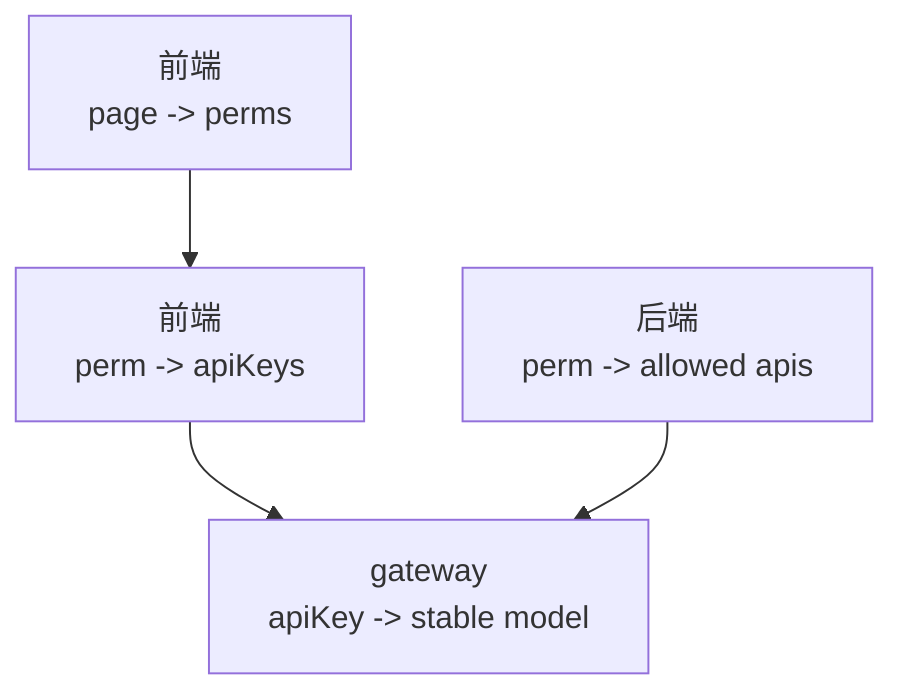
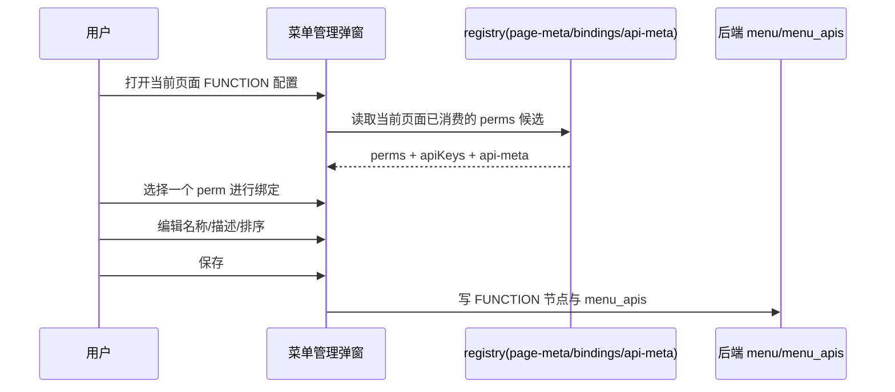
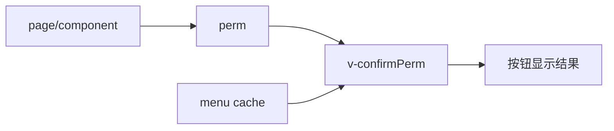
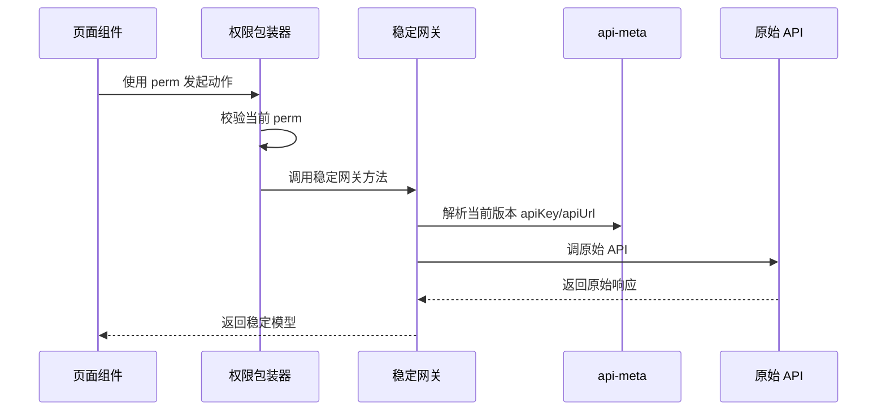
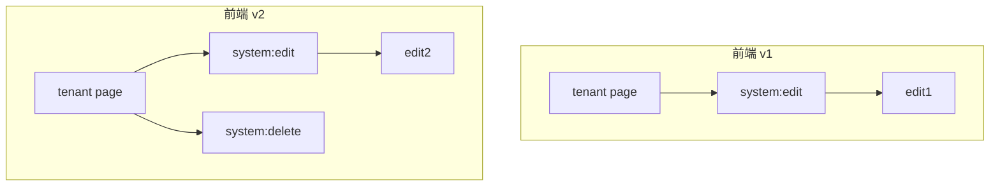
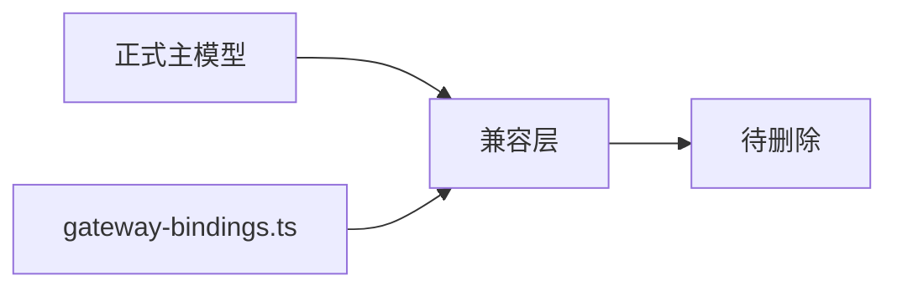
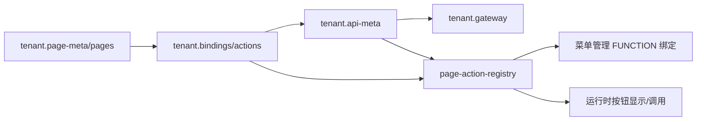
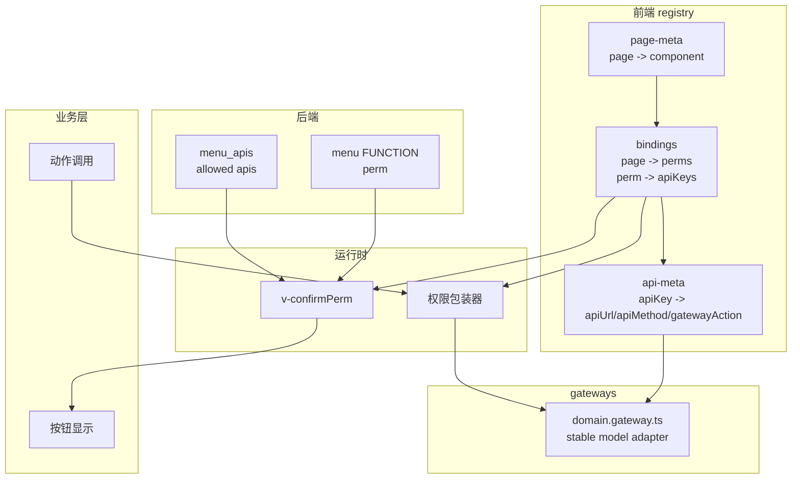

# 2026-04-02 权限-API-网关注册表最终设计

## 文档目的

本文件是当前讨论结果的最终落版设计文档。

它基于以下几轮设计收束而成：

- 第一版：结构问题与最小试点方向
- 第二版：事实源分层与 `registry / gateways` 分离
- 第三版：`page -> perms` 的页面消费建模

这份最终文档不再做版本对照，而是把最后落点的设计方案完整讲清楚，目标是：

1. 说明当前方案的痛点
2. 说明新方案的价值
3. 给出清晰、稳定的分层模型
4. 明确菜单管理、业务层、网关层的职责边界
5. 说明为什么这个方案能兼容不同前端源码版本
6. 在最后给出一版可执行的 MVP 试点方案

---

## 一句话结论

最终设计将前端权限消费链路收束为：

`page/component -> perms -> apiKeys -> api-meta -> gateway -> stable model`

其中：

- `registry` 只保留声明式元数据
- `gateways` 只保留执行逻辑与稳定模型适配
- 后端 `menu/menu_apis` 是权限能力生效事实源
- 前端 `registry` 是当前前端版本的页面消费映射与 API 消费映射

---

## 当前方案的痛点

### 痛点 1：权限模型和网关模型耦合

当前理解容易落成：

`perm -> gatewayAction -> apis`

这会带来两个问题：

1. 权限标识被迫依附网关方法
2. 业务语义会随着网关兼容壳的拆分/合并而变化

但实际上：

- 权限表达的是“某个页面功能点能不能做”
- 网关表达的是“原始 API 如何被兼容成稳定模型”

这两者不应该互为主语义。

### 痛点 2：页面消费哪些权限点没有被显式建模

前端页面按钮和动作守卫通常会写死某个 `perm`，例如：

```text
v-confirmPerm(routePath='/tenant', perm='sys:tenant:create')
```

这意味着页面源码已经声明了：

```text
/tenant page -> consumes sys:tenant:create
```

但如果模型里只有 `perm -> apiKeys`，没有 `page -> perms`，那么：

- 用户在菜单管理里看到的 FUNCTION 权限点
- 前端页面真实消费的权限点

就没有被统一建模，容易造成误解。

### 痛点 3：菜单管理容易被误解为“可编辑前端源码能力”

如果没有说明白，菜单管理里的 FUNCTION 很容易被理解成：

- 用户可以自由修改 `perm`
- 用户可以通过后端配置创造新的前端功能点

但实际上：

- 前端页面消费哪些 `perm` 是源码决定的
- 后端菜单只能绑定、放行、补充这些能力
- 后端不能凭空让前端长出不存在的按钮和行为

### 痛点 4：`gateway-bindings.ts` 在新模型下容易成为重复描述

当系统已经有：

- `page -> perms`
- `perm -> apiKeys`
- `apiKey -> gatewayAction`
- `gateway.ts -> stable model`

再单独维护：

- `gatewayAction -> apiKeys`

就会形成关系重复，长期会带来维护负担。

### 痛点 5：不同前端版本的差异没有统一承接点

实际项目里差异可能同时出现在两层：

1. 页面消费了哪些权限点
2. 某个权限点消费了哪些原始 API

例如：

```text
前端 v1
tenant page -> [system:edit]
system:edit -> [edit1]

前端 v2
tenant page -> [system:edit, system:delete]
system:edit -> [edit2]
```

如果模型不能同时承接这两类差异，版本兼容会越来越绕。

---

## 新方案的核心价值

### 价值 1：把“页面消费”、“权限能力”、“API 兼容”拆开

最终方案把三件事明确拆开：

1. 页面消费什么权限点
2. 权限点引用什么 API
3. API 如何被网关兼容为稳定模型

这会让团队在讨论问题时不再把“页面按钮权限”和“网关方法设计”混在一起。

### 价值 2：能稳定支持多前端版本并存

同一个后端权限点可以允许多个 API 能力。  
不同前端版本可以在自己的 registry 中选择自己需要的那一部分，而不必要求后端跟着改库。

### 价值 3：让菜单管理的边界清晰

菜单管理负责：

- 绑定前端已知能力
- 配置后端放行能力
- 补充名称、描述、排序等运营字段

菜单管理不负责：

- 创造前端源码不存在的能力
- 改写页面组件真实消费的权限点

### 价值 4：让 `registry` 和 `gateways` 分层明确

最终结构下：

- `registry` 是声明
- `gateways` 是执行

这样比把所有关系都塞进 registry 更清晰，也更利于后续删除兼容文件。

### 价值 5：能逐步迁移，不必一次性大改

这个方案允许：

- 先保留旧的 `gateway-bindings.ts`
- 先只改一个模块试点
- 跑通之后再继续推广

风险更低。

---

## 最终设计原则

本设计建议把以下 6 条作为正式原则：

1. 后端 `menu_apis` 是权限能力全集，不是前端实际调用清单。
2. 前端 `registry` 是当前版本页面消费映射与 API 消费映射，不是后端权限事实源。
3. `page/component -> perms` 是正式建模关系。
4. FUNCTION 的 `perm` 是受控绑定字段，不是自由编辑字段。
5. `gateway` 不属于 `registry`，它属于 `gateways` 层。
6. `gateway-bindings.ts` 是迁移期兼容文件，长期目标是删除。

---

## 最终分层模型

### 总体链路



### 每一层代表什么

#### 1. `page/component -> perms`

表达：

- 当前页面组件消费哪些权限点

例如：

```text
tenant page -> [sys:tenant:create, sys:tenant:delete, security:tenant:projectsLoad]
```

#### 2. `perm -> apiKeys`

表达：

- 当前前端版本下，这个权限点会使用哪些 API 引用键

例如：

```text
system:edit -> [edit1]
```

或：

```text
system:edit -> [edit2]
```

#### 3. `apiKey -> api-meta`

表达：

- API 地址
- Method
- 描述
- 归属哪个 `gatewayAction`

例如：

```text
edit1 -> POST /system/edit1 -> gatewayAction: edit
edit2 -> POST /system/edit2 -> gatewayAction: edit
```

#### 4. `gateway -> stable model`

表达：

- 原始 API 如何被兼容成稳定请求/响应模型

例如：

```text
edit(stableRequest)
  -> edit1 request mapper
  -> edit2 request mapper
  -> stableResponse
```

### 分层文字图

```text
页面组件层
  这个页面用哪些权限点

权限绑定层
  这个权限点在当前版本要走哪些 apiKeys

API 元数据层
  每个 apiKey 对应哪个 apiUrl/apiMethod/gatewayAction

网关层
  这些 API 如何被适配成统一稳定模型
```

---

## 文件结构建议

### 最终推荐命名

基于当前讨论，推荐文件命名收束为：

- `*.page-meta.ts`
- `*.bindings.ts`
- `*.api-meta.ts`
- `gateways/<domain>/<domain>.gateway.ts`

### 为什么这样命名更清晰

#### `*.page-meta.ts`

表达“页面定义本身”，比 `*.pages.ts` 更清楚是元数据文件。

#### `*.bindings.ts`

表达“绑定关系”，比 `*.actions.ts` 更贴近真实职责。  
因为这里承载的不只是 action，而是：

- `page -> perms`
- `perm -> apiKeys`

#### `*.api-meta.ts`

表达“API 元数据”，语义清楚且稳定。

#### `*.gateway.ts`

表达“稳定模型适配与执行逻辑”，不属于 `registry`。

### 最终结构图



---

## `bindings.ts` 的最终职责

这份文件是最终设计的核心。

### 它承载两层关系

#### 关系 1：页面消费哪些权限点

```text
page/component -> perms[]
```

#### 关系 2：权限点引用哪些 API

```text
perm -> apiKeys[]
```

### 为什么不单独拆 `perm-meta.ts`

因为当前 `perm` 在系统里只是一个标识，并没有非常独立、复杂的元数据属性集。  
既然它没有形成独立的“权限实体模型”，就没必要为了拆而拆一个 `perm-meta.ts`。

### `bindings.ts` 的概念图

```text
tenant.bindings.ts
  tenant page -> [permA, permB, permC]

  permA -> [apiKey1, apiKey2]
  permB -> [apiKey3]
  permC -> [apiKey4, apiKey5]
```

---

## 后端与前端的关系

### 后端负责什么

后端负责：

- 记录 FUNCTION 节点绑定了哪个 `perm`
- 记录这个 `perm` 被放行了哪些实际 API 能力

即：

```text
perm -> allowed apis
```

### 前端负责什么

前端负责两层映射：

1. 页面当前版本消费哪些 `perm`
2. 这些 `perm` 当前版本消费哪些 `apiKeys`

### 为什么不是“双真相”

这里不是冲突的“双真相”，而是不同层级的两份真相：

- 后端真相：权限能力全集
- 前端真相：当前版本消费映射

### 对照图



---

## 菜单管理的真实语义

### 不是“编辑前端源码能力”

菜单管理不能让前端凭空长出一个功能按钮。  
因为前端按钮、动作守卫、稳定网关调用，本身都是源码决定的。

### 是“绑定前端已消费能力 + 配置后端放行能力”

菜单管理更准确的语义是：

1. 从当前页面已消费的权限点里做绑定
2. 为这个绑定补充后端名称、描述、排序等运营字段
3. 配置这个权限点在后端允许哪些 API 能力

### FUNCTION 为什么不能自由编辑 `perm`

因为页面源码通常写死了 `perm`。

如果源码消费的是：

```text
/tenant -> sys:tenant:create
```

而菜单管理把后端 FUNCTION 节点改成：

```text
sys:tenant:create2
```

但前端页面没改，那么：

- 页面仍然检查旧 `perm`
- 后端只有新 `perm`
- 两边不匹配
- 按钮不按预期显示或生效

### 因此 FUNCTION 的 `perm` 应该怎样处理

FUNCTION 的 `perm` 应是：

- 受控绑定字段
- 候选来源于当前页面已消费的 `perm`
- 不建议自由输入

### 菜单管理流程图



### PAGE 和 FUNCTION 的对称关系

```text
PAGE:
  绑定已注册的 route/component

FUNCTION:
  绑定当前页面已注册消费的 perm
```

---

## 业务层消费链路

### 按钮显示链路

按钮显示要基于：

- 当前页面
- 当前按钮消费的 `perm`
- 后端菜单缓存是否已为该 `perm` 完成绑定和放行

### 按钮显示图



### 动作调用链路

业务层调用时应显式携带 `perm`，而不是再依赖：

`gatewayAction -> perm`

反查。

### 调用链路图



### 业务层为什么更简单

因为业务层只需要知道：

1. 我正在做哪个权限动作
2. 我要调用哪个稳定网关方法

业务层不需要知道：

- 调的是 `edit1` 还是 `edit2`
- 请求体和响应体如何兼容

---

## 版本兼容场景

最终方案支持两类版本差异。

### 差异 1：页面消费的权限点不同

例如：

```text
前端 v1
tenant page -> [system:edit]

前端 v2
tenant page -> [system:edit, system:delete]
```

### 差异 2：同一权限点消费的 API 不同

例如：

```text
前端 v1
system:edit -> [edit1]

前端 v2
system:edit -> [edit2]
```

### 双重差异图



### 为什么这有价值

这样可以做到：

- 后端不必频繁改权限库
- 同一个后端权限体系可兼容多个前端版本
- 前端自己决定当前版本消费哪些权限、哪些 API

---

## `gateway-bindings.ts` 的最终定位

### 当前结论

在最终模型下，`gateway-bindings.ts` 不再是主模型的一部分。

因为系统已经有：

- `page -> perms`
- `perm -> apiKeys`
- `apiKey -> gatewayAction`
- `gateway.ts -> stable model`

再保留：

- `gatewayAction -> apiKeys`

就形成了重复描述。

### 处理建议

短期：

- 保留作为兼容文件

长期：

- 删除

### 定位图



---

## 最终设计方案总结

### 最终结构

```text
registry/
  <domain>.page-meta.ts
  <domain>.bindings.ts
  <domain>.api-meta.ts

gateways/
  <domain>/<domain>.gateway.ts
```

### 最终关系

```text
page/component -> perms
perm -> apiKeys
apiKey -> api-meta
api-meta -> gatewayAction
gatewayAction -> stable model
```

### 最终角色边界

- 后端：权限能力生效事实源
- registry：当前版本页面与 API 消费映射
- gateways：稳定模型适配与执行逻辑
- 菜单管理：绑定前端已知能力并补充后端配置
- 业务层：消费 `perm` 与稳定网关

---

## MVP 方案

### MVP 目标

先用一个模块验证最终模型成立，并尽量不引发大面积重构。

### MVP 试点模块

`tenant`

### MVP 试点文件

- `apex_dev/src/registry/sources/tenant/tenant.actions.ts`
  后续建议重命名为 `tenant.bindings.ts`
- `apex_dev/src/registry/sources/tenant/tenant.pages.ts`
  后续建议重命名为 `tenant.page-meta.ts`
- `apex_dev/src/registry/sources/tenant/tenant.api-meta.ts`
- `apex_dev/src/permissions/registry-route-action/page-action-registry.ts`
- `apex_dev/src/gateways/tenant/tenant.gateway.ts`
- `apex_dev/src/registry/sources/tenant/tenant.gateway-bindings.ts`
  暂保留，仅作为兼容层

### MVP 要做的事

#### 1. 在 `tenant.actions.ts` 中显式表达两层关系

先不急着拆文件，但语义上明确：

- tenant 页面消费哪些 `perm`
- 每个 `perm` 对应哪些 `apiKeys`

#### 2. 在 `tenant.api-meta.ts` 中补齐 `gatewayAction`

让每个 `apiKey` 都能映射到：

- `apiUrl`
- `apiMethod`
- `gatewayAction`

#### 3. 让 `page-action-registry.ts` 优先读取新主链路

优先按：

`page -> perms -> apiKeys -> api-meta`

生成绑定候选与解析结果。  
旧的 `gateway-bindings.ts` 只作为回退兜底。

#### 4. 保持 `tenant.gateway.ts` 继续承载稳定模型适配

不把网关逻辑挪回 registry。

#### 5. 菜单管理中收紧 FUNCTION 绑定语义

MVP 阶段先按规则实现：

- `perm` 仅从当前页面已消费候选中选择
- 不支持自由输入
- `apiUrl/apiMethod` 不作为高自由编辑项

### MVP 不做的事

- 不批量改造所有 domain
- 不立即删除 `gateway-bindings.ts`
- 不先拆出新的 `perm-meta.ts`
- 不一次性重写全部运行时守卫逻辑

### MVP 验收标准

1. tenant 页面能明确表达“页面消费哪些 `perm`”
2. tenant 页面能明确表达“`perm` 引用哪些 `apiKeys`”
3. `api-meta` 能明确表达“`apiKey` 属于哪个 `gatewayAction`”
4. 菜单管理 FUNCTION 绑定只允许选择当前页面已消费的 `perm`
5. 现有 UI / 运行时权限 / 网关调用基本保持兼容
6. `tenant.gateway-bindings.ts` 已降级为兼容文件，不再是主事实源

### MVP 流程图



---

## 最终建议

建议正式按以下路线推进：

1. 用这份最终文档作为统一评审口径
2. 先做 tenant 模块 MVP
3. 跑通后评估是否重命名为：
   - `*.page-meta.ts`
   - `*.bindings.ts`
   - `*.api-meta.ts`
4. 再推广到其他 domain
5. 最后删除 `gateway-bindings.ts` 这类兼容文件

---

## 附：最终总览大图




