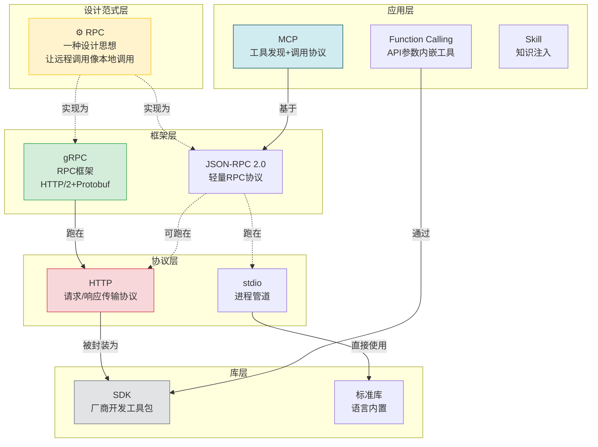
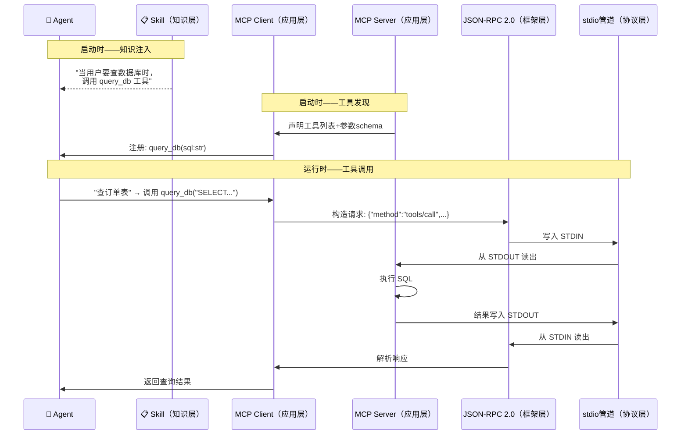
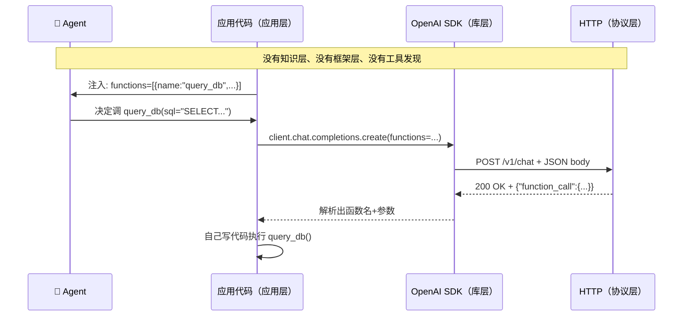

> **前置阅读**：本文是《鹅厂面试官：MCP 就是 Function Calling 套了层壳？》的拓展。那篇文章只比较了 **MCP vs Function Calling**，本文补全 **MCP 在整个工具调用生态里的全貌**——SDK、Skill、gRPC、三种传输模式、以及从一人公司到企业团队的全场景选型。

---

面试官放下前一篇的简历，抬头："你说你理解了 MCP 和 Function Calling 的区别，这很好。那我再问一层——MCP 和 SDK 有什么区别？和 Claude 的 Skill 又有什么区别？和 gRPC 搭的工具调用层有什么不同？"

他顿了顿，加了一句："另外，你简历里说写过一个 stdio MCP Server。那你告诉我，什么场景该用 stdio，什么场景该用 SSE？"

你要是只能答出"MCP 是协议"这一句，剩下的全卡住——他会觉得你只是背了上一篇文章。

---

## 一、先看清概念地图——五层参考模型

> **先给结论（金字塔塔尖）**：这五层不是你写代码时必须全部用上的调用栈。它是一个**参考坐标系**——拿来定位任何一套工具调用方案"用了哪几层、每层用的什么"。就像元素周期表，不是每个化合物都要用全所有元素，但你知道每个元素在哪个位置、有什么性质。

讨论 MCP、SDK、gRPC 这些东西最容易乱的地方，是把不同层次的东西放在一起比——就像拿"面向对象"跟"Java"比一样，它们不在同一层。先把层次理清：

### 1.1 五层怎么划分

划分标准是**每层解决什么问题**。从抽象到具体：



### 1.2 层与层的关系——不是必选项，是参考坐标系

这五层是**你理解任何一套工具调用方案时用来定位的坐标系**，不是一个必选的调用链。不同方案激活不同的层：

**方案 A：MCP stdio 调用**



这条链路里：**知识层**告诉 Agent 什么时候该调，**应用层**让 Agent 知道有什么工具可调，**框架层**定义了消息怎么封装，**协议层**负责把字节送过去。库层没参与——stdio 走的是操作系统管道，不需要额外库。

**方案 B：Function Calling + OpenAI SDK**



这条链路短得多：**应用层**声明工具，**库层**封装 HTTP，**协议层**传数据。没有框架层（不需要 Protobuf 序列化），没有知识层（Agent 不需要 Skill 指导行为），工具执行也在应用自己进程里。

### 1.3 两张图叠起来看——为什么 MCP 是"协议"，gRPC 是"框架"

把方案 A 和方案 B 放回五层参考模型里，就能一眼看清每种方案用了哪些层：

| | 方案 A: MCP stdio | 方案 B: FC + SDK | 方案 C: 自建 gRPC |
|---|---|---|---|
| **知识层** | Skill（可选） | — | — |
| **应用层** | MCP | Function Calling | 自定义 proto |
| **框架层** | JSON-RPC 2.0 | — | gRPC |
| **协议层** | stdio 管道 | HTTP | HTTP/2 |
| **库层** | stdlib | OpenAI SDK | gRPC 库 |

面试官问"你的系统用了哪几层"，你要能指着这张表说出来——**方案选型的本质，就是从这五层里挑出你需要的那几层，然后每层选一个具体实现。**

**关键纪律**：同一层的东西可以比（MCP vs Function Calling），不同层的东西只讲关系不讲优劣（"gRPC 和 MCP 谁更好？"——这问题本身就不成立，它们在不同层解决不同问题）。

---

## 二、MCP vs SDK——协议和库的区别

SDK（如 `@anthropic-ai/sdk`、`openai` Python 库）是厂商提供的开发工具包，帮你快速接入它的 API。MCP 是跨厂商的通信协议。

| | SDK | MCP |
|---|---|---|
| **本质** | 代码库，帮你调厂商 API | 协议标准，定义 Client-Server 通信规范 |
| **范围** | 单一厂商（Anthropic SDK 只管 Claude） | 跨厂商（任何支持 MCP 的客户端和服务端） |
| **工具定义位置** | 你的应用代码里（`@tool` 装饰器） | MCP Server 里（独立进程/服务） |
| **工具复用** | 换客户端 = 换 SDK = 重写 | 一份 Server，所有 MCP 客户端共用 |
| **类比** | iPhone 充电线（只给 iPhone 用） | USB-C 标准（谁用都行） |

### 具体场景

你用 Anthropic SDK 写了一个 `query_database` 工具：

```python
# 工具定义在你应用代码里
@anthropic.tool("query_database")
def query_db(sql: str) -> list:
    return db.execute(sql)
```

换到 OpenAI 客户端？全部重写——import 换、装饰器换、调用方式换。

包成 MCP Server：

```
# 独立进程，通过 JSON-RPC 暴露工具
# 任何 MCP 客户端都能用——Claude Desktop、Cursor、Cline
```

**SDK 解决的是"怎么快速写出工具"，MCP 解决的是"写好的工具怎么被更多人用"。** 一个是写的速度，一个是用的广度。

### 什么时候用 SDK 就够了

- 你是唯一的使用者，应用不会换 AI 厂商
- 工具是应用的内部业务逻辑，没有复用需求
- 开发速度优先，不想维护多一个进程

---

## 三、MCP vs Skill——工具和知识的边界

这是最容易混淆的一对，因为它们都服务于 Agent，但做的事情完全不同。

| | Skill | MCP |
|---|---|---|
| **形态** | `.md` 文本文件 | 可执行程序（进程/服务） |
| **作用** | 注入**知识**——"应该怎么做" | 提供**能力**——"能做到什么" |
| **给 Agent 的** | 行为指导、工作流、禁忌 | 新工具、新 API、新数据源 |
| **Agent 能不能调** | 不能"调用"，只能"被注入" | 能通过工具调用机制原生调用 |
| **举例** | "写播客时先做 U 型结构" | "合成播客为 MP3 文件" |
| **参数安全** | 靠 prompt 描述参数 | JSON Schema 强校验 |

### 关键区分

Skill 不会让 Agent 多出一种能力。Skill 只让 Agent **把本来就会的事做得更准**。MCP 让 Agent **做出本来做不了的事**。

一个 Skill 里可以写"运行 `python scripts/synthesize.py`"让 Agent 去调脚本——但 Agent 是通过读文本、理解意图、手拼 Bash 命令去调的。每一步都是自然语言驱动，参数拼错、脚本选错、输出格式误读都是可能发生的。

MCP 不一样——Client 启动时 MCP Server 主动声明自己的工具和参数 schema，Client 直接注册为原生工具。Agent 不需要琢磨"这个脚本怎么调"，它看到的是一个类型安全的函数签名。

### 选型

| 场景 | Skill | MCP |
|------|:---:|:---:|
| 告诉 Agent 一个工作流程 | ✓ | ✗（MCP 不承载流程知识） |
| 让 Agent 能操作外部系统 | ✗ | ✓ |
| 高频调用、参数复杂 | ✗ | ✓（强类型校验） |
| 一次性任务、简单脚本 | ✓ | ✗（过度设计） |
| 需要跨 AI 客户端复用能力 | ✗ | ✓ |

### 一个自我检验的例子

你写了一个"文档转播客"的 Skill——.md 文件里描述了 U 型结构、面经钩子、validate 和 TTS 脚本的调用方式。Agent 读完后按 Skill 指示一步一步做。这够用吗？够——播客是一次性任务，低频、单客户端、参数简单。

但如果你的 TTS 合成能力想让 Claude Desktop、Cursor、Cline 三个工具都能用，且每次调用都要保证参数正确（输出路径、音频格式、音色选择），那就应该把它抽出成一个 MCP Server。Skill 管"怎么写播客"，MCP 管"怎么合成音频"——知识和能力各司其职。

> **苏格拉底视角——决策时刻的三连问。** 下次你写了一个工具，纠结"要不要包成 MCP"的时候，别翻文档，先问自己三句话：
>
> **问**：这个工具除了我，还有没有第二个人或第二个 AI 客户端要用？
> → 没有 → Skill 就够。有 → 继续往下。
>
> **问**：调用频率是多高？一天一次还是一分钟十次？
> → 一天一次 → Skill + 脚本调一下就行，犯不着维护一个常驻进程。一分钟十次 → MCP 的类型安全和低延迟值得投资。
>
> **问**：参数复杂度有多高？传一个文件路径还是传十几个带枚举值的配置项？
> → 一个路径 → 拼错概率低，Bash 命令够用。十几个配置项 → 需要 JSON Schema 强校验，上 MCP。
>
> 三问过后，你自己心里就有答案了。工程判断力不需要从书上学——从追问中来。

---

## 四、先理清 RPC、HTTP、gRPC、SDK 这条线

> **费曼视角——用一家跨国公司串起全部概念。** 下面的故事里，每个角色对应一个技术概念，它们的关系就是这张知识图谱的实体关系。读完故事再回去看 4.1~4.5 的技术定义，你就不再是孤立地记每个词了。

想象你开了一家跨国公司，东京分部需要查纽约分部的库存。

- **RPC** 就是"打跨洋电话"这个想法本身。你拿起电话拨过去，对方接了，你说"帮我查库存"，对方查完告诉你。海底光缆怎么走的、信号怎么编码的——你完全不用管。你的感觉就是对方坐你隔壁。RPC 不是任何具体技术，它就是这个"让远程调影像本地调用"的思想。

- **HTTP** 就是"打跨洋电话时必须遵守的礼仪"。你必须先说"你好，我是东京分部"（请求头），用标准句式表达需求——"请查询"是 GET，"请更新"是 POST（请求方法），对方必须用标准格式回复——"200 OK，这是结果"或"404 没找到"（状态码）。不遵守这个礼仪？对方直接挂电话。注意：HTTP 只管格式，不管业务——你发的是查库存还是删库存，HTTP 一律不关心。

- **gRPC** 就是"公司采购的高清视频会议系统"。它跑在标准电话礼仪之上（基于 HTTP/2），但它有自己的专属高效压缩编码（Protobuf，二进制而不是啰嗦的纯文本），有自动会议纪要生成（代码生成器，你写一份接口描述，它自动生成所有语言的调用代码），还支持多人同时发言不冲突（双向流）。效率极高，但前提是会场两端都装了这套系统——你没法用这套系统打给一个只有普通电话的客户。

- **JSON-RPC 2.0** 就是"发短信"。比视频会议轻无数倍。格式极简：`{"method":"查库存","params":{"仓库":"纽约"},"id":1}`，对方回 `{"result":"还剩100件","id":1}`。没有视频、没有流式、没有代码生成——但足够快、足够简单、足够通用。**MCP 就是基于这种短信格式，在上面加了一层 AI 工具的黄页和工单系统。**

- **MCP** 就是"公司内部的服务黄页 + 标准化工单系统"。东京打电话前先翻黄页——纽约分部提供了哪些服务（工具发现）、每个服务需要填什么参数（schema 校验）、服务版本是 v1 还是 v2（能力协商）。拨通之后，整个通话有工单号追踪，下次再打能接续上次的上下文（会话管理）。而且黄页不绑定电话品牌——你用座机打、同事用手机打、老板用视频会议打，都能查到同一个黄页（跨客户端复用）。**MCP 不是另一个"更好的电话"，它是在电话之上建了一套让 AI 能够发现、理解、调用工具的标准化协作流程。**

- **Function Calling** 就是"在邮件末尾加个 PS"。你在给客户的邮件最后写："PS：我还能帮你查库存，如果需要，告诉我查什么仓库。"客户得读完你整封邮件才发现这个附言。而且这个 PS 只在这封邮件里有效——换一封邮件，PS 得重写。Function Calling 就是把这个 PS 贴在每次 API 请求里——工具定义跟应用绑定，换一个应用全部重写。

- **Skill** 就是"员工培训手册"。它不增加东京分部的任何新能力——东京本来就会打电话、会查系统。但培训手册告诉员工："当客户问库存时，先查东京本地仓库，没有再打电话问纽约。"指导行为，不提供新工具。Skill 让 Agent 把本来就会的事做得更准，MCP 让 Agent 做出本来做不了的事。

- **SDK** 就是"电话机上的快速拨号键"。你按"纽约库存查询"，电话自动拨号、自动说开场白、自动翻译对方回复。你不用知道拨号规则——但换一台不同品牌的电话机，快速拨号键的位置和设置方式全变了。

下面把每个概念的技术定义拆开——你现在脑子里已经有了整个跨国公司的画面，理解会快得多。

### 4.1 什么是 RPC

RPC（Remote Procedure Call）**不是技术，是一种设计思想**：让调用远程服务器上的函数，看起来跟调用本地函数一样。

```python
# 你写的代码
result = query_database("SELECT * FROM orders")

# 你心里知道 query_database 实际做了什么
# → 把参数序列化 → 发网络请求到另一台机器 → 等响应 → 反序列化返回
# RPC 的思想就是：把这些脏活藏起来，让你感觉在调本地函数
```

这跟"面向对象"是同一个层次的概念——一种思想，不对应任何具体技术。Java 实现了面向对象，Python 也实现了面向对象。同样，gRPC 实现了 RPC，JSON-RPC 也实现了 RPC。

### 4.2 什么是 HTTP

HTTP 是 **协议**——具体的通信规则。它定义了请求长什么样（`GET /api/orders`）、响应长什么样（`200 OK` + JSON body）、状态码什么意思（404 = 没找到）。

HTTP 不关心你传的是什么数据、业务语义是什么——它只管"把字节从 A 送到 B"这件事的格式规范。

### 4.3 RPC 和 HTTP 的关系——范式 vs 协议

这是最容易犯的错：拿 RPC 跟 HTTP 比。**它们不是同层的东西，不能比优劣。**

RPC 是一种**思想**，HTTP 是一种**协议**。RPC 可以用 HTTP 作为底层传输（gRPC 就用 HTTP/2），也可以用其他协议（比如直接走 TCP）。就像"快递"是一种思想——"把东西从 A 送到 B"——你可以用顺丰实现它，也可以用EMS实现它。HTTP 就是顺丰，它规定了你必须怎么打包、贴什么面单。

```text
范式层：RPC                → "我想让远程调用像本地调用"
          │
协议层：HTTP               → "我规定了请求和响应的格式"
          │
实现层：gRPC               → "我用 HTTP/2 + Protobuf 实现了 RPC"
```

### 4.4 什么是 gRPC

gRPC 是 Google 开源的 **RPC 框架**——它把 RPC 这个思想落地成了具体可用的技术栈：

| gRPC 的组成 | 作用 |
|---|---|
| Protocol Buffers | 定义服务接口和数据结构的 IDL（接口描述语言） |
| HTTP/2 | 底层传输协议（多路复用、头部压缩、双向流） |
| 代码生成器 | 根据 .proto 文件自动生成客户端和服务端代码 |

gRPC 之于 RPC，就像 Spring 之于"依赖注入"——前者是后者的一个具体实现。

### 4.5 什么是 SDK，它和 HTTP 什么关系

SDK 是 **库**——封装了 HTTP 调用细节的开发工具包。你不用自己写 `requests.post(url, headers=..., json=...)`，直接调 `sdk.query_database(sql)` 就行。

| | HTTP | SDK |
|---|---|---|
| **层次** | 协议（通信规则） | 库（开发工具） |
| **关系** | SDK 内部调的就是 HTTP | 封装了 HTTP，暴露更友好的接口 |
| **举例** | `POST /v1/chat` + API Key header + JSON body | `client.chat.completions.create(model="gpt-4o", messages=...)` |
| **换厂商** | HTTP 还是 HTTP | SDK 从 Anthropic 换成 OpenAI，代码全换 |

SDK 和 HTTP 的关系就像方向盘和转向轴——你转方向盘（调 SDK），下面的转向轴（发 HTTP）帮你完成实际动作，你不用知道转向轴怎么转的。

---

## 五、MCP vs gRPC——同是框架，不同战场

> **苏格拉底视角——用追问逼出本质。** 面试官问"为什么不用 gRPC 替代 MCP"时，他真正想听的不是功能列表，是你有没有想透这几层追问。

**问**：gRPC 也能定义服务接口（`.proto`），也能传数据（HTTP/2），为什么不能直接用 gRPC 搭一套 AI 工具调用？

**答**：可以——如果你只关心"把字节从 A 送到 B"。但 AI 工具调用有三个需求，gRPC 一个都不管：

> 1. **工具发现**：AI 怎么知道你能提供哪些工具？gRPC 没有"启动时自动声明工具列表"的机制。你得自己写一套注册中心。
> 2. **参数校验**：AI 传了错误类型的参数谁负责拦截？gRPC 的 proto 校验只管序列化格式，不管"这个工具的参数应该是 int 而不是 string"这种业务语义校验。MCP 的 JSON Schema 是专门为 AI 场景设计的——它能告诉 LLM "这个参数必须是 enum，可选值是 A、B、C"。
> 3. **会话上下文**：一次对话里 AI 调了 10 次工具，第 10 次调用需要知道前 9 次的结果。gRPC 每次调用是独立的——你可以在 proto 里塞一个 session_id，但上下文怎么存、怎么过期、怎么关联到对话轮次，全部你自己设计。

**问**：那如果我把这三样自己补上呢？用 gRPC 做底层，自己写注册中心 + schema 校验 + 会话管理？

**答**：恭喜，你在 gRPC 上重新发明了一个 MCP。而且你这个自建方案只能用在你自己的工具里——Claude Desktop、Cursor、Cline 不会去实现你自定义的 proto 协议。**MCP 的价值有一半在互操作性上：不是你写得好不好，是别人愿不愿意接你。**

下面从技术参数对比——你已经通过追问理解了"为什么不直接用 gRPC"：

| | MCP | gRPC |
|---|---|---|
| **自己是什么** | AI 工具调用的应用层协议 | 通用 RPC 框架 |
| **基于谁** | JSON-RPC 2.0（文本） | HTTP/2 + Protobuf（二进制） |
| **额外定义了** | 工具发现、能力协商、会话管理、三种传输绑定 | 流式传输、负载均衡、拦截器 |
| **不定义什么** | 工具怎么实现 | AI 语义、工具发现 |
| **适合场景** | 让 AI 客户端发现和调用工具 | 微服务间高性能通信 |

### 为什么不用 gRPC 代替 MCP

gRPC 能传数据，但传数据只是 MCP 最底层的事。MCP 真正值钱的是：

- **工具发现**：Client 启动时，Server 主动声明"我有这些工具，参数长这样"
- **能力协商**：Client 和 Server 互相确认支持的协议版本和功能
- **会话管理**：一次连接里多次工具调用共享上下文

这些 gRPC 一个都不管。如果非要用 gRPC 搭一套等价的东西，你得自己定义 proto 来描述工具、自己实现发现机制、自己处理版本协商——本质上就是在 gRPC 上重新发明一个 MCP。

### 什么时候 gRPC 就够

公司内部自建 Agent 平台、所有工具自己写、不跨厂商兼容。你的 Claude Desktop 不会去调别人自定义的 gRPC 服务——没有客户端会去实现你的私有 proto 定义。

---

## 六、stdio vs SSE vs HTTP——同是 MCP，传输怎么选

很多人写了一个 stdio MCP Server，面试官问"为什么不做成 SSE"，就答不上来了。三者不是技术优劣，是场景适配。

	SSE 指的是 Server-Sent Events（服务器发送事件）：基于 HTTP 的单向服务器推送技术，Server 独立运行，支持远程访问和多客户端共享，适合团队内部署的共享工具。

| | stdio | SSE | HTTP Streamable |
|---|---|---|---|
| **Server 位置** | 本地子进程 | 远程服务器 | 远程服务器 |
| **启动方式** | Host 自动拉起 | Server 独立运行 | Server 独立运行 |
| **网络需求** | 不需要 | 需要 HTTP 可达 | 需要 HTTP 可达 |
| **数据安全** | 最高（不出本机） | 中（内网 HTTP） | 低（公网 HTTP，需 TLS） |
| **多客户端共享** | 不能（进程绑定 Host） | 能 | 能 |
| **延迟** | 最低（管道通信） | 中（网络往返） | 中（网络往返） |
| **运维负担** | 无（Host 负责生命周期） | 有（需维护 Server 进程） | 有 |
| **典型场景** | 个人本地工具 | 团队共享工具 | 公网 SaaS 工具 |

### 选型判断

```text
一人公司、个人使用 → stdio
    ├── 工具跟你的电脑绑定，不需要别人访问
    ├── 零运维，删掉 mcp.json 那一行就停用
    └── 数据不出本机，安全最高

团队共享、多客户端 → SSE
    ├── 公司内网部署一个 Wiki MCP Server
    ├── 开发用 Claude Code、产品用 Cursor 都能连
    └── 工具逻辑只维护一处，升级推送统一

公开服务、SaaS 产品 → HTTP Streamable
    ├── 面向外部用户的 MCP 服务
    ├── 需要鉴权、限流、HTTPS
    └── 2025 年新增，正逐步替代 SSE
```

### 一个人做 MCP 的推荐路径

1. **一切从 stdio 开始**。本地启动，零运维，验证工具逻辑。
2. **有共享需求时**，同一份 MCP Server 代码，改传输层为 SSE 部署到内网。
3. **要公开服务时**，再加 HTTP Streamable 和鉴权。

三种传输模式公用同一套工具定义——换传输层不改工具逻辑。这是 MCP 设计好的分层。

---

## 七、全场景选型决策矩阵

| 场景 | FC | SDK | Skill | MCP stdio | MCP 远程 | gRPC |
|---|---|---|---|---|---|---|
| 一个 Agent，几个内部工具 | ✓ | — | — | — | — | — |
| 快速原型，先跑通 | — | ✓ | — | — | — | — |
| 给 Agent 注入工作流知识 | — | — | ✓ | — | — | — |
| 个人本地工具（文件、数据库） | — | — | — | ✓ | — | — |
| 团队共享工具（Wiki、文档） | — | — | — | — | ✓ | — |
| 高频、多参数、需强校验 | — | — | — | ✓ | ✓ | — |
| 跨 AI 客户端复用 | — | — | — | ✓ | ✓ | — |
| 一次性脚本调用 | — | — | ✓ | — | — | — |
| 公司自建平台、不跨厂商 | — | — | — | — | — | ✓ |
| 离线/本机最高安全 | — | — | — | ✓ | — | — |
| 定时任务、循环监控 | — | — | — | — | ✓ | — |

---

## 八、面试追问预测与应答

### 追问一："MCP 和 Claude 的 Skill 有什么区别？"

> Skill 是知识注入——`.md` 文件，告诉 Agent"应该怎么做"，不提供新能力。MCP 是能力扩展——独立进程/服务，让 Agent 能操作原本碰不到的系统。Skill 让 Agent 把会的事做准，MCP 让 Agent 做本来做不了的事。参数安全上，MCP 有 JSON Schema 强校验，Skill 里调脚本全靠 prompt 描述参数。

### 追问二："MCP 的三种传输模式各用在什么场景？"

> stdio 是个人本地工具——零网络、零运维、最高安全，Host 拉起子进程通过管道通信。SSE 是团队内网共享——Server 部署在一台机器上，多客户端通过 HTTP 连接。HTTP Streamable 是公网服务——需要鉴权、限流、HTTPS。判断标准：工具的使用者是只有你、还是你团队、还是全世界。

### 追问三："既然要做工具调用，为什么不用 gRPC 搭一套？"

> gRPC 是传输层框架，MCP 是应用层协议。gRPC 不解决工具发现和能力协商的问题——你需要自己定义 schema 怎么暴露、capability 怎么协商、错误怎么标准化。如果所有工具自建、不需要跨厂商兼容，gRPC 可行。但如果需要工具被 Claude Desktop、Cursor、Cline 等外部客户端使用，只有 MCP 能做到——没有客户端会去实现你自定义的 gRPC 协议。**MCP 的价值不在传输，在互操作。**

### 追问四："你写的播客工具，用 Skill + 脚本就够了，为什么不做成 MCP？"

> 这是正确的工程判断——选择取决于场景。播客工具是低频、单客户端、一次性任务。Skill + 脚本更合适——Agent 读完 Skill 后调一次 validate、一次 synthesize，拼错参数的概率极低。写成 MCP 要处理 JSON-RPC 握手、维护 tool schema 声明，收益不成正比。**MCP 的真正价值在高频、多参数且跨客户端复用的场景**，这个场景三个都不沾。工程判断力就是知道什么时候该用什么。

---

## 九、总结

回到面试官那个问题："MCP 和 SDK、Skill、gRPC 又是什么关系？"

这不是在考定义，是在考你能不能把技术栈分层看透——什么问题在哪一层解决：

```
知识层（Skill）           →  告诉 Agent "应该怎么做"
应用层（FC / SDK）         →  为单个应用快速实现工具
协议层（MCP）              →  让工具独立存在，跨客户端复用
传输层（gRPC / JSON-RPC）  →  把字节从这边送到那边
```

**一个人做工程，判断力比熟练度更值钱。** 知道什么时候用 MCP、什么时候用 Skill 就够、什么时候 stdio 就解决问题——这才是 Agent 工程师的核心能力。

背答案的人记住"MCP 是协议"，做决策的人知道"这个场景用 Skill 加脚本就够了，那个场景必须上 MCP SSE"。面试官三句话，听出的不是你知道什么，是你做过什么取舍。
