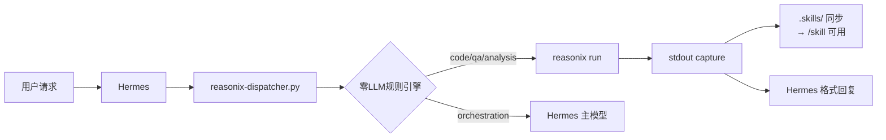

# Reasonix Dispatcher

> Hermes 编排 + Reasonix 推理：编码/问答类任务自动路由到 Reasonix，利用 DeepSeek prefix cache 省 token。

## 架构



## 文件

| 文件 | 职责 |
|------|------|
| `SKILL.md` | Hermes agent skill（含触发词和自动执行规则） |
| `scripts/reasonix-dispatcher.py` | 核心引擎：intent detection + reasonix dispatch + file_ops extraction |
| `scripts/skill-bridge.sh` | Hermes SKILL.md → Reasonix .skills/ 桥接 |
| `templates/before/` | 改前：Hermes 全程跑，token 高 |
| `templates/after/` | 改后：Reasonix 委派，token 低 |
| `assets/frontmatter-template.yaml` | frontmatter 模板 |

## 关键设计决策

### 1. Intent Detection：零 LLM

纯关键词匹配（写/改/修 vs 发消息/cron vs 分析/为什么），不消耗任何 token。误判时自动 fallback。

### 2. Skill Bridge

当 Hermes 加载了一个 skill 且匹配 Reasonix 路由时，自动把 SKILL.md 内容传入 Reasonix 的 `/skill <name>` 上下文。Hermes skill 和 Reasonix playbook 共用同一套知识。

### 3. 静默 Fallback

Reasonix 不可用时完全透明回退到 Hermes 主模型，不报错不中断。

## 受益预期

| 场景 | 改前（Hermes 全程） | 改后（Dispatcher） | 节省 |
|------|-------------------|-------------------|------|
| 编码类 | ~15K token | ~500 编排 → ~3K reasonix | **~77%** |
| 问答类 | ~8K token | ~300 编排 → ~1.5K reasonix | **~78%** |
| Gateway | ~2K token | ~2K（不走 reasonix） | 0% |

## 验证

```bash
# 测试意图分类
python3 scripts/reasonix-dispatcher.py "帮我写个脚本" --dry-run

# 测试分发
python3 scripts/reasonix-dispatcher.py "解释这个 Python 代码" --workdir .

# 检查 reasonix 可用性
python3 -c "from scripts.reasonix_dispatcher import is_available; print(is_available())"
```
