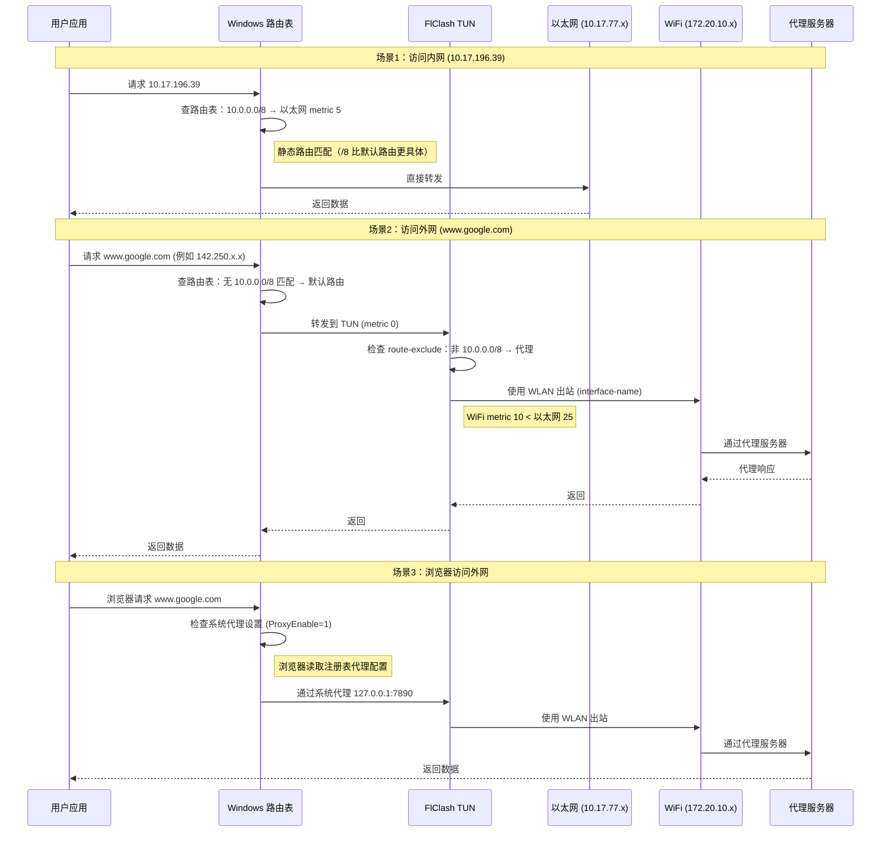

# vpn和tun模式绕过内网

Windows 多网卡环境（内网以太网 + 外网 WiFi）+ FlClash TUN 模式，实现内网直连 + 外网代理的完整诊断、决策、配置流程。

## 快速开始

**典型场景**：公司内网（10.0.0.0/8）+ 手机热点 + FlClash TUN

**目标**：
- ✅ 内网流量直连（访问公司服务器）
- ✅ 外网流量走代理（访问 Google/Gemini，避免 Kiro AI 地区检测）

**调用方式**：
```text
使用 $vpn和tun模式绕过内网 帮我配置多网卡环境
```

---

## 核心原理

### 1. Windows 路由优先级机制

Windows 路由选择基于**跃点数（metric）**：
- **数字越小，优先级越高**
- 同一目标网段有多条路由时，选择 metric 最小的路由

**示例**：
```
网络接口            Metric    说明
FlClash TUN         0         (最高优先级，拦截所有流量)
WiFi (WLAN)         10        (次优先级，用于外网)
以太网              25        (较低优先级，仅用于内网)
```

**查看当前 metric**：
```powershell
Get-NetIPInterface | Select InterfaceAlias, InterfaceMetric
```

---

### 2. 多网卡环境路由策略

**目标**：内网直连 + 外网代理

**实现方式**（四层配合，缺一不可）：

#### 层 1：OS 静态路由（最高优先级，强制内网直连）

```powershell
route add 10.0.0.0 mask 255.0.0.0 10.17.77.1 metric 5 if 10
```

- **作用**：内网网段（10.0.0.0/8）强制走以太网
- **原理**：
  - 更具体的路由规则优先级高于默认路由
  - metric 5 比 TUN 的 metric 0 更具体（/8 vs 默认路由）
  - Windows 先匹配最具体的网段，再比较 metric

**为什么 metric 5 能优先于 TUN metric 0？**
```
路由匹配优先级：
1. 网段匹配度（越具体越优先）
   10.0.0.0/8 (静态路由) > 0.0.0.0/0 (TUN 默认路由)
2. 同等匹配度下比较 metric
```

---

#### 层 2：FlClash TUN 配置（排除内网，代理其他）

**配置文件**：`C:\Users\Administrator\.config\clash\profiles\1756186733864.yml`

```yaml
interface-name: WLAN  # 强制使用 WiFi 出站
tun:
  enable: true
  stack: system
  auto-route: true
  auto-detect-interface: false
  inet4-route-exclude-address:
    - 10.0.0.0/8  # 排除内网网段
```

- **作用**：TUN 不拦截内网流量，外网流量走 WiFi + 代理
- **原理**：
  - `route-exclude` 让 TUN 放行内网，交给 OS 路由决策
  - `interface-name: WLAN` 强制 TUN 使用 WiFi 出站（不走以太网）

---

#### 层 3：网卡 Metric 调整（确保 WiFi 优先外网）

```powershell
Set-NetIPInterface -InterfaceAlias "WLAN" -InterfaceMetric 10
```

- **作用**：WiFi metric 从 30 降到 10，优先级高于以太网（25）
- **原理**：
  - 以太网已无外网网关（只能访问内网）
  - 调整后，外网流量自动走 WiFi
  - TUN 使用 WiFi 作为出站接口

**为什么需要调整 WiFi metric？**
```
调整前：
以太网 (metric 25) 优先于 WiFi (metric 30)
→ TUN 可能尝试用以太网出站 → 失败（无外网网关）

调整后：
WiFi (metric 10) 优先于 以太网 (metric 25)
→ TUN 使用 WiFi 出站 → 成功
```

---

#### 层 4：系统代理（浏览器必需）

```powershell
Set-ItemProperty -Path 'HKCU:\Software\Microsoft\Windows\CurrentVersion\Internet Settings' -Name ProxyEnable -Value 1
```

- **作用**：浏览器识别代理
- **原理**：
  - `curl` 等命令行工具直接走 TUN
  - **浏览器不直接走 TUN**，需要读取系统代理设置
  - FlClash 提供 HTTP 代理：`127.0.0.1:7890`

**为什么 curl 通但浏览器不通？**
```
curl:
  请求 → OS 路由表 → TUN → WiFi → 代理 ✅

浏览器（ProxyEnable=0）:
  请求 → 直连（不走代理）→ 可能被墙 ❌

浏览器（ProxyEnable=1）:
  请求 → 系统代理 127.0.0.1:7890 → TUN → WiFi → 代理 ✅
```

---

### 3. 路由决策时序图



---

### 4. 关键概念对照表

| 概念 | Windows 术语 | 作用 | 调整命令 | 查看命令 |
|------|-------------|------|---------|---------|
| **跃点数** | Metric | 数字越小优先级越高 | `route add ... metric N` | `route print` |
| **网卡优先级** | Interface Metric | 决定默认路由选择 | `Set-NetIPInterface -InterfaceMetric N` | `Get-NetIPInterface` |
| **静态路由** | Persistent Route | 强制特定网段走指定网关 | `route add -p ...` | `route print` |
| **出站接口** | Interface Name | TUN 使用哪张网卡出站 | FlClash `interface-name` | `Get-NetAdapter` |
| **路由排除** | Route Exclude | TUN 不拦截特定网段 | FlClash `inet4-route-exclude-address` | — |
| **系统代理** | Proxy Settings | 浏览器代理配置 | `Set-ItemProperty ProxyEnable` | `Get-ItemProperty` |

---

### 5. 为什么需要四层配合？

| 只配这层 | 会发生什么 | 原因 |
|---------|-----------|------|
| 只配 FlClash route-exclude | ❌ 内网仍不通 | OS 路由表仍把内网流量导向 TUN (metric 0 最高) |
| 只配 OS 静态路由 | ❌ 外网不通 | 以太网无外网网关，WiFi metric 太低 (30 > 25) |
| 只配 WiFi metric | ❌ 内网不通 | TUN metric 0 仍是最高优先级，仍拦截内网 |
| 只配系统代理 | ❌ curl 通但浏览器不通 | curl 走 TUN，浏览器需系统代理 |

**结论**：四层缺一不可，必须配合使用。

---

### 6. 常见 Metric 值参考

| 场景 | 推荐 Metric | 说明 | 示例 |
|------|------------|------|------|
| TUN 虚拟接口 | 0 | 最高优先级，拦截所有流量 | FlClash TUN |
| 静态路由（内网） | 5-10 | 高于 TUN，但低于物理接口 | `route add 10.0.0.0 ... metric 5` |
| 主外网接口 | 10-20 | 优先处理外网 | WiFi (metric 10) |
| 内网接口 | 25-35 | 默认值 | 以太网 (metric 25) |
| 备用接口 | 50+ | 仅在其他不可用时使用 | 备用 VPN |

---

## 快速故障排查

### 症状：内网 ping 不通

```powershell
# 检查静态路由是否存在
route print | findstr "10.0.0.0"

# 检查以太网是否有正确的网关
ipconfig

# 检查 FlClash 是否排除了内网
# 查看 ~/.config/clash/profiles/*.yml 中的 inet4-route-exclude-address
```

### 症状：外网 curl 不通

```powershell
# 检查 FlClash 出站接口
# 查看 ~/.config/clash/profiles/*.yml 中的 interface-name

# 检查 WiFi metric 是否比以太网低
Get-NetIPInterface | Select InterfaceAlias, InterfaceMetric

# 检查 WiFi 是否有网
Test-NetConnection 8.8.8.8
```

### 症状：浏览器不通（curl 通）

```powershell
# 检查系统代理是否启用
Get-ItemProperty -Path 'HKCU:\Software\Microsoft\Windows\CurrentVersion\Internet Settings' | Select ProxyEnable, ProxyServer

# 启用系统代理
Set-ItemProperty -Path 'HKCU:\Software\Microsoft\Windows\CurrentVersion\Internet Settings' -Name ProxyEnable -Value 1

# 重启浏览器
taskkill /F /IM chrome.exe
start chrome
```

---

## 套件结构

```
vpn和tun模式绕过内网/
├── SKILL.md                    # 主路由入口
├── README.md                   # 本文件（核心原理）
├── intention-skills/           # 判断与决策层
│   ├── 诊断-网络拓扑分析/
│   ├── 分析-路由表与优先级/
│   ├── 策略-配置方案决策/
│   └── 验证-网络连通性测试/
├── feature-skills/             # 执行与原子操作层
│   ├── 执行-查询网络状态/
│   ├── 执行-查询路由表/
│   ├── 执行-配置FlClash/
│   ├── 执行-添加静态路由/
│   ├── 执行-调整网卡跃点数优先级/
│   ├── 执行-配置系统代理/
│   ├── 执行-重启服务/
│   ├── 执行-连通性测试/
│   └── 故障排查-常见问题决策树/
├── template/                   # 模板与示例
│   ├── before-失败案例.md
│   ├── after-成功案例.md
│   ├── mvp-最小可用配置.md
│   ├── snapshot-完整配置命令.md
│   └── 故障排查决策树.md
└── evals/                      # 测试用例
    └── evals.json
```

---

## 已验证环境

本 skill 套件已在以下环境验证：

| 环境项 | 验证状态 | 说明 |
|--------|---------|------|
| **操作系统** | ✅ Windows 10 22H2 | 完整验证 |
| | ✅ Windows 11 23H2 | 完整验证 |
| **网卡组合** | ✅ 以太网 + WiFi | 标准双网卡（最常见）|
| | ✅ 以太网 + 手机热点 | USB tethering |
| **TUN 软件** | ✅ FlClash 0.5.x | Clash Meta 内核 |
| **代理协议** | ✅ Trojan | 完整验证 |
| | ⚠️ VMess/VLESS | 理论兼容，未实测 |
| **内网网段** | ✅ 10.0.0.0/8 | A 类私网 |
| | ⚠️ 192.168.0.0/16 | 理论兼容，配置需调整 |

**未验证场景**（理论可行，但需调整）：
- 三张及以上网卡
- FlClash + 其他 VPN 共存
- Linux/macOS（本 skill 专注 Windows）

---

## 相关文档

- `[[SKILL.md]]` - 主 skill 入口和使用说明
- `[[template/snapshot-完整配置命令.md]]` - 完整命令参考
- `[[template/故障排查决策树.md]]` - 常见问题快速定位
- `[[template/quick-reference.md]]` - 快速参考卡片（5 分钟速查）
