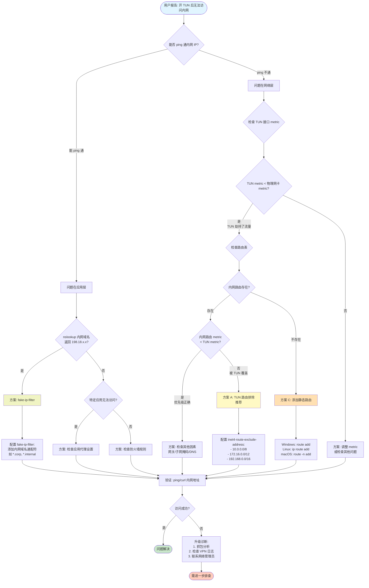

# VPN TUN 模式内网访问诊断流程图

## 完整决策树



## 快速判断表

| 症状 | 可能原因 | 优先方案 |
|------|----------|----------|
| ping 不通内网 IP | TUN 劫持路由 | TUN 路由排除 (方案 A) |
| ping 通但浏览器无法访问 | DNS 返回 fake-ip | fake-ip-filter (方案 B) |
| 部分网段可访问，部分不可 | 路由表缺失 | 静态路由 (方案 C) |
| 关闭 TUN 就正常 | TUN metric 过低 | 方案 A 或调整 metric |
| 特定应用无法访问 | 应用代理配置 | 检查应用设置 |

## 诊断命令速查

### Windows
```powershell
# 查看路由表
route print

# 查看网络接口 metric
Get-NetIPInterface | Select-Object InterfaceAlias, InterfaceMetric | Sort-Object InterfaceMetric

# 测试连通性
ping 10.17.196.39
Test-NetConnection -ComputerName 10.17.196.39 -Port 80

# DNS 解析测试
nslookup internal.corp
```

### Linux/macOS
```bash
# 查看路由表
ip route show        # Linux
netstat -rn          # macOS

# 查看 TUN 接口
ip link show         # Linux
ifconfig             # macOS

# 测试连通性
ping -c 4 10.17.196.39
curl -v http://10.17.196.39

# DNS 解析测试
nslookup internal.corp
dig internal.corp
```

## 常见陷阱

1. **只配置 fake-ip-filter**：仅解决域名问题，IP 直连仍会失败
2. **静态路由 metric 过高**：被 TUN 路由覆盖，需设置为 < TUN metric
3. **重启后路由失效**：静态路由不持久化，需添加启动脚本
4. **子网掩码错误**：导致路由匹配失败，需精确配置
5. **网关地址错误**：使用 VPN 网关而非物理网关，流量仍被劫持

## 下一步

- 详细错误模式 → [常见错误模式](常见错误模式.md)
- TUN 工作原理 → [Clash TUN 原理](../references/clash-tun-原理.md)
- 真实案例参考 → [真实案例库](../references/真实案例库.md)
