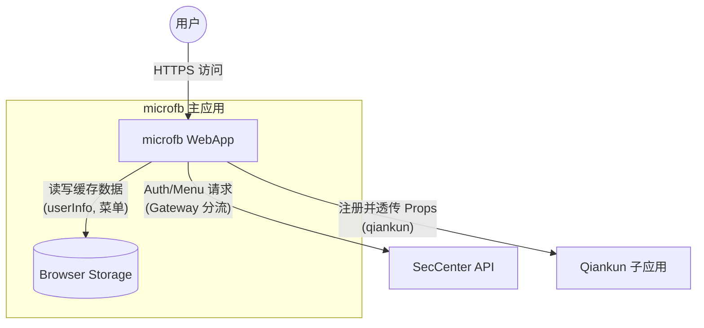
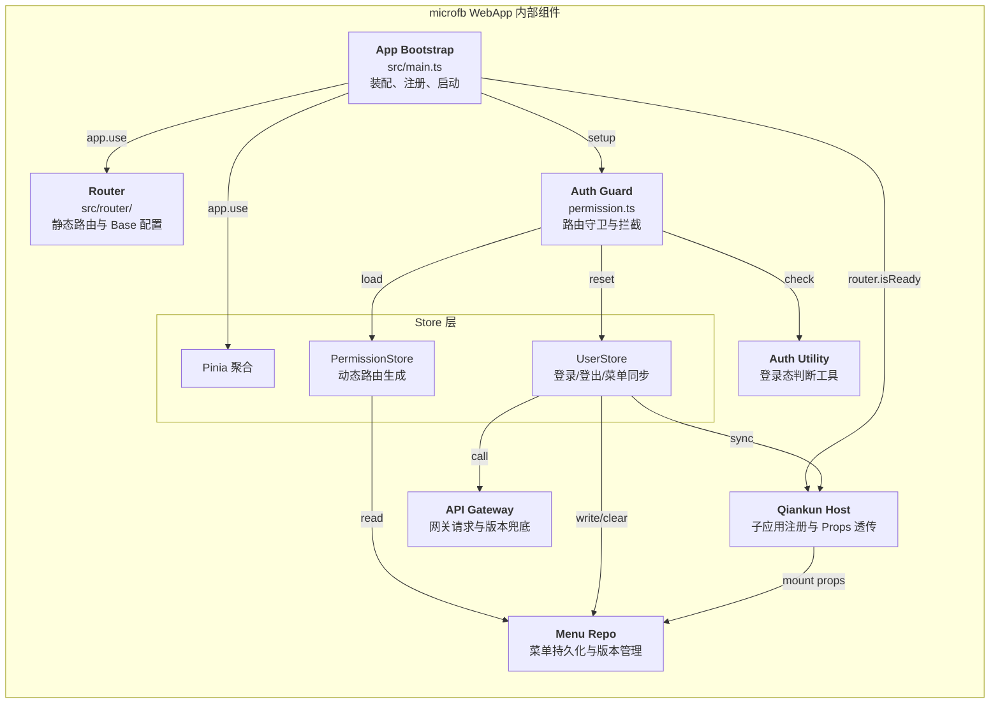

# microfb（基座）MVP：前端架构拓扑图

本文档目标：基于 `microfb` 源码事实，输出可版本化的 **静态架构拓扑图**（流程图风格），用于团队对齐边界、依赖方向与关键链路入口。

## 1. 结论先行（MVP 范围）

- **主容器**：`microfb`（Vue3 + Vite）作为 qiankun 主应用，挂载并管理多个子应用（示例：`Apex`）。
- **权限链路**：路由守卫 `setupPermission()` 负责“未登录拦截 → 登录跳转 → 动态路由生成 → 入口菜单落点”。
- **菜单/路由生成**：`permission.store.generateRoutes()` 以“菜单缓存（v2）优先、v1 回退”为原则，生成动态路由并 `router.addRoute()` 注入。
- **登录后置**：`user.store.finalizeV2Login()` 负责“写入 userInfo → 解析/兜底菜单树 → 写入菜单缓存 → 同步 props 到子应用 → 跳转首个菜单”。
- **微前端注册**：`registerApps()` 在 `router.isReady()` 后启动 qiankun，避免容器未渲染导致挂载失败。

## 2. 静态拓扑（系统边界）

### 源码证据（对应边与节点）

- **基座启动与 qiankun 启动时机**：`src/main.ts`
- **路由 base（部署在子路径）**：`src/router/index.ts` → `getAppBase()`（`src/gateway/route-base.gateway.ts`）
- **路由守卫/登录跳转/动态路由注入**：`src/plugins/permission.ts`
- **动态路由生成（菜单缓存优先、v1 回退）**：`src/store/modules/permission.store.ts`
- **登录后置初始化与子应用 props 同步**：`src/store/modules/user/user.store.ts`（`finalizeV2Login()`）
- **qiankun 注册与 props 透传（menuList/userInfo）**：`src/plugins/qiankun/apps.ts`
- **认证网关（v1/v2 分流与降级）**：`src/gateway/auth.gateway.ts`

## 3. 静态拓扑（聚焦“鉴权-菜单-路由-微前端”）

## 4. MVP 的“边界约定”（先写成文字，后续可固化为依赖规则）

- **组件禁止直连 API 实现**：页面/组件只调用 store 或 composable；HTTP 细节仅在 `src/api/**`。
- **登录态来源**：以 `Cookie-Session` 为主，前端不保存 token（`finalizeV2Login` 已体现），仅缓存 userInfo/menu。
- **子应用数据同步**：统一通过 `setMicroAppProps()` 透传 `menuList/userInfo/menuVersion/routerBase`，避免子应用重复拉取或产生版本漂移。

