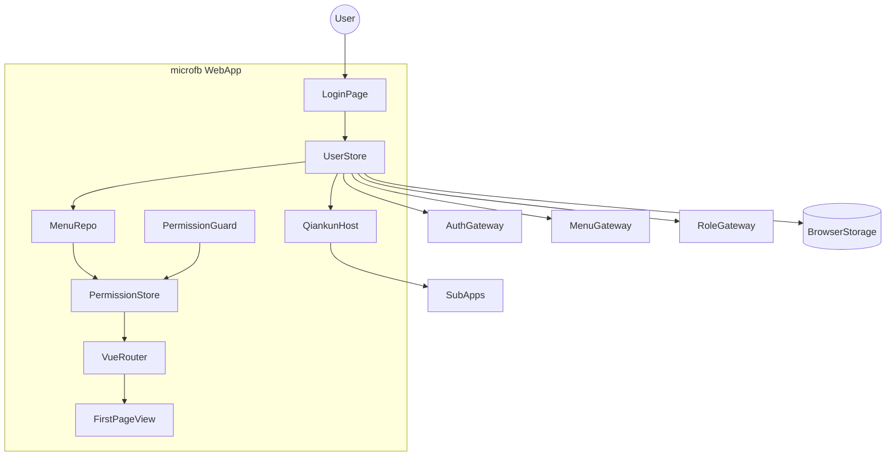
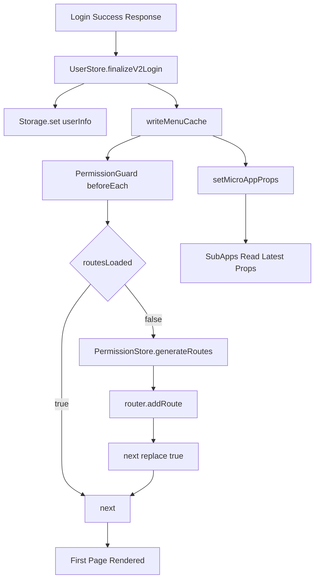

# microfb（基座）MVP：架构拓扑补充（首次登录关键组件关系）

本文档目标：补充“首次登录”场景下的架构拓扑视角，明确从登录请求到菜单缓存、路由注入、首屏渲染的关键组件边界与依赖方向。

## 1. 场景范围（MVP）

- 覆盖首次登录主链路：`Login -> UserStore -> MenuRepo -> PermissionStore -> Router -> View`。
- 覆盖关键同步链路：主应用向子应用透传 `menuList/menuVersion/userInfo`。
- 不覆盖登录页 UI 细节与后端认证内部实现。

## 2. 静态边界拓扑（graph TB）

## 3. 首次登录关键依赖流（flowchart TD）

## 4. 源码证据（关键边 → 文件/函数）

- `src/store/modules/user/user.store.ts`
  - `loginV2()` / `finalizeV2Login()`：首次登录数据归一化与缓存写入。
- `src/services/menu/menu-repo.ts`
  - `writeMenuCache()` / `readMenuCache()`：菜单缓存入口与读取点。
- `src/plugins/permission.ts`
  - `setupPermission()` / `handleAuthenticatedUser()`：首次登录后守卫判断与动态路由注入。
- `src/store/modules/permission.store.ts`
  - `generateRoutes()`：缓存菜单到动态路由。
- `src/plugins/qiankun/apps.ts`
  - `setMicroAppProps()`：首次登录后子应用 props 同步。

## 5. MVP 验收点（架构关系视角）

- 首次登录后，`UserStore -> MenuRepo -> PermissionStore -> Router` 链路应完整闭环。
- `routesLoaded=false` 时应只触发必要一次路由注入，不出现重复注入冲突。
- 子应用收到的 props 与主应用缓存一致，不出现菜单版本漂移。

