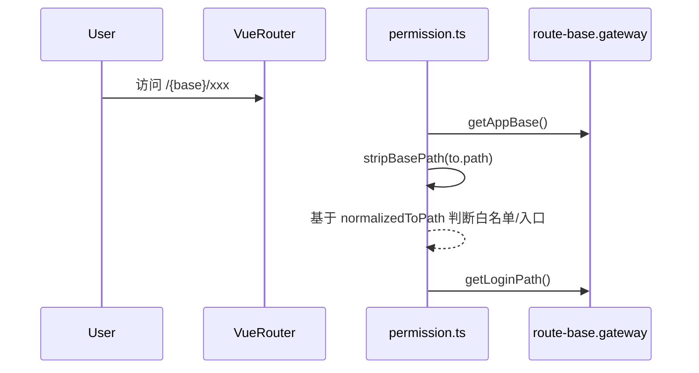
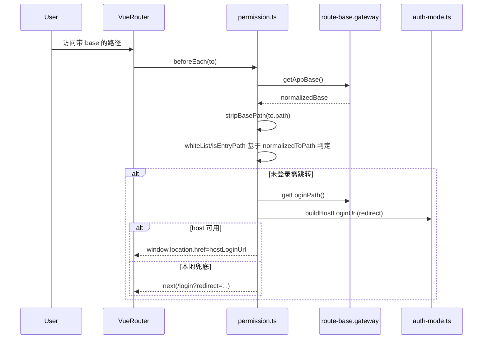

# 状态链路：Base 路径一致性链路（stripBasePath 与登录路径拼接）

本文档目标：以“部署在子路径（如 `/cloud`）时，守卫判断与登录跳转仍一致”为单一链路，描述 `microfb` 如何：

- 用 `getAppBase()` 统一运行时 `history.base`；
- 用 `stripBasePath()` 在守卫中把 base 从 `to.path` 剥离后再做白名单/入口判断；
- 用 `getLoginPath()`/`buildHostLoginUrl()` 拼出正确的登录 URL（含 redirect）。

## 1. 链路边界（MVP）

- **起点**：用户访问带 base 前缀的路径（例如 `/cloud/...`）。
- **终点**：守卫对白名单/入口路径判断不受 base 干扰；需要登录时能跳到正确的 host 登录页（或本地 `/login`），并携带正确的 redirect。

## 2. 链路流程图（sequenceDiagram，简洁版）

## 3. 链路流程图（sequenceDiagram，细节版）

适用场景：简洁版用于解释 base 一致性主线，细节版用于排查登录跳转拼接错误。  
阅读建议：优先核对 `stripBasePath` 与 `buildHostLoginUrl` 的入参是否一致。

## 4. 源码证据（关键节点 → 文件/函数）

- **运行时 base 统一来源**：`src/gateway/route-base.gateway.ts`
  - `getAppBase()`：规范化 `VITE_APP_BASE`（去尾斜杠、确保 `/` 开头）
  - `getLoginPath()`：返回 `${base}${LOGIN_PATH}`
- **路由 history.base 使用**：`src/router/index.ts`
  - `createWebHistory(getAppBase())`
- **守卫剥离 base 再判断**：`src/plugins/permission.ts`
  - `stripBasePath(rawPath)`：从 `to.path` 剥离 history base
  - `whiteList`/`isEntryPath` 判断均基于 `normalizedToPath`
- **host 登录 URL 拼装**：`src/utils/auth-mode.ts`
  - `buildHostLoginUrl(redirect)`：
    - mock 模式返回 null（走本地登录兜底）
    - host 缺失返回 null（走本地登录兜底）
    - `loginPath` 默认为 `getLoginPath()`（也支持 `VITE_HOST_LOGIN_PATH` 覆盖）

## 5. MVP 验收点（base 一致性视角）

- **入口判断不受 base 干扰**：访问 `/cloud/` 仍会被识别为 `ROOT_PATH`（或等价入口），能正确落到首菜单/默认页。
- **登录跳转 redirect 正确**：访问 `/cloud/xxx` 未登录时，最终 redirect 仍指向“业务路径”，不会丢失 query/hash（按 `redirectToLogin` 的拼装规则）。

