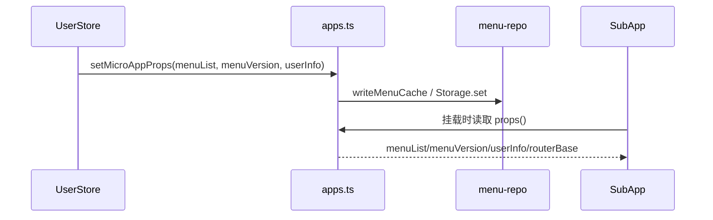
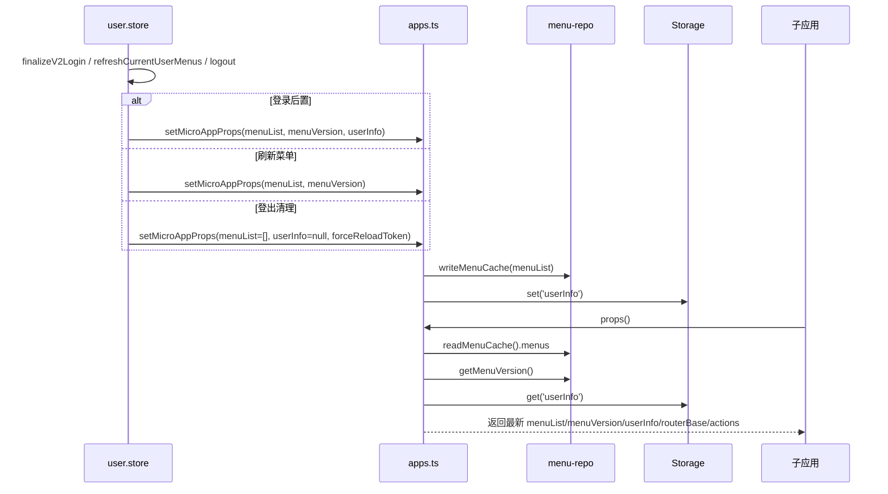

# 状态链路：子应用 Props 同步链路（menuVersion 驱动）

本文档目标：以“主应用菜单/用户信息变化后，子应用能拿到一致的 props”为单一链路，描述 `microfb` 的 props 同步策略：**写入侧**通过 `setMicroAppProps` 写缓存；**读取侧**在子应用每次挂载时通过 `props(): () => ({...})` 动态读取最新值，并携带 `menuVersion` 作为变更信号。

## 1. 链路边界（MVP）

- **起点**：主应用发生“菜单/用户信息更新”，例如：
  - 登录后置：`UserStore.finalizeV2Login()`
  - 刷新菜单：`UserStore.refreshCurrentUserMenus()`
  - 登出：`UserStore.logout()`（清空）
- **终点**：子应用在挂载时拿到最新 `menuList/menuVersion/userInfo/routerBase`；主应用保证不会把旧用户的权限数据透传给新会话。

## 2. 链路流程图（sequenceDiagram，简洁版）

## 3. 链路流程图（sequenceDiagram，细节版）

适用场景：简洁版用于说明“写入侧+读取侧”闭环，细节版用于排查切账号串权和菜单版本不一致。  
阅读建议：先验证 `setMicroAppProps` 是否触发，再验证子应用读取时是否拿到新 `menuVersion`。

## 4. 源码证据（关键节点 → 文件/函数）

- **读取侧（挂载时动态读取）**：`src/plugins/qiankun/apps.ts`
  - `getAppProps()`：每次调用时读取
    - `readMenuCache().menus`
    - `getMenuVersion()`
    - `Storage.get('userInfo')`
  - `buildApps()`：将 `props` 定义为函数 `props: () => ({ ...getAppProps(), ...item.props })`
- **写入侧（同步入口）**：`src/plugins/qiankun/apps.ts`
  - `setMicroAppProps(appName, partialProps)`：
    - `menuList` → `writeMenuCache(...)`
    - `userInfo` → `Storage.set('userInfo', ...)`
    - 注：写入后子应用“下次挂载/下次读取 props”即可拿到最新值
- **触发写入的业务点**：`src/store/modules/user/user.store.ts`
  - `finalizeV2Login()`：登录后置写入 userInfo/menu，并对所有 enabled app 执行 `setMicroAppProps`
  - `refreshCurrentUserMenus()`：写 menuCache，并可选同步子应用 props
  - `logout()`：清空 props（含 `forceReloadToken`）避免切换账号串权
- **menuVersion 信号**：`src/services/menu/menu-repo.ts`
  - `getMenuVersion()`：读取当前版本号
  - `writeMenuCache()`：写入菜单并更新版本信号

## 5. MVP 验收点（同步视角）

- **切换账号不串权**：登出后子应用不能继续使用旧 `menuList/userInfo`。
- **菜单变更可感知**：子应用能通过 `menuVersion` 判断“菜单是否变化”，从而触发自身刷新（子应用侧的契约）。
- **路由基准一致**：每个子应用都能拿到 `routerBase=activeRule`，保证路由前缀一致。

