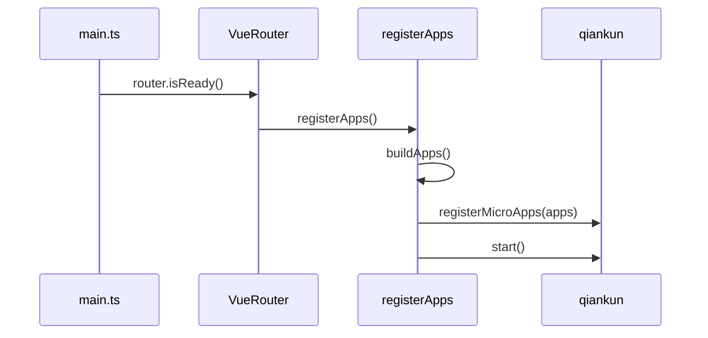
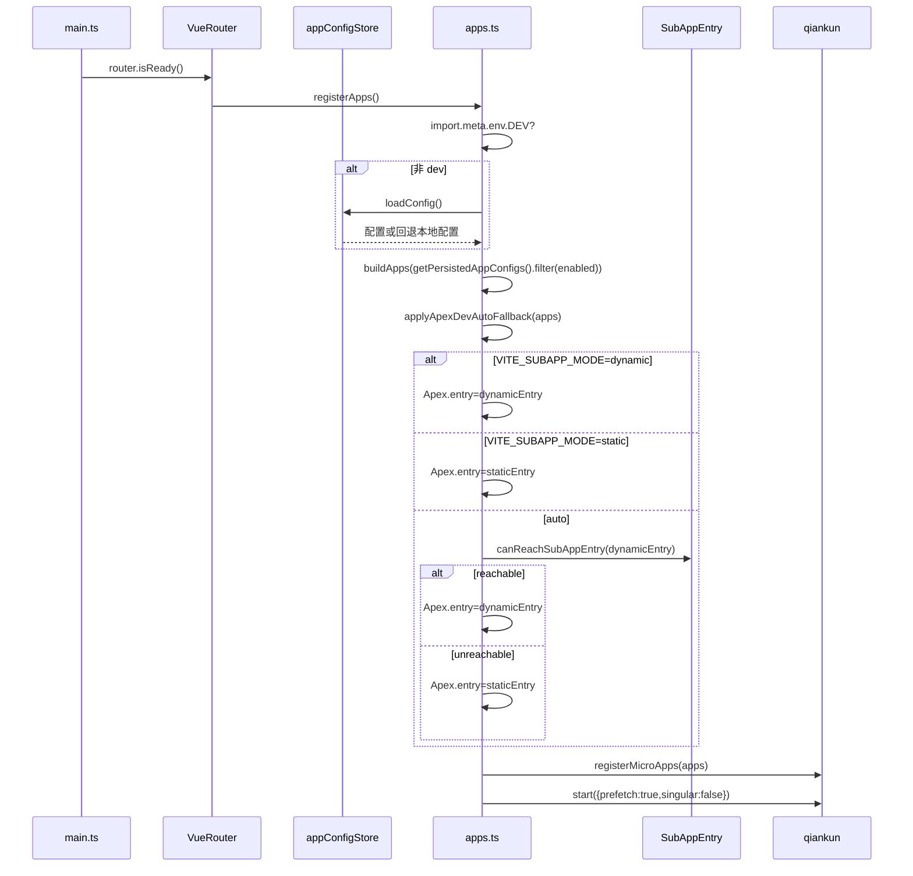

# 状态链路：子应用注册链路（qiankun 启动 + Apex dev 自动降级）

本文档目标：以“子应用能够被正确注册并挂载”为单一链路，描述 `microfb` 在何时启动 qiankun、如何从持久化配置生成注册列表、以及在开发环境如何为 `Apex` 自动选择 dynamic/static entry。

## 1. 链路边界（MVP）

- **起点**：主应用启动后，`router.isReady()` 触发 `registerApps()`。
- **终点**：完成 `registerMicroApps(apps)` 并 `start(...)`，子应用能按 `activeRule` 激活并挂载到容器 `#subapp-container`。

## 2. 链路流程图（sequenceDiagram，简洁版）

## 3. 链路流程图（sequenceDiagram，细节版）

适用场景：简洁版用于说明启动顺序，细节版用于排查 dev 环境 Apex dynamic/static 选择问题。  
阅读建议：遇到子应用挂载异常时，先核对 `router.isReady` 再核对 `VITE_SUBAPP_MODE` 分支。

## 4. 源码证据（关键节点 → 文件/函数）

- **启动时机（等待路由 ready）**：`src/main.ts`
  - `router.isReady().then(registerApps)`
- **qiankun 注册入口**：`src/plugins/qiankun/apps.ts`
  - `registerApps()`：非 dev 先 `appConfigStore.loadConfig()`；然后 `buildApps()`；dev 下 `applyApexDevAutoFallback(apps)`；最后 `registerMicroApps + start`
  - `buildApps()`：基于 `getPersistedAppConfigs().filter(enabled)` 生成注册列表，并补齐 `container/activeRule/props()`
  - `applyApexDevAutoFallback(apps)`：dev 下根据 `VITE_SUBAPP_MODE` 与 `canReachSubAppEntry` 选择 entry
- **挂载容器选择器**：`src/constants/micro-app.ts`
  - `SUB_APP_CONTAINER_SELECTOR = '#subapp-container'`
- **Apex static 入口常量**：`src/constants/route-paths.ts`
  - `APEX_STATIC_ENTRY`（示例：`/Apex?isSubApp=true`）

## 5. MVP 验收点（注册视角）

- **首次进入系统**：`router.isReady()` 后一定会触发 `registerApps()`，不会因为容器未渲染导致子应用挂载失败。
- **dev 下 Apex entry 选择**：
  - `VITE_SUBAPP_MODE=dynamic/static/auto` 三种模式均可得到可预期的 entry；
  - `auto` 下 dynamic 不可达时会稳定回退到 static。

