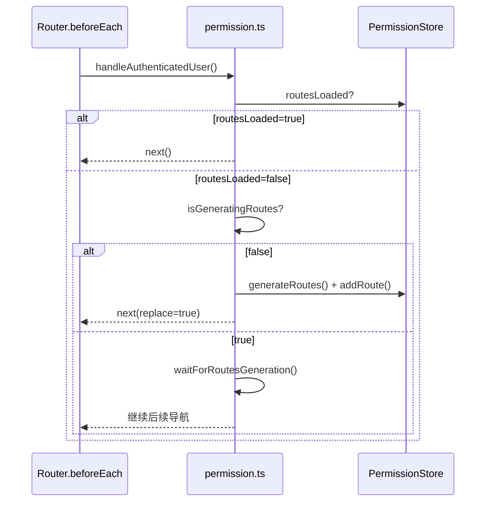
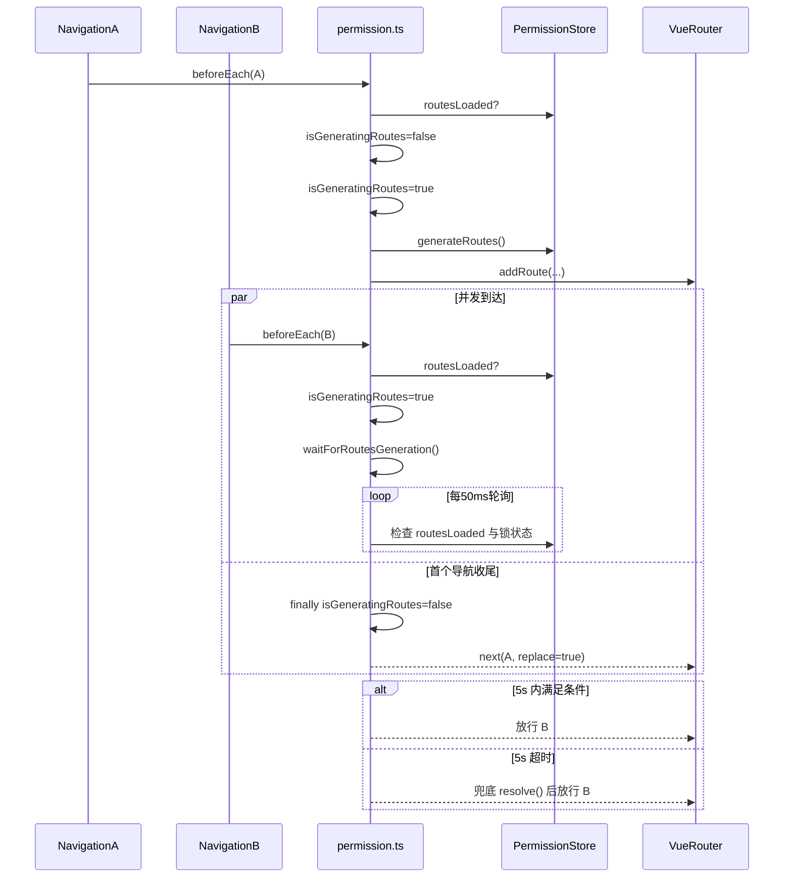

# 状态链路：并发导航互斥链路（动态路由生成 isGeneratingRoutes）

本文档目标：以“并发导航下动态路由生成只执行一次”为单一链路，说明 `microfb` 如何在 `beforeEach` 中互斥生成动态路由，避免重复 `generateRoutes()` 与重复 `addRoute()` 引发的不一致/异常。

## 1. 链路边界（MVP）

- **起点**：在 `routesLoaded=false` 的窗口期，出现多个并发/连续导航触发 `beforeEach`。
- **终点**：只会有一个导航触发真实的 `generateAndAddRoutes()`；其余导航等待（或超时兜底）后继续走正常流程。

## 2. 链路流程图（sequenceDiagram，简洁版）

## 3. 链路流程图（sequenceDiagram，细节版）

适用场景：简洁版用于说明互斥机制，细节版用于验证高并发导航时只有一次真实生成。  
阅读建议：重点关注 `isGeneratingRoutes` 的置位/释放时机和 5s 超时分支。

## 4. 源码证据（关键节点 → 文件/函数）

- `src/plugins/permission.ts`
  - `let isGeneratingRoutes = false`：模块级互斥锁
  - `handleAuthenticatedUser(...)`：当 `routesLoaded=false` 时走互斥分支
  - `generateAndAddRoutes(permissionStore)`：唯一执行 `permissionStore.generateRoutes()` 并 `router.addRoute(...)` 的位置
  - `waitForRoutesGeneration(permissionStore)`：
    - `setInterval(50ms)` 轮询
    - `setTimeout(5000ms)` 超时兜底放行

## 5. MVP 风险点与验收点

- **风险：5s 超时放行**：如果 `routesLoaded` 最终仍为 false，后续导航可能落入 `to.matched.length===0` 的 404 分支（取决于目标路由是否是静态路由）。
- **验收：高频点击菜单**：在首次进入系统（routesLoaded=false）时快速点击菜单，不应触发多次 `generateRoutes()`；也不应出现路由表异常或卡死。

