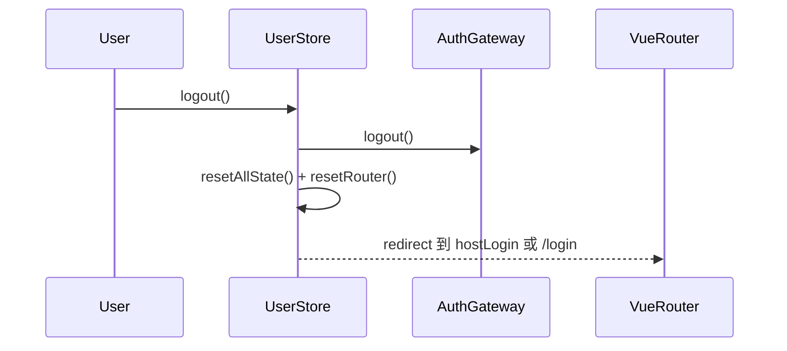
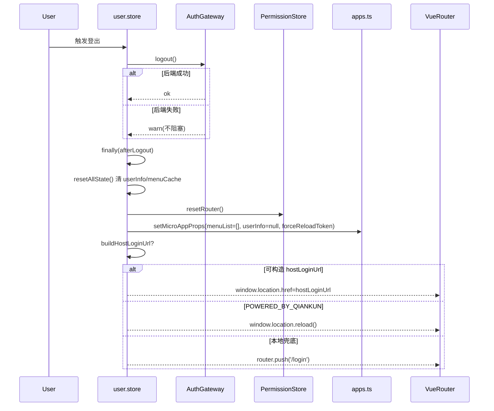

# 状态链路：登出强解散链路（后端失败不阻塞）

本文档目标：以“用户登出后必须立刻清空前端状态并跳回登录”为单一链路，说明 `microfb` 的登出策略：后端登出失败也不阻塞前端清理与跳转，避免卡在旧会话/旧权限状态。

## 1. 链路边界（MVP）

- **起点**：用户触发登出（调用 `UserStore.logout()`）。
- **终点**：本地状态（userInfo/menuCache/动态路由/子应用 props）被清理；用户被跳转到 host 登录或本地登录页（或 qiankun 场景下 reload）。

## 2. 链路流程图（sequenceDiagram，简洁版）

## 3. 链路流程图（sequenceDiagram，细节版）

适用场景：简洁版用于说明“后端失败不阻塞前端登出”核心策略，细节版用于核对清状态和跳转优先级。  
阅读建议：重点核对 `finally` 后的清理顺序，避免遗留旧会话数据。

## 4. 源码证据（关键节点 → 文件/函数）

- `src/store/modules/user/user.store.ts`
  - `logout()`：
    - `AuthGateway.logout().catch(...).finally(afterLogout)`
    - `resetAllState()` → `permissionStore.resetRouter()`
    - 遍历 `getPersistedAppConfigs().filter(enabled)` 清空子应用 props，并携带 `forceReloadToken`
    - 优先跳 `buildHostLoginUrl(ROOT_PATH)`，否则 qiankun 场景 reload，否则 `router.push(LOGIN_PATH)`
  - `resetUserState()`：
    - `Storage.remove('userInfo')` / `Storage.sessionRemove('userInfo')`
    - `clearMenuCache()`

## 5. MVP 验收点（登出视角）

- **后端登出失败也要登出成功（前端视角）**：无论 `AuthGateway.logout()` 成功与否，都能清空本地状态并跳转离开受保护页面。
- **切换账号不串权**：登出后再次登录新账号，子应用不应拿到旧的 `menuList/userInfo`（清空 props 生效）。

