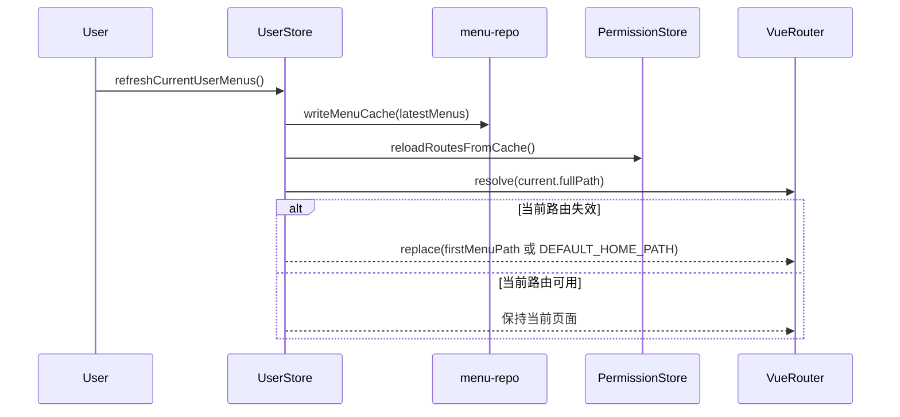
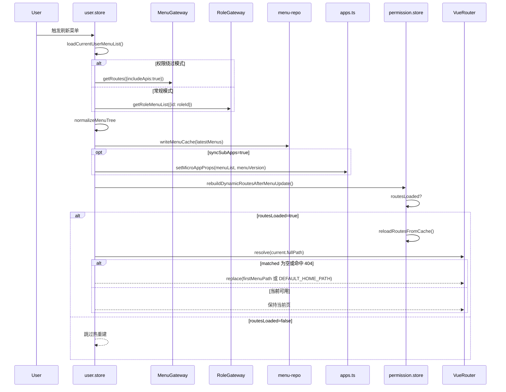

# 状态链路：菜单刷新链路（无刷新同步 → 动态路由热重建 → 404 回退）

本文档目标：以“菜单变更后无需刷新页面即可生效”为单一链路，描述 `microfb` 如何刷新菜单、写入缓存、（可选）同步到子应用、热重建动态路由，以及在当前路由失效时的回退策略。

## 1. 链路边界（MVP）

- **起点**：用户触发“刷新菜单”动作（调用 `UserStore.refreshCurrentUserMenus()`）。
- **终点**：主应用 `menuCache` 更新完成；动态路由按需热重建完成；若当前路由已失效则自动回退到“首个可用菜单路径/默认首页”；（可选）子应用接收到最新菜单 props。

## 2. 链路流程图（sequenceDiagram，简洁版）

## 3. 链路流程图（sequenceDiagram，细节版）

适用场景：简洁版用于展示“刷新后立即生效”主链路，细节版用于定位是否触发子应用同步与路由回退。  
阅读建议：问题定位时重点看 `syncSubApps` 与 `routesLoaded` 两个开关分支。

## 4. 源码证据（关键节点 → 文件/函数）

- **刷新入口与同步**：`src/store/modules/user/user.store.ts`
  - `refreshCurrentUserMenus(options)`：刷新菜单、写缓存、可选同步子应用、触发路由热重建
  - `loadCurrentUserMenuList(currentUserInfo)`：根据 `hasPermissionBypass` 选择
    - `MenuGateway.getRoutes({ includeApis: true })`（绕过权限）
    - `RoleGateway.getRoleMenuList({ id: roleId })`（常规）
- **写菜单缓存**：`src/services/menu/menu-repo.ts`
  - `writeMenuCache(menus)`：唯一写入口（同时会更新 `menuVersion` 信号）
- **路由热重建与回退**：`src/store/modules/user/user.store.ts`
  - `rebuildDynamicRoutesAfterMenuUpdate(menuList)`：
    - `permissionStore.reloadRoutesFromCache()`
    - 当前路由失效时 `router.replace(firstMenuPath || DEFAULT_HOME_PATH)`
- **子应用 props 同步**：`src/plugins/qiankun/apps.ts`
  - `setMicroAppProps(app.name,{ menuList, menuVersion })`

## 5. MVP 验收点（刷新菜单视角）

- **不刷新页面菜单生效**：刷新后侧边栏/权限应立刻按新菜单渲染（依赖你们 UI 对 `menuVersion`/缓存更新的订阅方式）。
- **当前页面被删除/无权限**：刷新后若当前路由失效，应自动回退到首个可用菜单或默认首页。
- **可控同步子应用**：`options.syncSubApps=false` 时不会更新子应用菜单 props（仅主应用生效）。

