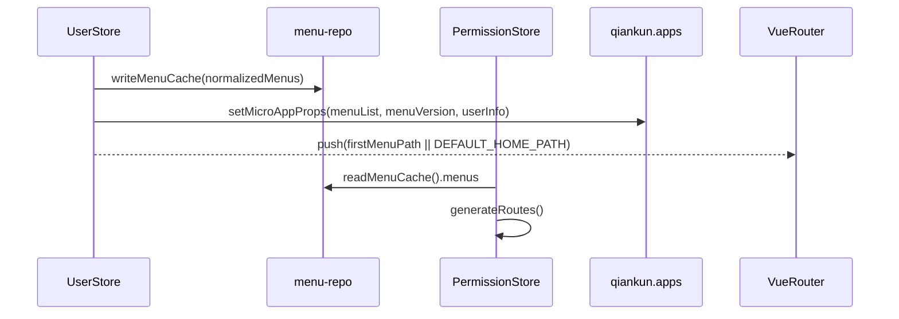
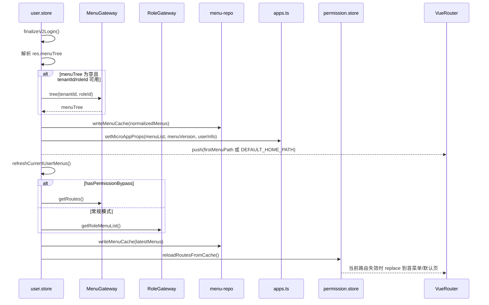

# 状态链路：菜单存储链路（登录后置 → 菜单缓存 → 动态路由 → 子应用 Props）

本文档目标：以“菜单数据如何落地并驱动路由/子应用”为单一链路粒度，描述 `microfb` 的菜单来源、缓存写入点、路由重建点、以及对子应用的同步方式。

## 1. 链路边界（MVP）

- **起点**：v2 登录成功（非 MFA）进入 `UserStore.finalizeV2Login()`，或用户主动刷新菜单 `refreshCurrentUserMenus()`。
- **终点**：`menu-repo` 缓存更新完成；主应用动态路由可按需重建；子应用下次挂载/或 props 更新后能拿到最新菜单。

## 2. 链路流程图（sequenceDiagram，简洁版）

## 3. 链路流程图（sequenceDiagram，细节版）

适用场景：简洁版用于讲解菜单写入与读取闭环，细节版用于排查登录后置与刷新菜单差异。  
阅读建议：先看写入侧，再看 `reloadRoutesFromCache` 的读侧重建。

## 4. 源码证据（关键节点 → 文件/函数）

- **菜单缓存仓库**：`src/services/menu/menu-repo.ts`
  - `readMenuCache()` / `writeMenuCache()` / `clearMenuCache()` / `getMenuVersion()`
- **登录后置写入菜单缓存**：`src/store/modules/user/user.store.ts`
  - `finalizeV2Login()`：login 返回 `menuTree` 优先；为空时 `MenuGateway.tree(...)` 兜底；然后 `writeMenuCache()`
  - `loginV2()`：`mfaRequired` 时不进入 `finalizeV2Login`
- **菜单刷新与路由热重建**：`src/store/modules/user/user.store.ts`
  - `refreshCurrentUserMenus(options)`：拉取菜单 → `writeMenuCache` → 可选 `setMicroAppProps` → `rebuildDynamicRoutesAfterMenuUpdate`
  - `rebuildDynamicRoutesAfterMenuUpdate(menuList)`：`permissionStore.reloadRoutesFromCache()`；当前路由失效时回退到首菜单/默认页
- **动态路由生成读缓存**：`src/store/modules/permission.store.ts`
  - `generateRoutes()`：v2 读取 `readMenuCache().menus`；v1 回退 `RoleGateway.getRoleMenuList`
- **子应用 props 同步（写入侧 + 读取侧）**：`src/plugins/qiankun/apps.ts`
  - 写入：`setMicroAppProps()`（写 menuCache / userInfo storage）
  - 读取：`props: () => ({ menuList: readMenuCache().menus, userInfo: Storage.get('userInfo'), ... })`

## 5. MVP 风险点与验收点

- **风险：login 返回 menuTree 为空且缺 tenantId/roleId**：会跳过 `MenuGateway.tree` 兜底，导致菜单为空；需确认此时默认页是否可访问。
- **风险：props 同步时机**：`setMicroAppProps` 更新的是“下次挂载/下次读取 props 时”的来源；需要子应用侧按 `menuVersion` 感知变化。
- **验收：切换账号**：登出会 `clearMenuCache()` 并清空子应用 props，避免残留旧权限数据（见 `logout()`）。

