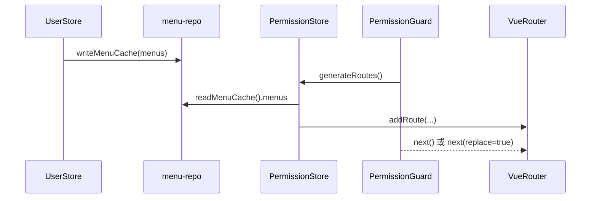
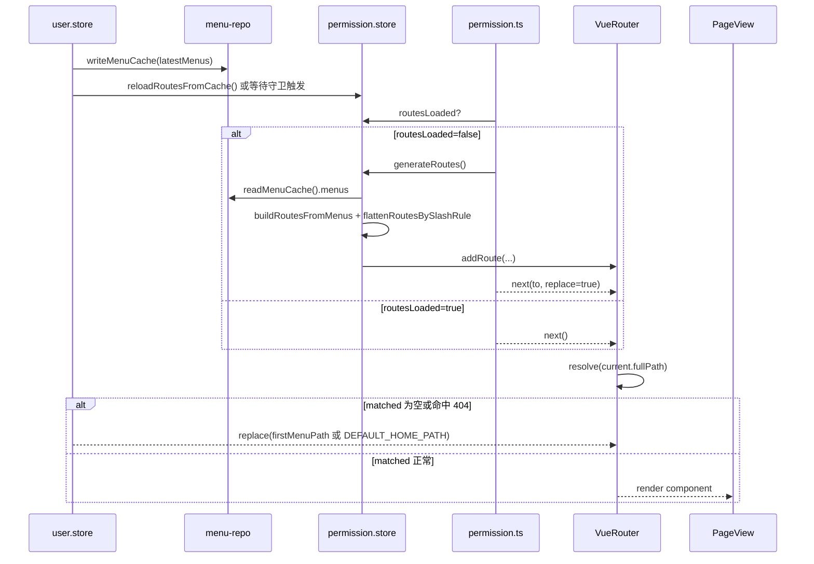

# 状态链路：菜单缓存与显示链路（menuCache → 路由注入 → 页面渲染）

本文档目标：聚焦“菜单缓存如何影响页面显示”，给出从 `writeMenuCache` 到 `generateRoutes` 再到页面渲染的完整闭环，便于排查“菜单已更新但页面未显示/显示错误”问题。

## 1. 链路边界（MVP）

- **起点**：菜单缓存被写入（登录后置或刷新菜单）。
- **终点**：当前页面可命中路由并完成渲染；若当前路由失效则回退到首菜单或默认首页。

## 2. 链路流程图（sequenceDiagram，简洁版）

## 3. 链路流程图（sequenceDiagram，细节版）

适用场景：简洁版用于确认缓存到显示主链路是否通，细节版用于排查“缓存已写但页面不对”的具体断点。  
阅读建议：先看 `routesLoaded` 分支，再核对 `resolve(current.fullPath)` 的结果与回退行为。

## 4. 源码证据（关键节点 → 文件/函数）

- `src/services/menu/menu-repo.ts`
  - `writeMenuCache()` / `readMenuCache()` / `getMenuVersion()`。
- `src/store/modules/permission.store.ts`
  - `generateRoutes()` / `buildRoutesFromMenus()` / `flattenRoutesBySlashRule()`。
- `src/plugins/permission.ts`
  - `handleAuthenticatedUser()`：路由生成与守卫放行。
- `src/store/modules/user/user.store.ts`
  - `refreshCurrentUserMenus()` / `rebuildDynamicRoutesAfterMenuUpdate()`：菜单更新后热重建与失效回退。

## 5. MVP 验收点（菜单显示视角）

- 菜单缓存更新后，目标页面应能在一次守卫流程内命中路由并渲染。
- 当前页无权限或菜单删除时，应自动回退到首菜单或默认首页，不停留空白页。
- 切换菜单版本后，主应用与子应用的菜单视图应保持一致。

