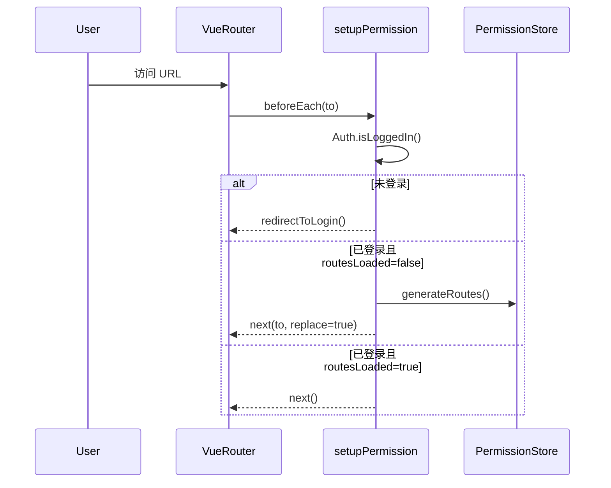
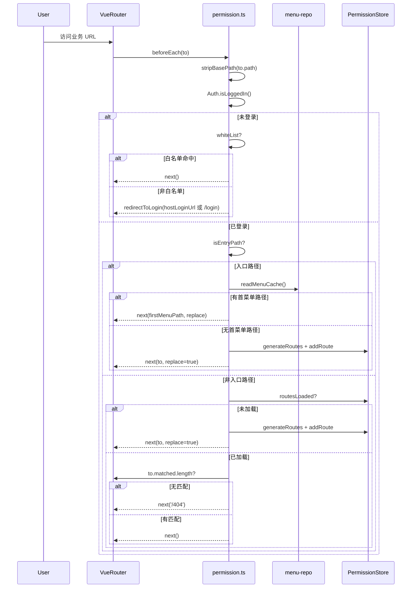

# 状态链路：页面显示链路（登录 → 路由 → 守卫 → 组件）

本文档目标：以“页面能正确显示”为单一链路粒度，描述从用户进入 URL 到目标页面组件渲染完成的关键状态变化、决策点与源码入口。

## 1. 链路边界（MVP）

- **起点**：用户在浏览器访问任意基座页面 URL（入口或业务页）。
- **终点**：目标路由匹配成功、动态路由已注入（如需要）、页面组件可正常渲染；若无权限/无会话则被重定向到登录。

## 2. 链路流程图（sequenceDiagram，简洁版）

## 3. 链路流程图（sequenceDiagram，细节版）

适用场景：简洁版用于解释主链路，细节版用于定位 404、入口落点和白名单判断问题。  
阅读建议：排查时优先核对 `stripBasePath` 和 `to.matched.length` 两个判定点。

## 4. 源码证据（关键节点 → 文件/函数）

- **路由守卫入口**：`src/plugins/permission.ts`
  - `setupPermission()`：注册 `beforeEach/afterEach`
  - `stripBasePath()`：去掉 history base 后再做白名单/入口判断
  - `redirectToLogin()`：构造 hostLoginUrl 或走本地 `/login?redirect=...`
  - `handleAuthenticatedUser()`：路由生成/重进/404/标题注入/异常兜底
  - `resetUserStateAndRedirect()`：异常后 `useUserStore().resetAllState()` 并重定向登录
- **动态路由生成**：`src/store/modules/permission.store.ts`
  - `routesLoaded`：是否已完成动态路由加载
  - `generateRoutes()`：v2 从缓存菜单生成；v1 回退调用角色菜单接口
- **菜单首路径**：`src/utils/menu.ts` / `src/services/menu/menu-repo.ts`
  - `findFirstValidMenuPath()`：首个可用菜单路径
  - `readMenuCache()`：读取缓存菜单

## 5. MVP 验收点（页面显示视角）

- **未登录访问非白名单页**：必定跳转登录（host 登录优先），不会停留在半渲染状态。
- **已登录首次进入口页**：若缓存有菜单首路径，直接 replace；否则生成动态路由后进入默认/首菜单。
- **路由不存在**：`to.matched.length===0` 时稳定跳 `/404`。
- **异常恢复**：守卫抛错时会清理状态并重定向登录，避免“半登录态”。

