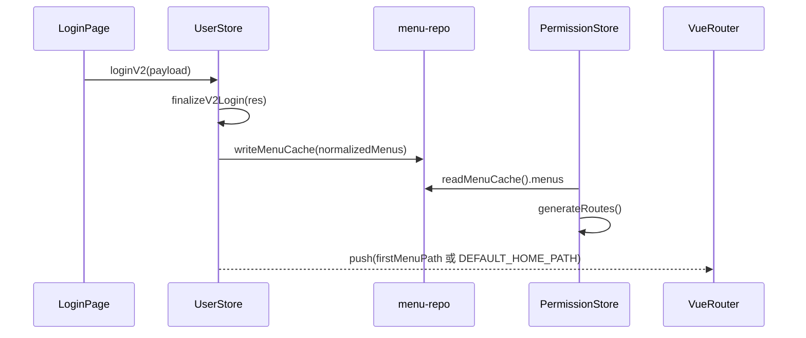
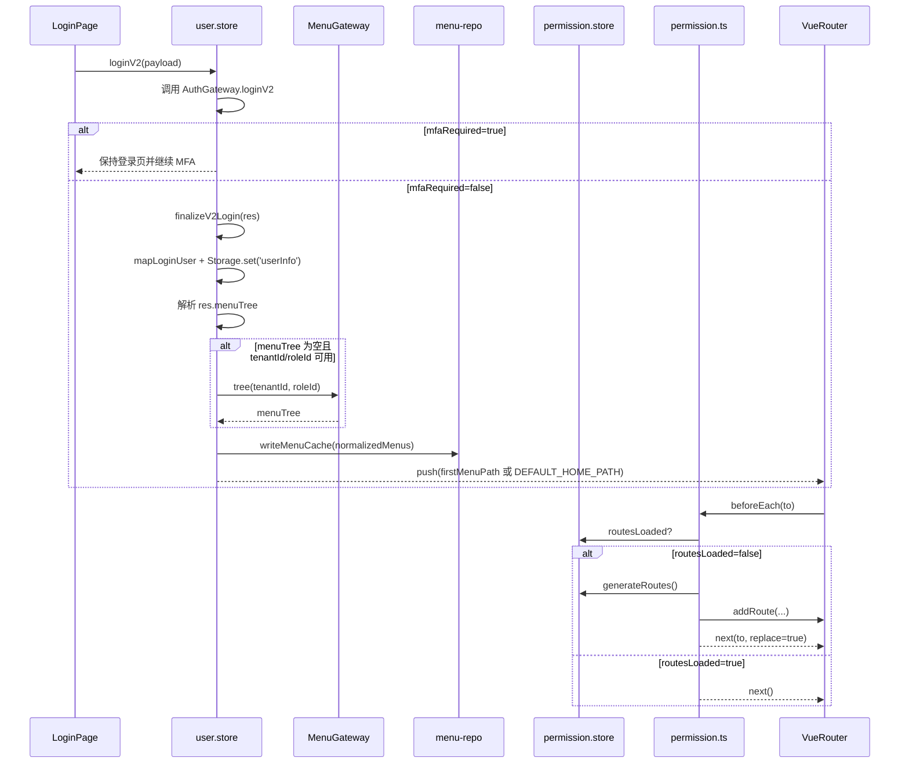

# 状态链路：首次登录状态链路（会话建立 → 首屏显示）

本文档目标：以“首次登录成功后如何稳定到达首屏”为单一链路，描述 `microfb` 从登录响应处理到菜单缓存写入、动态路由注入、页面显示完成的关键时序与异常兜底。

## 1. 链路边界（MVP）

- **起点**：用户完成登录提交并拿到 v2 登录响应（`loginV2`）。
- **终点**：主应用完成 `menuCache` 写入与动态路由可用，浏览器落到首个可访问菜单（或默认首页）。

## 2. 链路流程图（sequenceDiagram，简洁版）

## 3. 链路流程图（sequenceDiagram，细节版）

适用场景：简洁版用于对齐“首次登录主链路”，细节版用于排查“登录成功后白屏/404/未落首屏”。  
阅读建议：排查时优先核对 `mfaRequired` 分支、`writeMenuCache` 是否执行、`routesLoaded` 是否从 false 切到 true。

## 4. 源码证据（关键节点 → 文件/函数）

- `src/store/modules/user/user.store.ts`
  - `loginV2()`：登录主入口，处理 `mfaRequired`。
  - `finalizeV2Login()`：写 `userInfo`、解析菜单、写缓存、跳转首路径。
- `src/services/menu/menu-repo.ts`
  - `writeMenuCache()` / `readMenuCache()`：菜单缓存读写。
- `src/store/modules/permission.store.ts`
  - `generateRoutes()`：从缓存菜单构建动态路由（v2 优先）。
- `src/plugins/permission.ts`
  - `handleAuthenticatedUser()` / `generateAndAddRoutes()`：守卫内动态路由注入与重进。

## 5. MVP 验收点（首次登录视角）

- **首次登录成功（非 MFA）**：应写入 `userInfo` 与 `menuCache`，并跳到首菜单或默认首页。
- **首次进入目标路由**：若 `routesLoaded=false`，应自动触发一次动态路由生成并重进，不应卡在空白页。
- **菜单为空兜底**：菜单为空时仍有默认首页或兜底跳转，不出现无限重定向。

