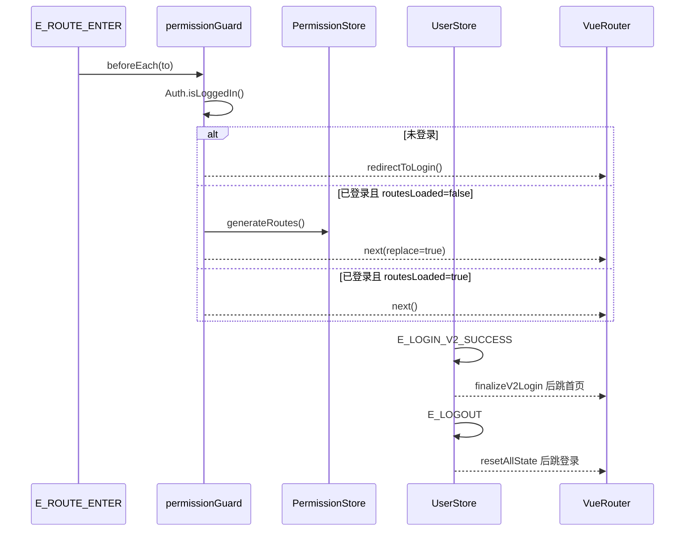
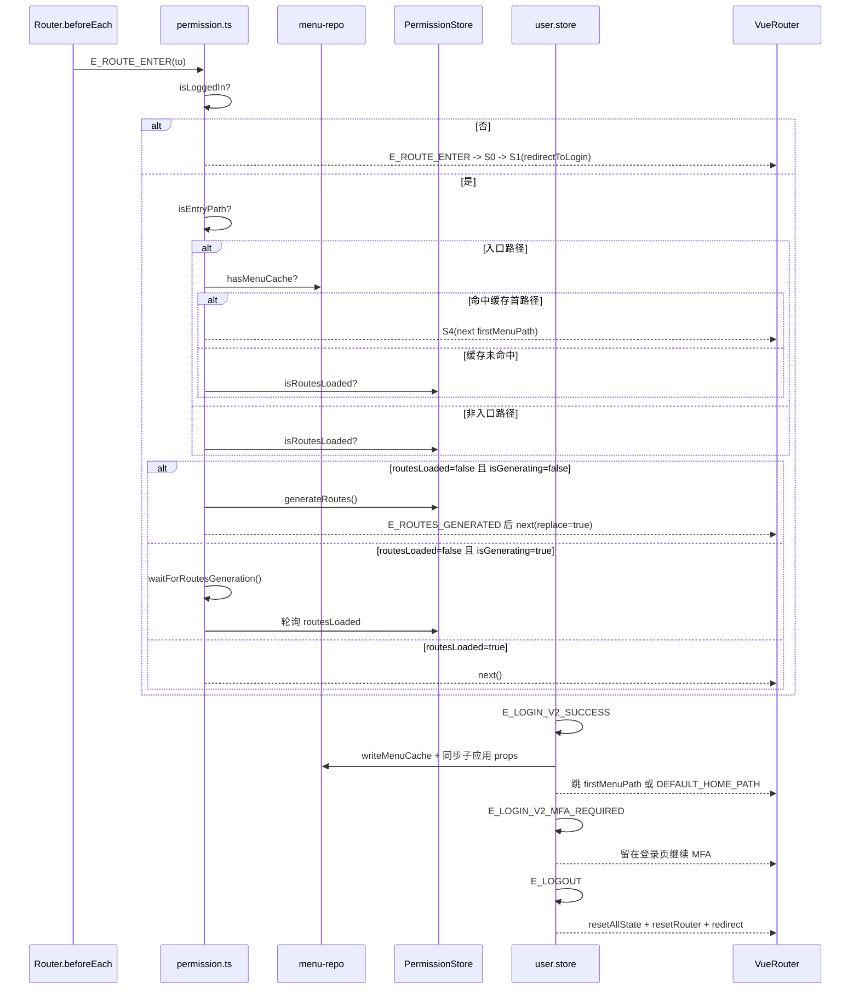

# microfb（基座）MVP：状态驱动说明书（登录 / 会话校验）

本文档目标：把 `microfb` 的“登录态判定 + 路由守卫 + 动态路由生成 + 登录后置初始化”收敛为一份 **状态驱动说明书**。  
原则：复杂交互链路统一使用 **Mermaid `sequenceDiagram`**，并同时提供“简洁版 + 细节版”。

## 1. 范围与非目标（MVP）

- **覆盖**
  - 路由进入时的会话校验：`Auth.isLoggedIn()` 为单一真值来源。
  - 未登录重定向：`redirectToLogin()`（优先 hostLoginUrl，否则 `/login?redirect=...`）。
  - 动态路由生成：`PermissionStore.generateRoutes()` + `router.addRoute(...)`。
  - v2 登录后置初始化：`UserStore.loginV2()` → `finalizeV2Login()`（写入 userInfo、写入 menuCache、同步子应用 props、跳转首个菜单）。
- **不覆盖**
  - 具体登录页表单交互（UI 层）。
  - MFA 细分流程（本说明书把 `mfaRequired` 视为“暂停在登录页面继续验证”的分支）。

## 2. 状态模型（State）

> 这里的“状态”是 **系统级会话与路由可用性状态**，不是某个组件的局部状态。

- **S0 未登录（Unauthenticated）**
  - 判定：`Auth.isLoggedIn() === false`
- **S1 登录重定向中（RedirectingToLogin）**
  - 行为：跳转 hostLoginUrl 或 `/login?redirect=...`
- **S2 已登录但路由未就绪（Authenticated / RoutesNotLoaded）**
  - 判定：`Auth.isLoggedIn() === true && permissionStore.routesLoaded === false`
- **S3 路由生成中（GeneratingRoutes）**
  - 判定：`isGeneratingRoutes === true`（守卫模块级互斥锁）
- **S4 已就绪（Ready）**
  - 判定：`Auth.isLoggedIn() === true && permissionStore.routesLoaded === true`
- **S5 异常恢复中（Recovering）**
  - 行为：`userStore.resetAllState()`，然后重定向登录

## 3. 事件（Event）

- **E_ROUTE_ENTER(to)**：路由进入（`router.beforeEach` 触发）
- **E_LOGIN_V2_SUCCESS(res)**：v2 登录成功且非 MFA
- **E_LOGIN_V2_MFA_REQUIRED(res)**：v2 登录返回 `mfaRequired`
- **E_LOGOUT**：用户登出（或被动触发登出逻辑）
- **E_ROUTES_GENERATED(dynamicRoutes)**：动态路由生成成功
- **E_ERROR(error)**：守卫/生成路由/后置初始化发生异常

## 4. 状态迁移图（sequenceDiagram，简洁版）

## 5. 状态迁移图（sequenceDiagram，细节版）

适用场景：简洁版用于业务评审，细节版用于排障与回归验证。  
阅读建议：先按事件名对齐状态，再按细节版检查守卫分支是否覆盖。

## 6. 迁移规则（Guard）与副作用（Effect）

### 5.1 路由守卫（会话校验）
- **Guard G1：是否登录**
  - **判定**：`Auth.isLoggedIn()`  
  - **源码**：`src/plugins/permission.ts`（`beforeEach`）
- **Effect A1：未登录重定向**
  - **行为**：`redirectToLogin(to,next)`：优先 `buildHostLoginUrl(redirect)`，否则 `next(/login?redirect=...)`
  - **源码**：`src/plugins/permission.ts`（`redirectToLogin`）

### 5.2 动态路由生成（RoutesNotLoaded → Ready）
- **Guard G2：routesLoaded**
  - **判定**：`permissionStore.routesLoaded`
  - **源码**：`src/plugins/permission.ts`（`handleAuthenticatedUser`）
- **Effect A2：generateAndAddRoutes**
  - **行为**：`permissionStore.generateRoutes()` → `router.addRoute(route)`
  - **互斥**：`isGeneratingRoutes` + `waitForRoutesGeneration()`（50ms 轮询，5s 超时兜底）
  - **源码**：`src/plugins/permission.ts`（`generateAndAddRoutes` / `waitForRoutesGeneration`）
- **Effect A3：入口路径落点**
  - **行为**：从 `readMenuCache().menus` 找 `findFirstValidMenuPath`，找不到则 `DEFAULT_HOME_PATH`
  - **源码**：`src/plugins/permission.ts`（`resolveEntryMenuPath` / `handleAuthenticatedUser`）

### 5.3 v2 登录后置初始化（Login success → Ready）
- **Effect A4：finalizeV2Login**
  - **行为（按顺序）**
    - `mapLoginUser(res)` → `Storage.set("userInfo")` → `userInfo.value = Storage.get(...)`
    - 从 `res.menuTree` 解析菜单；为空则调用 `MenuGateway.tree(...)` 兜底（需 tenantId/roleId）
    - `writeMenuCache(normalizedMenus)`
    - 遍历 enabled appConfigs：`setMicroAppProps(app.name,{menuList,menuVersion,userInfo})`
    - 跳转 `firstMenuPath` 或 `DEFAULT_HOME_PATH`
  - **源码**：`src/store/modules/user/user.store.ts`（`finalizeV2Login`）
- **Guard G3：MFA required**
  - **判定**：`res?.mfaRequired`
  - **行为**：不做后置初始化，交给登录页继续 MFA
  - **源码**：`src/store/modules/user/user.store.ts`（`loginV2`）

### 5.4 异常恢复（任何状态 → 重置 → 重定向）
- **Effect A5：resetUserStateAndRedirect**
  - **行为**：`userStore.resetAllState()`；若可构造 hostLoginUrl 则 hard redirect；否则 `next(LOGIN_PATH)`
  - **源码**：`src/plugins/permission.ts`（`resetUserStateAndRedirect`）

### 5.5 登出（Ready → Unauthenticated）
- **Effect A6：logout（后端失败不阻塞前端解散）**
  - **行为（摘要）**
    - 调 `AuthGateway.logout()`（失败仅 warn，不影响后续）
    - `resetAllState()` + `permissionStore.resetRouter()` + 清空所有 enabled 子应用 props（含 `forceReloadToken`）
    - 优先跳 hostLoginUrl，否则 qiankun 下 reload，否则 `router.push(LOGIN_PATH)`
  - **源码**：`src/store/modules/user/user.store.ts`（`logout`）

## 7. 验收清单（MVP）

- **未登录访问任意非白名单页**：应稳定重定向到 host 登录或本地 `/login`，不会出现路由死循环。
- **已登录首次进入入口页**：若 menuCache 有首路径，直接 replace 到首路径；否则生成动态路由后落到首路径/默认页。
- **并发导航**：快速切换路由时，不应触发重复生成路由导致异常（`isGeneratingRoutes` 互斥生效）。
- **登录成功（非 MFA）**：应写入 userInfo、写入 menuCache、同步子应用 props，并跳转到首菜单。
- **登出**：无论后端登出是否成功，前端都必须清理本地状态并跳到登录页（或 host 登录页）。

