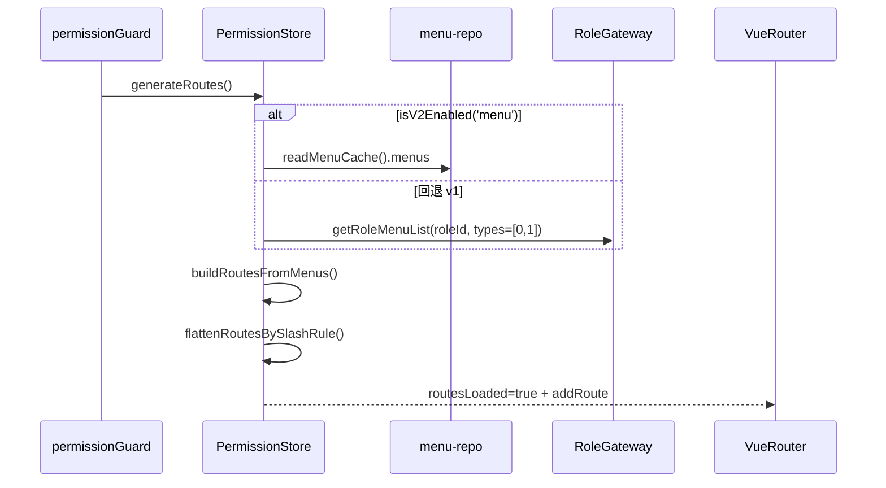
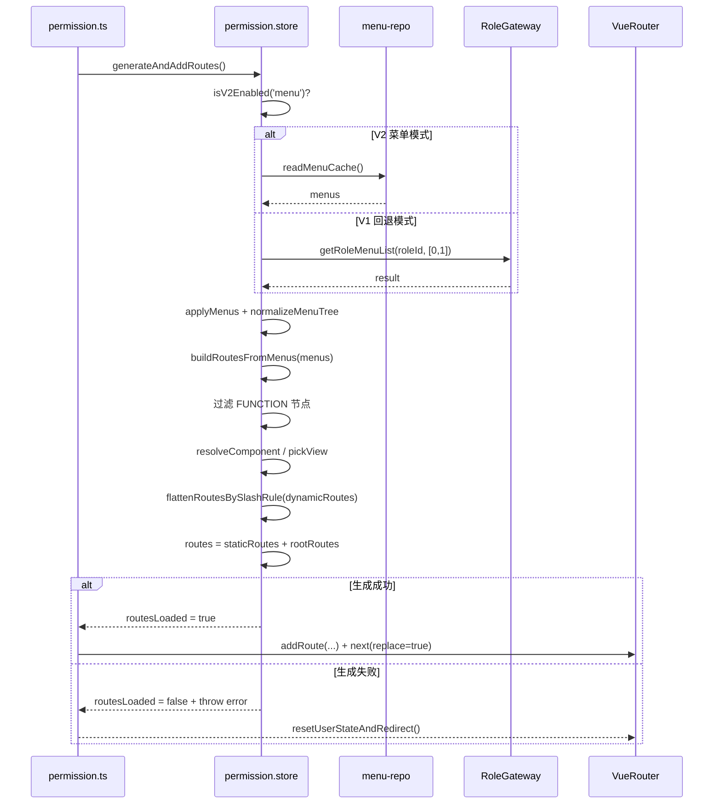

# 说明文档：菜单模型与动态路由生成（microfb）

本文档目标：说明 `microfb` 如何把“后端菜单树/缓存菜单”转换为“前端动态路由”，以及关键规则（可见性/类型/组件解析/扁平化/回退策略）。该文档用于避免改菜单字段或路由生成逻辑时引入 404/白屏/路由层级错误。

## 1. 核心结论（MVP）

- **v2 优先、v1 回退**：`PermissionStore.generateRoutes()` 优先走 v2 菜单缓存（`readMenuCache()`），当 `isV2Enabled('menu')` 关闭时回退 `RoleGateway.getRoleMenuList`。
- **功能项不能生成路由**：菜单类型为 `FUNCTION` 会被过滤/拒绝进入路由生成器（否则会抛错）。
- **顶层统一挂 Layout**：`buildRoutesFromMenus()` 仅将 `parentId=0` 的菜单作为一级路由，并统一挂载 Layout 容器。
- **最终注入的是“rootRoutes”**：生成的动态路由会经过 `flattenRoutesBySlashRule()` 进行“展示/提升”规则处理后，与静态路由合并成 `routes`。

## 2. 数据输入/输出

- **输入**：菜单树数组 `menus: any[]`
  - 可能来自：
    - v2：`readMenuCache().menus`
    - v1：`RoleGateway.getRoleMenuList(...).result`
- **输出**：
  - `dynamicRoutes`：按菜单层级生成的路由树（未扁平化）
  - `rootRoutes`：按斜杠规则扁平化/提升后的路由列表（用于与静态路由合并）

## 3. 路由生成主流程图（sequenceDiagram，简洁版）

## 4. 路由生成主流程图（sequenceDiagram，细节版）

适用场景：简洁版用于说明“v2 优先、v1 回退”主线；细节版用于定位组件解析、路由注入和异常回退问题。  
阅读建议：先核对数据来源分支，再核对 build/flatten/addRoute 三段执行顺序。

## 5. 菜单字段与可见性/类型规则

### 4.1 可见性（visible / isVisible / enable 混用）

- `isMenuVisible(menu)` 会把 `visible/isVisible/enable` 归一化为可见/隐藏。
- `normalizeMenuTree(nodes)` 会对菜单树做字段补齐与归一化（建议所有外部菜单数据先走归一化）。

**源码证据**

- `src/utils/menu-visibility.ts`
  - `normalizeVisible()` / `isMenuVisible()` / `normalizeMenuTree()`

### 4.2 菜单类型（MENU/DIRECTORY/PAGE/FUNCTION）

- `normalizeMenuType(rawType, fallback)` 仅接受语义枚举值；
- `FUNCTION` 类型：
  - 在 `walk()` 里会被过滤掉（`!isFunctionType(n)`）
  - 若进入 `resolveComponent` 仍会抛错（双保险）

**源码证据**

- `src/utils/menu-visibility.ts`：`normalizeMenuType()`
- `src/store/modules/permission.store.ts`：`buildRoutesFromMenus()` / `resolveComponent()`

## 6. 组件解析规则（component/routePath → views 模块）

### 5.1 pickView 的候选路径规则

后端可能给：
- `component` 或 `routePath`
- 值形如：`system/user`、`/system/user`、`system/user/index`

`pickView(raw)` 的策略：

- 去掉前导 `/`
- 不以 `.vue` 结尾时，补齐为 `xxx/index.vue`
- 生成候选路径：
  - `p`
  - 若以 `system/` 开头：追加 `p.slice('system/'.length)`；否则追加 `system/${p}`
- 在 `import.meta.glob('/src/views/**/*.vue')` 的模块映射中匹配到即使用，否则回退到 `@/views/error/404.vue`

**源码证据**

- `src/store/modules/permission.store.ts`
  - `const viewModules = import.meta.glob('/src/views/**/*.vue') ...`
  - `pickView()` / `resolveComponent()`

## 7. 路由扁平化/提升规则（flattenRoutesBySlashRule）

`flattenRoutesBySlashRule(dynamicRoutes)` 的目标：对“顶层是否展示”做规则处理，保证侧边栏与路由层级可控。

- **展示顶层**：当 `String(route.name).startsWith('/')` 时
  - 顶层 route 保留；必要时补 Layout 容器（`needsLayout`）
- **不展示顶层**：否则把子路由“提升为根”
  - 子路由 path 通过 `ensureRootPath()` 强制以 `/` 开头
  - 必要时补 Layout 容器

**源码证据**

- `src/store/modules/permission.store.ts`
  - `flattenRoutesBySlashRule()` / `ensureRootPath()` / `needsLayout()`

## 8. 生成失败与回退策略

- **v1 回退失败**：`RoleGateway.getRoleMenuList` 失败会：
  - 打印错误
  - `routesLoaded=false`
  - reject error（由上层守卫捕获并走恢复策略）

**源码证据**

- `src/store/modules/permission.store.ts`：`fallbackToV1().catch(...)`
- `src/plugins/permission.ts`：`handleAuthenticatedUser catch → resetUserStateAndRedirect`

## 9. 验收点（路由生成视角）

- **菜单包含 FUNCTION**：不会生成路由；且不应导致整个生成器崩溃。
- **菜单隐藏节点**：`visible/isVisible/enable` 任一字段变化都能得到一致的可见性结果。
- **组件映射失败**：应回退 404 视图，而不是白屏。
- **v2 缓存为空**：动态路由为空时仍能走默认首页或 404（取决于静态路由是否覆盖）。

