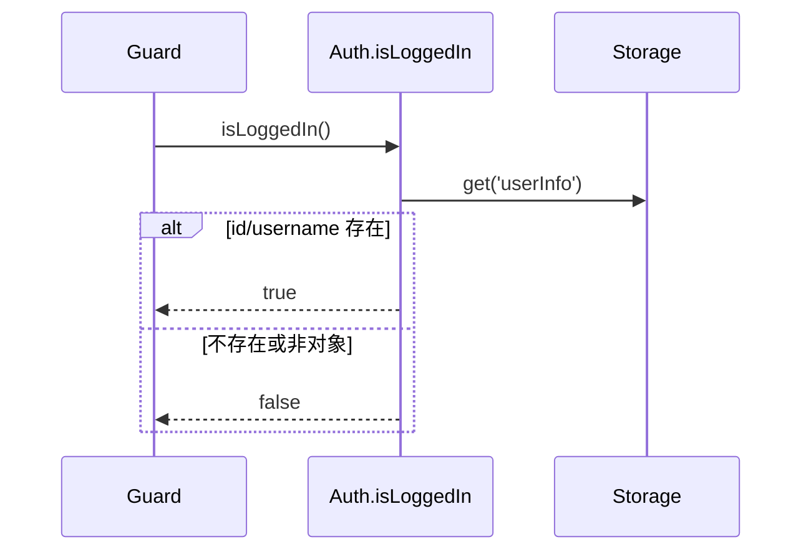
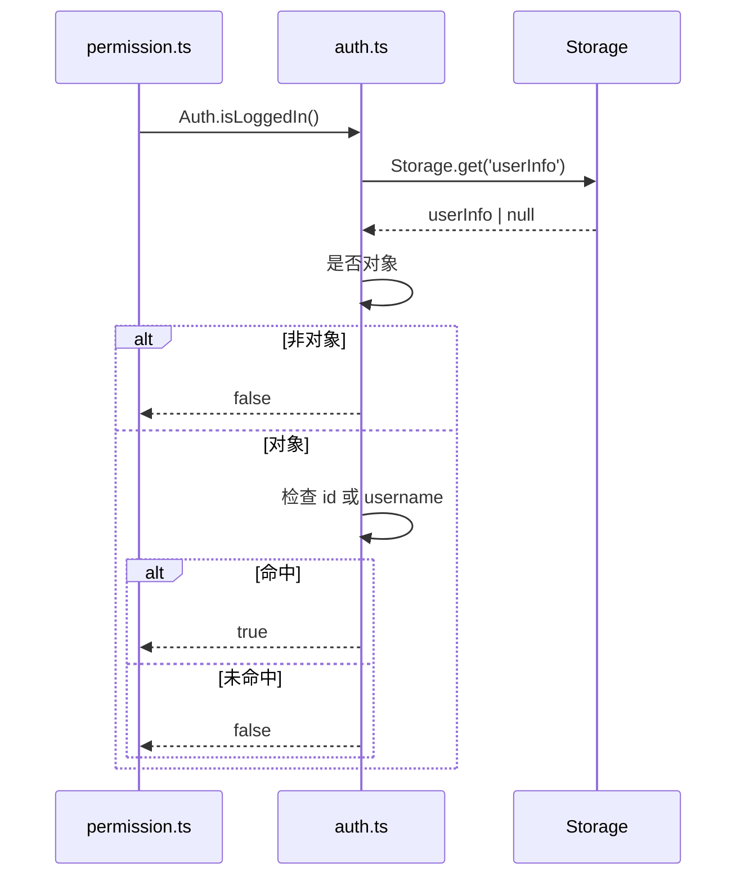

# 说明文档：鉴权与会话语义（Cookie-Session 与本地信号）

本文档目标：说明 `microfb` 在 Cookie-Session 模式下如何判断“是否已登录”、登录/登出时本地状态如何读写、以及守卫异常时如何恢复，避免团队成员误把它当成“JWT token 模式”来理解与改造。

## 1. 核心结论（MVP）

- **会话语义**：后端使用 HttpOnly Cookie 维护会话；前端无法读取 Cookie，因此 **登录态判定必须依赖本地信号**。
- **单一判定点**：`Auth.isLoggedIn()` 是守卫使用的登录态真值来源。
- **本地信号来源**：`Storage.get('userInfo')` 的 `id/username` 是否存在。

## 2. 登录态判定规则（sequenceDiagram，简洁版）

## 3. 登录态判定规则（sequenceDiagram，细节版）

适用场景：简洁版用于理解登录态真值来源，细节版用于排查“Cookie 还在但前端判未登录”问题。  
阅读建议：登录态误判时优先检查 `userInfo` 写入与字段完整性。

**源码证据**

- `src/utils/auth.ts`
  - `Auth.isLoggedIn()`：读取 `Storage.get<UserInfo|null>('userInfo')` 并判定 `id/username`

## 4. 登录成功后：本地写入点（v2）

- `UserStore.loginV2(payload)`：调用 `AuthGateway.loginV2`，若 `mfaRequired` 则提前返回（不写入本地状态）
- `UserStore.finalizeV2Login(res)`：完成以下写入/同步：
  - `Storage.set('userInfo', mapLoginUser(res))`
  - `writeMenuCache(normalizedMenus)`
  - 对所有 enabled 子应用 `setMicroAppProps(app, { menuList, menuVersion, userInfo })`
  - 跳转首菜单/默认首页

**源码证据**

- `src/store/modules/user/user.store.ts`
  - `loginV2()` / `finalizeV2Login()`

## 5. 登出：强解散策略（后端失败不阻塞）

登出链路要保证“前端立即解散”，因此后端 `logout` 失败只记录告警，不阻塞本地清理与跳转：

- `AuthGateway.logout().catch(...).finally(afterLogout)`
- `resetAllState()`：
  - `Storage.remove('userInfo')` / `Storage.sessionRemove('userInfo')`
  - `clearMenuCache()`
- `permissionStore.resetRouter()`：移除动态路由
- 清空子应用 props（避免串权）
- 跳 host 登录 / qiankun reload / 本地 login 兜底

**源码证据**

- `src/store/modules/user/user.store.ts`：`logout()` / `resetUserState()`

## 6. 守卫异常恢复

当守卫逻辑抛错时，会执行“清状态 → 重定向登录”的恢复策略，避免半登录态：

- `useUserStore().resetAllState()`
- `redirectToLogin()`（优先 hostLoginUrl，否则本地 `/login`）

**源码证据**

- `src/plugins/permission.ts`：`handleAuthenticatedUser catch` → `resetUserStateAndRedirect()`

## 7. 验收点（会话语义视角）

- **Cookie-Session 下刷新页面**：只要本地 `userInfo` 仍在，就应被识别为“已登录”；清理 `userInfo` 后必须被识别为“未登录”。
- **MFA required**：出现 `mfaRequired` 时不应写入 `userInfo/menuCache`，避免误判为已登录。
- **后端登出失败**：前端仍能完成登出（清状态 + 跳转），不会卡在旧权限。

