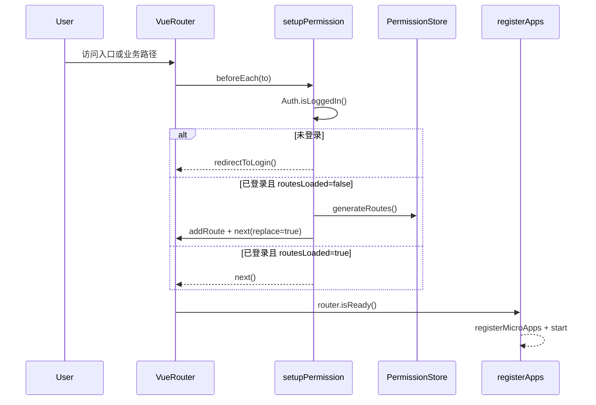
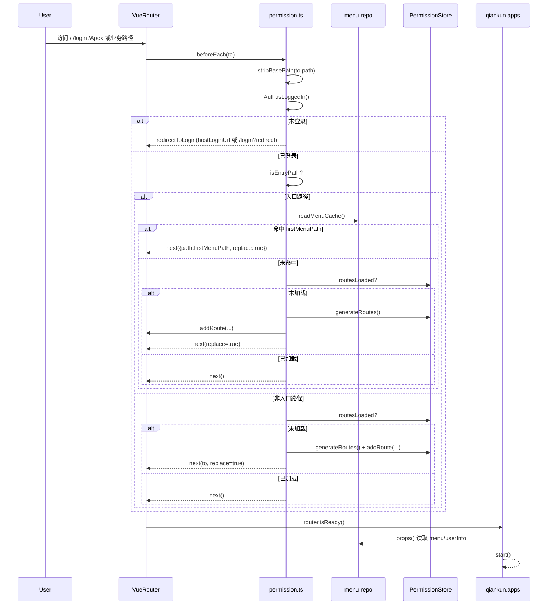

# microfb（基座）MVP：运行时拓扑（登录 → 会话校验 → 首屏/子应用）

本文档目标：用一张“运行时场景图”把 `microfb` 从进入页面到可用首屏的关键交互讲清楚，并与源码入口一一对应。

## 1. 场景定义（MVP）

- **场景名**：已登录用户进入基座入口（`/` / `/cloud` / `/Apex` 等）后，自动落到第一个可用菜单，并确保动态路由已注入；随后启动 qiankun 以便挂载子应用。
- **关键约束**：
  - 路由 `history.base` 由 `VITE_APP_BASE` 决定（`getAppBase()`）。
  - `router.isReady()` 之后再 `registerApps()`（避免容器未渲染）。
  - v2 菜单默认从缓存读取（`menu-repo`），v1 作为回退。

## 2. 运行时拓扑（sequenceDiagram，简洁版）

## 3. 运行时拓扑（sequenceDiagram，细节版）

适用场景：简洁版用于评审入口链路，细节版用于定位“入口落点/路由注入/缓存命中”问题。  
阅读建议：先看简洁版确认主线，再按细节版核对每个分支的源码落点。

## 4. 源码证据（入口与关键函数）

- **启动顺序与 qiankun 启动时机**：`src/main.ts`
  - `setupPermission()` 先注册守卫
  - `router.isReady().then(registerApps)`
- **守卫逻辑（入口落点/路由生成/异常重置）**：`src/plugins/permission.ts`
  - `stripBasePath()` 去除 base 后参与判断
  - `resolveEntryMenuPath()` 从 `menu-repo` 找首个可用菜单
  - `permissionStore.routesLoaded` 决定是否生成并注入动态路由
  - 出错后 `useUserStore().resetAllState()` 并重定向登录
- **动态路由生成策略（v2 缓存优先、v1 回退）**：`src/store/modules/permission.store.ts`
  - `isV2Enabled("menu")` 为 true 时直接用缓存菜单
  - 否则调用 `RoleGateway.getRoleMenuList` 获取菜单
- **子应用注册与 props 透传**：`src/plugins/qiankun/apps.ts`
  - `props: () => ({ menuList, menuVersion, userInfo, routerBase, ... })`
  - `applyApexDevAutoFallback()` 在 dev 自动选择 dynamic/static entry

## 5. MVP 风险点（先记录，后续再固化规则/监控）

- **菜单缓存为空**：入口路径会回退到 `DEFAULT_HOME_PATH`，但若动态路由尚未生成可能出现短暂 404（需要结合 `routesLoaded` 与 reload 逻辑观察）。
- **并发生成路由**：守卫用 `isGeneratingRoutes + waitForRoutesGeneration()` 做了互斥与超时兜底（5s）。
- **base 前缀一致性**：守卫使用 `stripBasePath()` 避免 `/cloud` 等前缀干扰路径判断；需要确保所有“常量路径”以“去 base 后”的业务路径表达。

