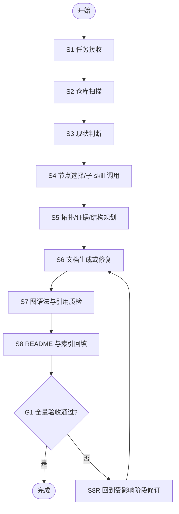
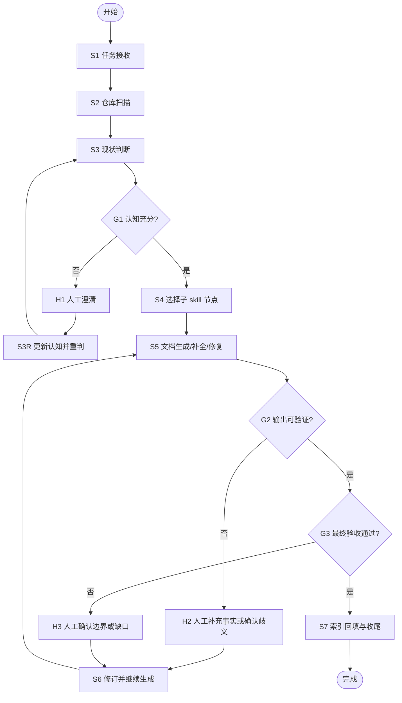

# 基于源码生成文档 Agent Skill

## 适用场景

- 用户希望基于仓库源码生成一套可维护的文档，而不是临时写一篇说明。
- 任务需要先观察仓库结构、现有文档、关键源码证据，再决定文档范围和写法。
- 任务可能需要多轮提问、确认、补证据，而不是一次性线性完成。
- 任务涉及架构说明、模块说明、状态链路、运行流程、README 或索引维护中的一种或多种。

## 不适用场景

- 只是补一段一次性说明，不需要形成文档体系。
- 没有源码依据，只希望凭经验或想象写文档。
- 本质是功能开发、调试代码或单纯润色文案，而不是“基于源码产出文档”。

## 输入契约

至少要拿到以下输入；缺失时先进入人工澄清，不允许硬猜：

- `仓库根目录`
- `目标输出目录`
- `文档目标`
- `输出粒度`
- `目标受众`
- `已有文档范围`
- `是否允许人工交互`
- `resumeFromState`（可选）

## Agent 工作循环

每一轮都遵循同一套最小循环：

1. 观察：扫描仓库结构、现有文档、关键源码证据、模板与 few-shot。
2. 判断：确认当前认知是否足以继续。
3. 执行：选择合适的子 skill 节点推进当前阶段。
4. 验证：检查产物、证据链、图语法、索引和目标覆盖度。
5. 收敛或提问：
   - 若信息充分，进入下一阶段。
   - 若存在歧义、冲突或关键事实缺失，先向人提问，再基于回答进入下一轮。

每一轮必须显式输出：

- `currentUnderstanding`
- `routingOrExecutionDecision`
- `missingFacts`
- `humanQuestions`
- `selectedSubskills`
- `artifactsPlan`
- `gates`
- `rollbackMap`
- `nextIterationAction`

## 理想单轮完成图

以下状态机描述的是“信息充分时的一次完成路径”，是理想态，不是默认现实。

## 真实多轮迭代图

以下状态机描述真实工作方式。任一阶段发现认知不足，都允许转入人工澄清并继续下一轮。

## 人工介入门禁

以下情况必须先问人，禁止硬猜：

- 仓库入口、模块边界、运行入口或关键调用链不清楚。
- 现有文档与源码证据冲突，且无法仅靠仓库事实裁决。
- 存在多个合理解释，无法排除其一。
- 输出目录、目标受众、章节粒度、交付范围不明确。
- 图类型、章节结构、主题拆分存在高歧义。
- 模板锚点缺失，或 few-shot 不能覆盖当前任务。
- 当前阶段继续执行会明显改变产物结构，但 agent 没有足够依据做该决定。

提问规则：

- 只问会改变执行路径的关键问题。
- 必须说明“为什么当前不能继续猜”。
- 收到回答后，先更新 `currentUnderstanding`，再进入下一轮。

## 子 skill 调用规则

父级 skill 是 agent，不是固定流水线执行器。每轮根据当前状态选择最小必要节点：

1. `子技能路由决策`
2. `架构拓扑映射`
3. `源码符号定位`
4. `文档结构规划`
5. `源码证据抽取`
6. `图类型判定`
7. `文档内容生成`
8. `Mermaid图语法修复`
9. `最佳实践同步`
10. `README索引维护`

调用原则：

- 不默认串行跑完整条链。
- 先走最小必要路径，再根据验证结果追加节点。
- 子 skill 如果发现事实不足，必须回退到人工澄清，而不是补脑补全。
- `template/microfb/` 只作为 few-shot 和历史案例，不再作为默认输入来源。

## 关键约束

- 每份核心文档都要落到源码证据，而不是抽象描述。
- 需要出图时，必须先做图类型判断，再做图语法质检。
- 生成多文件体系时，README 或主题索引必须可导航到产物。
- 人工澄清是标准能力，不是异常兜底。
- 父级 `template/microfb/` 是真实 few-shot 成品；子 skill 的模板必须从这套成品中拆出真实试跑输入/输出，不允许只留占位说明。
- 子 skill 的 `真实输出.md` 必须保留必要的真实片段，不能只有摘要结论。
- 子 skill 的 `来源摘录.md` 必须明确写出消费了父级哪份真实案例材料。
- 子 skill 的 `产物快照.md` 必须是格式样板，而不是检查提示。

## RED

- 如果没有该 skill，agent 常见失败包括：
  - 直接按经验写文档，不先扫仓库。
  - 只写正文，不维护索引。
  - 遇到歧义时硬猜模块边界或输出结构。
  - 明明需要多轮澄清，却假设自己一次就能收敛。

## GREEN

- 首次交付必须至少具备：
  - 中文 frontmatter
  - 双状态机：理想单轮图 + 真实多轮图
  - 明确输入/输出契约
  - 人工介入门禁
  - 子 skill 调用原则
  - few-shot 与模板职责说明

## REFACTOR

- 如果 agent 仍然跳过提问，就继续收紧“禁止硬猜”规则。
- 如果 skill 被误触发到非源码文档任务，就收紧适用场景和 description。
- 如果输出结构不稳定，就把稳定样例下沉到 `assets/` 或 `template/`。
- 如果子 skill 仍然各自为战，就继续补统一契约和回退规则。
