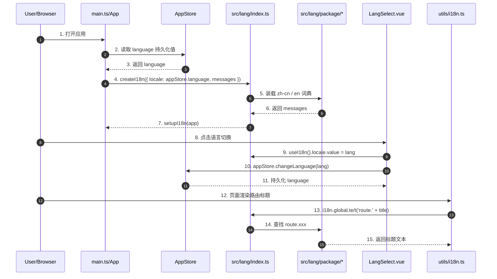

# microfb I18n Chain

## Scope

本示例只覆盖 `microfb` 当前旧 i18n 方案的两条核心链路：

- 应用初始化时加载旧 runtime
- 顶部语言切换组件修改语言值并驱动后续组件取词

## Sequence Diagram

## Participant Anchors

| 图中变量 | 浏览器/运行时中是什么 | 源码定位 | 关键变量/函数 | 说明 |
| --- | --- | --- | --- | --- |
| `APP` | 应用启动与插件注册层 | `microfb/src/main.ts`, `microfb/src/App.vue` | `setupI18n(app)` | 负责注册旧 i18n runtime |
| `AS` | Pinia 应用 store | `microfb/src/store/modules/app.store.ts` | `language`, `changeLanguage()` | 持久化语言值 |
| `IR` | 旧 i18n runtime | `microfb/src/lang/index.ts` | `createI18n()`, `setupI18n()` | 运行时翻译入口 |
| `LP` | 旧 TS 语言包 | `microfb/src/lang/package/zh-cn.ts`, `microfb/src/lang/package/en.ts` | `route`, `login`, `navbar` | 词条资产来源 |
| `LS` | 顶部语言切换组件 | `microfb/src/components/LangSelect/index.vue` | `useI18n()`, `handleLanguageChange()` | 同时修改 runtime 与 store |
| `RH` | 非组件路由标题 helper | `microfb/src/utils/i18n.ts` | `translateRouteTitle()` | 直接依赖 `i18n.global.t` |

## Variable Anchors

| 字段/符号 | 运行时含义 | 源码定位 | 关键变量/函数 |
| --- | --- | --- | --- |
| `language` | 当前语言持久化值 | `microfb/src/store/modules/app.store.ts` | `const language = useStorage("language", defaultSettings.language)` |
| `messages` | 旧语言包聚合对象 | `microfb/src/lang/index.ts` | `const messages = { "zh-cn": ..., en: ... }` |
| `locale.value` | 运行时当前语言 | `microfb/src/components/LangSelect/index.vue` | `const { locale } = useI18n()` |
| `translateRouteTitle()` | 路由标题翻译 helper | `microfb/src/utils/i18n.ts` | `i18n.global.te/t("route." + title)` |

## Risks

- 语言状态同时存在于 `useI18n().locale.value` 和 `appStore.language`，属于双写链路。
- 非组件 helper 直接依赖 `i18n.global.t`，退化时必须优先脱钩。
- 语言包是旧 TS 嵌套对象，迁移到新 JSON 方案时需要平铺或重建 key 策略。
