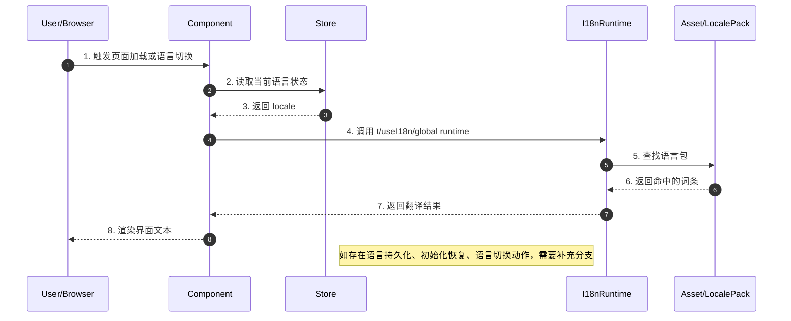

# Sequence Diagram Template

```mermaid
sequenceDiagram
  autonumber
  participant U as User/Browser
  participant C as Component
  participant S as Store
  participant R as I18nRuntime
  participant A as Asset/LocalePack

  U->>C: 1. 触发页面加载或语言切换
  C->>S: 2. 读取当前语言状态
  S-->>C: 3. 返回 locale
  C->>R: 4. 调用 t/useI18n/global runtime
  R->>A: 5. 查找语言包
  A-->>R: 6. 返回命中的词条
  R-->>C: 7. 返回翻译结果
  C-->>U: 8. 渲染界面文本

  Note right of S: 如存在语言持久化、初始化恢复、语言切换动作，需要补充分支
```

## Rules

- 使用 `sequenceDiagram`
- 打开 `autonumber`
- 参与者命名保持稳定
- `alt / else` 表达互斥分支
- `Note` 只说明条件，不新增执行链
