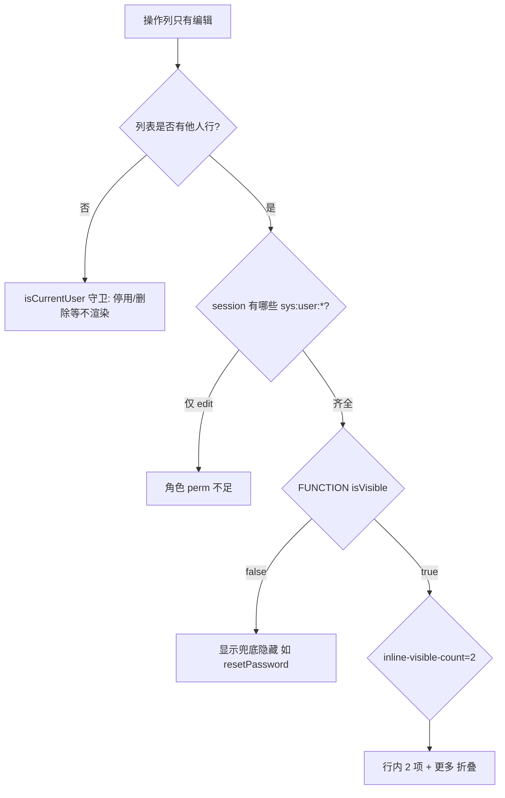

# 用户列表操作列与权限排查

## 判定链（唯一真相源）

`apex_dev/src/directive/permission/index.ts` → `checkHasPerm`

1. 未传 `perm` → 显示
2. **`isOwner` → 直接通过**（跳过角色 perm 与 FUNCTION 显示兜底）
3. 角色 `perms` 未命中 → 隐藏
4. 角色命中 → FUNCTION 显示兜底（`isVisible` / `isSystemOnly`，无缓存 fail-closed）

数据源：`menu/detail`、`menu/list`、`menu/tree`（**不信任**本地路由树上的 `isVisible` 做兜底，仅用于找 `menuId`）。

## UserTable 绑定（与菜单 YAML 对齐）

| OpItem | perm |
|--------|------|
| 编辑 | `sys:user:edit` |
| 停用 | `sys:user:lock` |
| 启用 | `sys:user:unlock` |
| 重发激活 | `sys:user:resendActivation` |
| 重置密码 | `sys:user:resetPassword` |
| 删除 | `sys:user:delete` |

参考：`docs/menu/0601菜单树_20260601084145.yaml`

## 「只有编辑」排查顺序



## OperationColumn

- `inline-visible-count="2"`：行内最多 2 个 OpItem，其余进「更多」
- 若整行可渲染 OpItem **只有 1 个**（如仅编辑），**不会出现「更多」**

## isCurrentUser 与 selectable

- **操作列** `v-if="!isCurrentUser(row.id)"`：本人行隐藏停用/删除/重置密码等
- **复选框** `:selectable="(row) => !isCurrentUser(row.id)"`：防批量删自己（独立防线）
- 临时注释 `TEMP` 仅用于权限验证，**测完恢复**

## 单测入口

- `src/directive/__tests__/hasPerm.test.ts`
- `src/directive/__tests__/userTableOpPermDiagnostic.test.ts`
- `src/directive/__tests__/userTableCurrentUserRow.test.ts`

## OpenCLI 诊断 eval 片段

在用户页已打开时：

```javascript
(() => {
  const me = JSON.parse(sessionStorage.getItem('userInfo') || '{}');
  const perms = (me.permissions || me.perms || []).filter(p => p.startsWith('sys:user:'));
  const rows = [...document.querySelectorAll('.el-table__body tbody tr')].map(tr => ({
    userName: tr.cells[1]?.innerText?.trim(),
    ops: [...tr.querySelectorAll('.operation-column-op-item')]
      .filter(el => !el.classList.contains('operation-column-op-item--hidden'))
      .map(el => el.dataset.opLabel),
    hasMore: !!tr.querySelector('.operation-column-more-trigger'),
  }));
  return JSON.stringify({ me: me.userName, perms, rows }, null, 2);
})()
```
