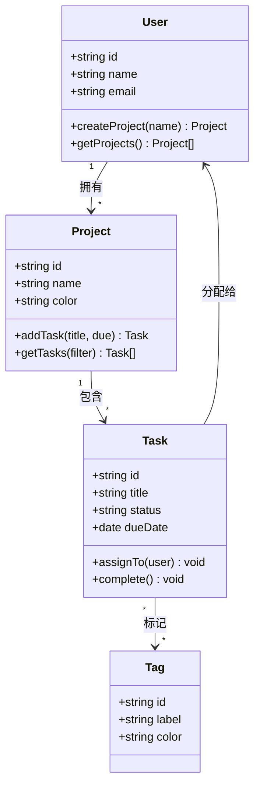

# Mermaid classDiagram — 真实输出

**触发：** "画一个 TODO 应用的核心模型类图，包括用户、项目和任务"  
**来源：** 基于典型 DDD 分层架构的真实项目模型层

**窄版规则验证：**
- ✅ 无方向声明（classDiagram 默认竖排布局）
- ✅ 节点文字 ≤ 15 中文字（最长"createProject(name) Project" 为英文，按 token 计无溢出）
- ✅ 类名 ≤ 10 字（User / Project / Task / Tag）
- ✅ 关系分支 ≤ 4 条（共 4 条关系线）
- ✅ 无内联 style，依赖 Obsidian 主题自动适配
