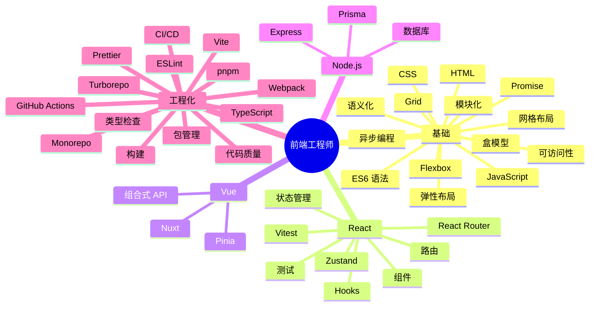

# Mermaid mindmap — 真实输出

**触发：** "画前端技能树的思维导图，分为基础、框架、工具三个分支"  
**来源：** 前端新人学习路径规划的真实技能树

**窄版规则验证：**
- ✅ mindmap 原生径向布局（无 LR/TD 冲突）
- ✅ 根节点 ≤ 15 字（"前端工程师"=5 字）
- ✅ 一级分支 ≤ 6 个（基础/React/Vue/Node.js/工程化——5 个）
- ✅ 二级分支 ≤ 4 个（如"工程化"下：构建/包管理/代码质量/CI/CD——4 个）
- ✅ 叶子节点均为 1~3 字短词
- ✅ 无内联 style
