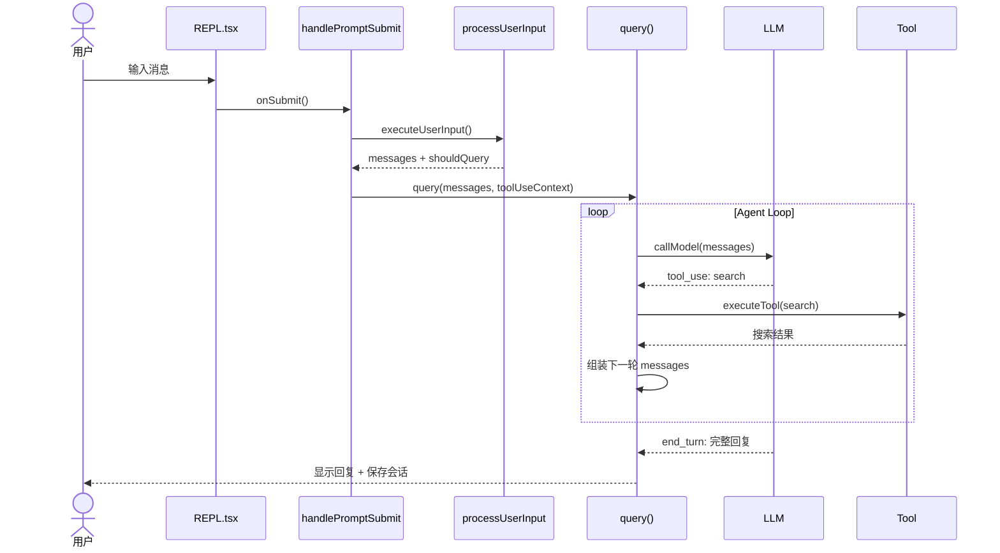

# Mermaid sequenceDiagram — 真实输出

**触发：** "画用户输入到 Agent 回复的时序图"  
**来源：** 基于 craft-agents-oss `query.ts` 的 Agent Loop 12 步链路

````markdown

````

**来源：** 此图直接对应 craft-agents-oss 的源码链路：`REPL.tsx` → `handlePromptSubmit.ts` → `processUserInput.ts` → `query.ts`。
