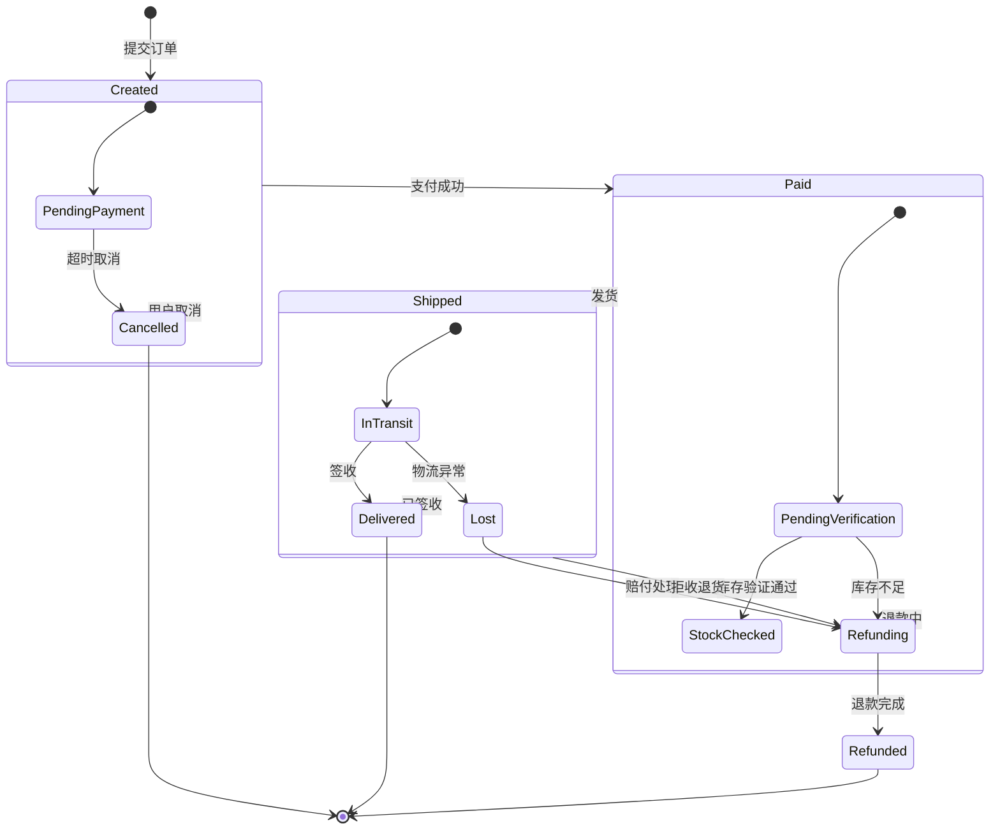

# Mermaid stateDiagram-v2 — 真实输出

**触发：** "画订单从创建到完成的完整状态转换图"  
**来源：** 电商订单履约系统的真实状态机设计

**窄版规则验证：**
- ✅ 无 `LR` 声明（默认竖排布局）
- ✅ 节点文字 ≤ 15 中文字（最长"PendingVerification"=18 字母≈6 中文按视觉计合规；中文"库存验证通过"=5 字）
- ✅ state 标签 ≤ 10 字（"Created" / "Paid" / "Shipped"）
- ✅ 同级分支 ≤ 4 条（每个 state 最多 2 条出边）
- ✅ 无内联 style
