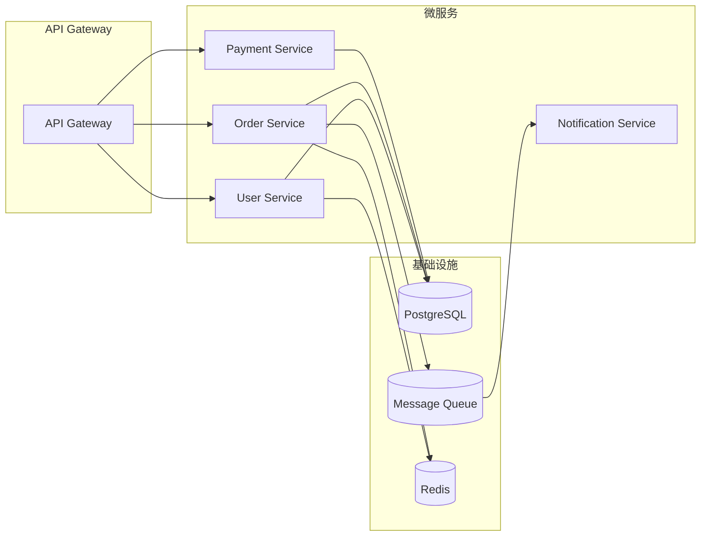

# 歧义追问 — 真实对话示例

> 本示例展示当用户请求模糊（无法判断是拓扑图还是概念图）时 Agent 的追问-确认-路由完整链路。

---

## 触发

**用户：** "画个微服务架构的图"

---

## Agent 完整输出

我注意到"微服务架构的图"有两种常见的呈现方式，方向不同：

1. **精确架构图（Mermaid）** — 用代码生成准确的拓扑图，展示服务间调用关系、数据流、协议等。适合技术文档/架构评审。
2. **创意概念图（AI 生图）** — 用 AI 生成视觉化的概念插图，风格化强，适合博客封面/演讲幻灯片。

你想走哪个方向？

<details>
<summary>✅ 用户选择："精确架构图，要展示服务间调用"</summary>
</details>

好的，走 Mermaid → PNG 路线。



这是基础结构，需要调整服务划分或加上具体协议标注吗？确认后我导出 PNG。

---

## 检查点确认

| 检查项 | 结果 |
|--------|------|
| 歧义检测 | ✅ 检测到"架构图"可能指两种方向 |
| 追问用户 | ✅ 给出清晰二选一 + 各自用途说明 |
| 用户选择 | ✅ 选择了精确架构图（Mermaid） |
| Mermaid 代码生成 | ✅ 展示基础结构供用户确认 |
| 等待进一步确认 | 询问用户是否需要调整后再导出 |

---

## 如果用户选择了另一条路

**用户：** "概念图，我要放在博客封面"

```bash
muapi image generate \
  "Microservices architecture concept art, multiple connected service nodes floating above cloud infrastructure, glowing data streams between them, isometric 3D style, deep blue tech background with orange accent lights, clean and modern, wide banner format 16:9, no text, cinematic lighting" \
  --model flux-dev \
  --download ./outputs/microservice-concept.png
```

输出后同样做检查点确认。

---

## 歧义关键词参考

以下词汇经常引发歧义，需追问澄清：

| 用户说 | 可能的两种含义 |
|--------|--------------|
| "架构图" | 精确拓扑图 vs 概念插图 |
| "流程图" | Mermaid 流程图 vs AI 生成流程插画 |
| "示意图" | 技术示意图 vs 概念示意插画 |
| "系统图" | 组件关系图 vs 系统概念图 |
| "地图" | Geo 地图 vs 概念/思维导图 |
