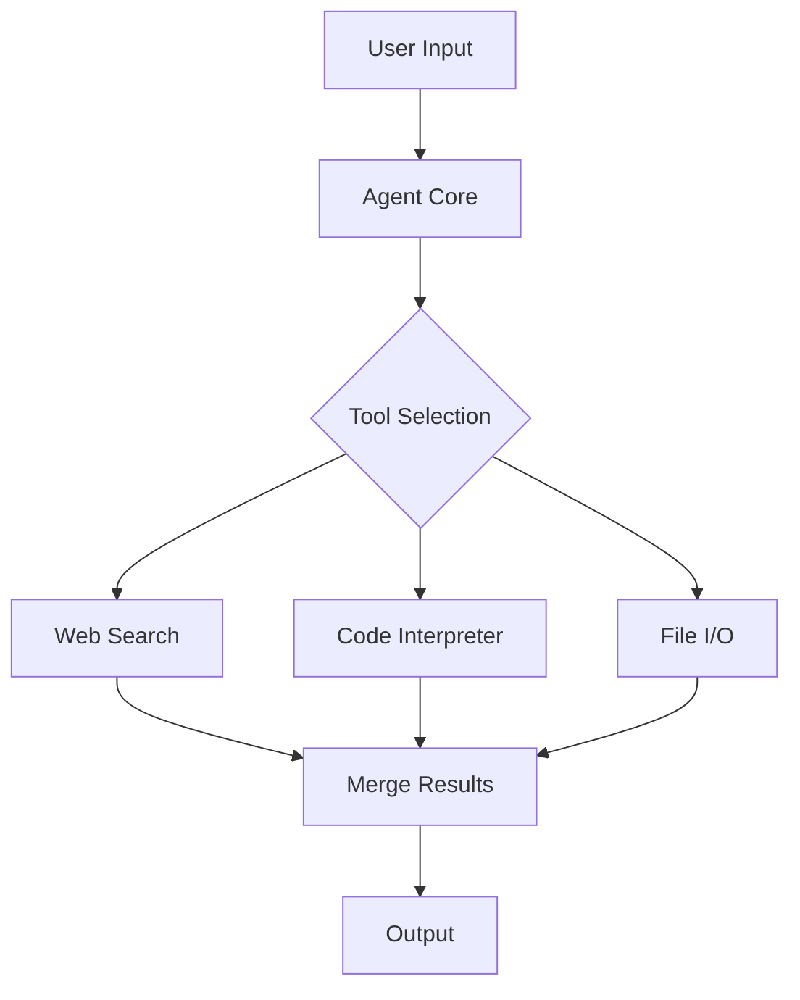

# Mermaid → PNG 完整链路示例

> 本示例展示当用户需要将 Mermaid 图导出为 PNG 时 Agent 的完整输出链路。与 image-gen / muapi 不同，此路由使用 Playwright 截图，不依赖 AI 生图 API。

---

## 触发

**用户：** "把当前对话里的 Agent 架构 Mermaid 图导出为 PNG，我需要贴到文档里"

---

## Agent 完整输出

我来把这张 Mermaid 架构图导出为 PNG。先确认 Mermaid 代码本身渲染正常。

**第一步：确认 Mermaid 代码**

你的 Mermaid 代码：


这段代码在 Obsidian 中渲染是否正常？请确认没有渲染错位或语法错误。

<details>
<summary>✅ 用户确认渲染正常</summary>

> 用户：渲染没问题，继续导出
</details>

**第二步：嵌入 HTML + Playwright 截图**

```bash
# 1. 将 Mermaid 代码嵌入标准 HTML 模板
cat > mermaid-export.html << 'EOF'
<!DOCTYPE html>
<html>
<head>
  <script src="https://cdn.jsdelivr.net/npm/mermaid@10/dist/mermaid.min.js"></script>
  <style>
    body { margin: 0; display: flex; justify-content: center; align-items: center; min-height: 100vh; background: white; }
  </style>
</head>
<body>
  <div class="mermaid">
graph TD
    A[User Input] --> B[Agent Core]
    B --> C{Tool Selection}
    C --> D[Web Search]
    C --> E[Code Interpreter]
    C --> F[File I/O]
    D --> G[Merge Results]
    E --> G
    F --> G
    G --> H[Output]
  </div>
  <script>mermaid.initialize({startOnLoad:true});</script>
</body>
</html>
EOF

# 2. 用 Playwright 截图（全尺寸、无裁剪）
npx playwright screenshot mermaid-export.html \
  --output agent-architecture.png \
  --full-page
```

**输出：** `agent-architecture.png`

---

## 检查点确认

| 检查项 | 结果 |
|--------|------|
| Mermaid 代码在 Obsidian 渲染确认 | ✅ 用户确认正常 |
| HTML 模板嵌入 | ✅ mermaid.min.js CDN + 白色背景 |
| Playwright 截图命令 | ✅ `npx playwright screenshot` full-page |
| 输出文件 | ✅ `agent-architecture.png` |
| 最终交付 | 询问用户：PNG 清晰度够吗？需要调整尺寸或背景色吗？ |

---

## 边界情况处理

| 异常 | 处理方式 |
|------|---------|
| 用户没有 Obsidian | 直接嵌入 HTML 后用浏览器打开确认，或使用 `npx playwright open mermaid.html` 预览 |
| Mermaid 代码有语法错误 | 提示错误位置，协助修正后再导出 |
| 图片需要透明背景 | 在 HTML 中设置 `background: transparent`，截图时加 `--omit-background` |
| 宽 Mermaid 图被截断 | 使用 `--full-page` 参数确保全图捕获；或在 CSS 中设 `width: max-content` |
| 用户要求批量导出多张图 | 逐张生成 HTML → 逐张截图，或循环脚本处理 |
