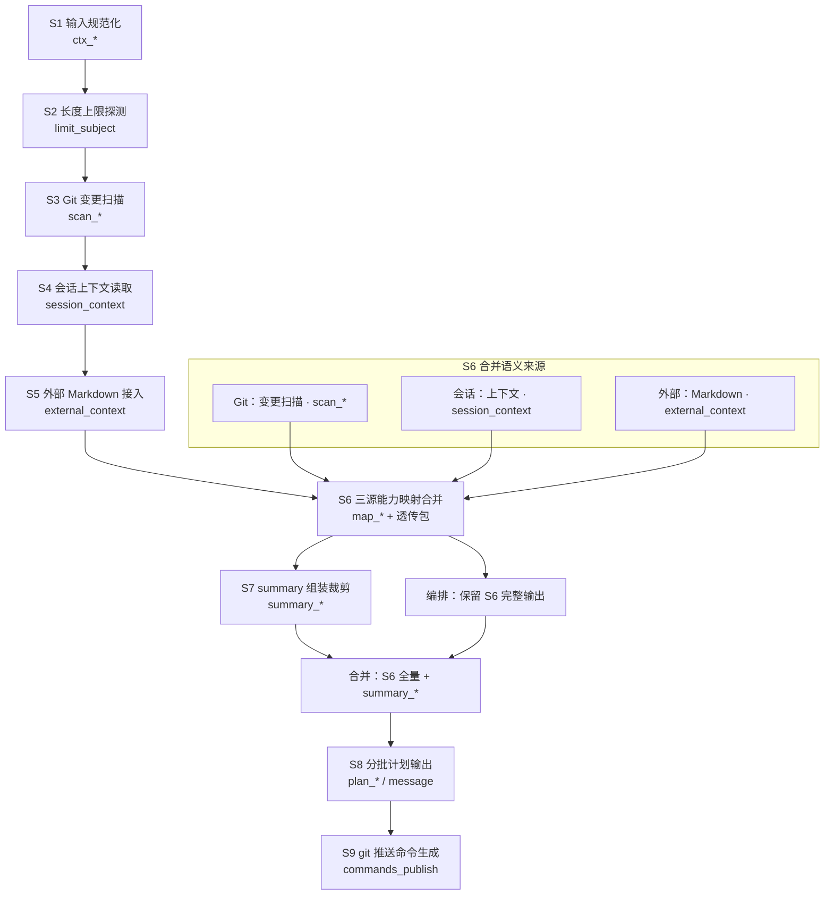

# git-commit-batching-workflow

面向多仓库未提交改动的链式工作流。目标是产出“可提交但不代提交”的分批方案，并保证规则单写点、低心智负担。

## 60 秒上手

```text
仓库：apex_dev,microfb
工作区根：F:\Documents\Repertory\Sieyuan\nebula
修改主题：菜单管理与权限；导航栏 Bug 修复
推送参数：origin（可选，不传默认 origin）
分支名：seccenter_v2（可选，不传默认当前分支）
```

## Cursor 对话指令（父入口）

在 Cursor 对话里直接复制下面命令，会通过父编排器先落盘 artifact（`artifact/templates -> run_id`），再执行 `S1 -> ... -> S9`，最终生成 `${artifact_root}/${run_id}/S0/end_outputs.md` 以及各步骤的 `S1~S8` 落盘文件。

```text
@.cursor/mySkills/git-commit-batching-workflow/SKILL.md apex_dev and microfb，主题：菜单管理与权限；权限注册中心
```

可选：显式带推送参数与分支名（其余不写则沿用默认值）。

```text
@.cursor/mySkills/git-commit-batching-workflow/SKILL.md apex_dev,microfb，主题：菜单管理与权限；权限注册中心，推送参数：origin，分支名：seccenter_v2
```

```text
@.cursor/mySkills/git-commit-batching-workflow/SKILL.md apex_dev and microfb，主题：功能项-api-api契约-前端网关方法、组件-路由的链路、前端的持久化、后端的持久化、微服务和基座的注册中心上送与下发、菜单管理的UI交互解耦、租户管理的UI交互解耦、角色管理的UI交互解耦
记得使用编排器，依次触发子skill，每一步都落袋到commit-workflow-artifacts，最后根据输出文件参考mySkills\git-commit-batching-workflow\artifact\templates\S0\examples\end_outputs.md生成输出文档
```

## 流程总览

`S1 -> S2 -> S3 -> S4 -> S5 -> S6 -> S7 -> S8 -> S9`

- `S1 输入规范化`：统一 `ctx_*`
- `S2 长度上限探测`：单写点产出 `limit_subject`
- `S3 Git 变更扫描`：产出 `scan_*`
- `S4 会话上下文读取`：产出 `session_*`
- `S5 外部 Markdown 接入`：产出 `external_*`
- `S6 三源能力映射合并`：产出 `map_*`
- `S7 summary 组装裁剪`：产出 `summary_*`
- `S8 分批计划输出`：产出 `plan_*`
- `S9 git 推送命令生成`：产出 `commands_publish`

## 编排清单（复选框任务流）

> 复选框用于人类/执行方在一次运行中跟进进度；不影响同一套 skill 被多次复用。
>
> 约束定义只在 `SKILL.md` 的 `全局约束` 保留；清单只做对照与验收指引。

### A. 入口执行器（S0，必经）
- [ ] 解析命令行并写入 `${artifact_root}/${run_id}/S0/start_inputs.yaml`
- [ ] 按 `artifact/templates/` → `run_id` 拷贝覆盖物化 `S1~S8` 骨架
- [ ] 按固定顺序调度 `S1 → … → S9`
- [ ] 更新 `${artifact_root}/${run_id}/S0/executor_state.yaml`（详见 `SKILL.md` `全局约束` 第 7 条）

### B. 子步骤流水线（S1–S9，顺序固定）
- [ ] **S1** `s1-repo-targets/SKILL.md` → `S1/ctx_pack.yaml`
- [ ] **S2** `s2-subject-limit-detector/SKILL.md` → `S2/limit_subject.yaml`
- [ ] **S3** `s3-git-change-scan/SKILL.md` → `S3/scan_changes*.yaml`
- [ ] **S4** `s4-session-context-reader/SKILL.md` → `S4/session_context.yaml`
- [ ] **S5** `s5-external-markdown-ingest/SKILL.md` → `S5/external_context.yaml`
- [ ] **S6** `s6-session-capability-merge/SKILL.md` → `S6/map_*.yaml`
- [ ] **S7** `s7-commit-summary-assembler/SKILL.md` → `S7/summary_parts.yaml`
- [ ] **S8** `s8-commit-batch-plan/SKILL.md` → `S8/plan_batches.yaml`
- [ ] **S9** `s9-git-publish-command-emitter/SKILL.md` → `commands_publish`

### C. 运行验收
- [ ] 按 `SKILL.md` 的 `全局约束` 完成最终验收（对照第 1/6/7 条等）

### 数据流（Mermaid）

顺序执行 **S1→S6** 后，**S6 输出整包须由编排保留**；**S7** 仅追加 `summary_*`；进入 **S8** 前由编排 **合并「S6 全量 + S7 summary」**（与「V2 I/O 契约」§2 一致）。



## 单写点约束

- `subject_limit` 只在 S2 定义；S8 只消费。
- `summary` 裁剪只在 S7 定义；S8 只消费。
- 文件清单格式只在 S8 模板定义（每行一个路径）。
- git 推送命令格式只在 S9 输出契约中定义（不在正文【元信息】中暴露）。
- **V2 I/O 契约**（字段、合并优先级、置信度、`source_ref`）只在本文 **「V2 I/O 契约」** 定义；子目录 README 仅摘要 + 指向本节。

## V2 I/O 契约（SSOT）

### 1. 字段前缀与职责

| 前缀 / 根对象 | 产出步骤 | 含义 |
|---|---|---|
| `ctx_*` | S1 | 工作区根、仓库列表、主题列表 |
| `limit_subject` | S2 | 各仓 `subject_limit` 与证据 |
| `${artifact_root}/${run_id}/S3/scan_changes.yaml` / `${artifact_root}/${run_id}/S3/scan_capability_candidates.yaml` | S3 | Git 变更与路径启发式候选（写入 artifact 文件） |
| `${artifact_root}/${run_id}/S4/session_context.yaml` | S4 | 会话摘要、hints、约束、开放问题、trace（写入 artifact 文件） |
| `${artifact_root}/${run_id}/S5/external_context.yaml` | S5 | 外部 Markdown 结构化条目（可空 docs；写入 artifact 文件） |
| `${artifact_root}/${run_id}/S6/map_*.yaml` | S6 | 三源合并后的能力与冲突、总体置信度（写入 artifact 文件） |
| `${artifact_root}/${run_id}/S7/summary_parts.yaml` | S7 | 标题用 summary 与裁剪备注（写入 artifact 文件） |
| `plan_*` | S8 | 最终分批与 message |
| `S0/end_outputs.md` | S9 | 最终用户可读的渲染结果（包含所有批次块与命令注入） |
| `commands_publish` | S9 | 推送相关可复制命令（不执行） |

### 2. 透传包（S3 → S8）（弱透传）

**总原则**：除运行时参数外，各子 skill 不再在对话中透传结构化大对象（scan/session/map/summary/plan 均写入 artifact 文件）。  
**S3/S4/S5/S6/S7**：均通过固定 artifact 路径读取各自输入并写入各自产物文件。  
**S8**：读取 `${artifact_root}/${run_id}/S3~S7` 产物文件渲染最终 `plan_*`，并同时写入 `${artifact_root}/${run_id}/S8/plan_batches.yaml`。  
**S9**：仅读取 `${artifact_root}/${run_id}/S8/plan_batches.yaml` 与 `${artifact_root}/${run_id}/S6/*` 生成 `commands_publish`，并把“重新渲染后的最终可读文本”写入 `${artifact_root}/${run_id}/S0/end_outputs.md`，不再依赖对话透传结构体。

### 3. `confidence`（S4 / S5 单条文档）

统一结构（便于 S6 汇总）：

```yaml
confidence:
  level: high | medium | low
  reasons:
    - <string>
```

- **S4 `session_context.confidence`**：依据 `trace.completeness`、`open_questions` 数量、与 `scan` 是否可对齐等综合判定。
- **S5 `external_context.docs[].confidence`**：依据调用方传入的 `trust_level`（`high|medium|low`）、解析是否完整、是否与 `session`/`scan` 明显矛盾等综合判定（`trust_level` 仅作输入信号，**不等于**最终 `confidence.level`）。

### 4. `source_ref`（S6 写入 `map_capabilities`）

每条能力行须可追溯；`source_refs` 为对象数组（**禁止**仅用裸字符串 `git|session|external`）：

```yaml
source_refs:
  - channel: git | session | external
    detail: <string>   # 例如：scan_capability_candidates:tag=权限网关；session:用户明确禁止拆分 api 层
    doc_path: <string | null>   # 仅 channel=external 时建议填写
```

### 5. S6 合并优先级（冲突时顺序应用）

1. **硬约束**：`external_context.docs[].constraints`（`role=constraints` 优先于 `other`）与 `session_context.constraints` 并列时，若冲突 → 写入 `map_conflicts`，**不静默覆盖**。
2. **变更事实**（路径、增删改状态、`MM/MD` 等）：**仅以 Git `scan_changes` 为准**；会话/文档不得改写事实。
3. **能力标签 / 主题语义**（非路径事实）：`session_context` 中用户已确认陈述 > `external` 中 `decision_log` / `requirements` > `scan_capability_candidates` 启发式。

### 6. `map_conflicts` 与 `map_confidence`（S6 产出）

```yaml
map_conflicts:
  - id: <short-id>
    topic: <string>
    conflicting_channels: [git, session, external]
    note: <string>
    suggested_resolution: <string | null>
    requires_user: boolean

map_confidence:
  level: high | medium | low
  reasons:
    - <string>
```

**`map_confidence` 启发式（可调整，须写明 reasons）**

- `high`：`scan` 完整 + `session_context.trace.completeness=full` + `map_conflicts` 为空或均可自动消解。
- `medium`：存在 `partial/unknown` 会话或外部 `trust_level` 偏低，或存在 1 条 `requires_user=false` 且已 `suggested_resolution` 的冲突。
- `low`：多条 `requires_user=true`，或会话/外部与 `scan` 事实层矛盾未解决。

### 7. S7 `summary_budget_len`

由执行方根据 S2 的 `subject_limit` 与标题前缀（`<type>(<scope>): :<emoji>: `）长度，计算 **剩余可用字符** 作为 `summary_budget_len`；细则单写点在 `s7-commit-summary-assembler/SKILL.md`。

### 8. 批次粒度（S8 规划前）

- **默认**：**一批次 ≈ 一条 `map_capabilities` 能力行**（或同一 `source_refs` 聚类），且 **可独立回滚**；避免多能力混在同一 commit。
- **默认（强化）**：**一批次 ≈ 一条 `map_capabilities` 的「单主能力 tag」**，且 **可独立回滚**；如果同批次会同时覆盖多个可解耦能力，则默认仍应拆分为多个批次（否则推送意义消失）。
- **强耦合 bundle 例外**：当 S6 输出 `map_coupling_bundles` 且提供 `merge_reason/coupling_evidence`（满足“硬条件”或“语义硬条件/二者皆算”）时，允许同批聚合多个主能力 tag。
- **仍过大时**：在同一能力域内按 **目录/依赖** 再拆（如「仅删旧文件」与「新 UI」分批），并遵守 §5 合并优先级。
- **依赖顺序**：基础设施（config、类型）→ 路由/store → 契约（gateway）→ 运行时权限 → 微前端插件 → UI → 测试 → 文档；**勿**为求快破坏拓扑。

## 输出契约（最终）

### commitlint 与 Git 消息结构（必读）

- **`header-max-length`（如 100）仅约束「首行」**（subject / header 第一行），**不是**整段 commit message 只能 100 字符。
- **首行之后**：空一行，再写 **body**（元信息、摘要、四段式）；body 总长度 **不受** header 行数限制（若仓库另有 `body-max-line-length`，按行换行即可）。
- **不执行**：`git commit`、`git push`（本 workflow 仅输出计划文案）。

### 标题（双轨，可选）

| 字段 | 含义 |
|---|---|
| `header_full` | 在 `subject_limit` 内尽量完整的 `<type>(<scope>): :<emoji>: <summary_final>` |
| `header_short` | 更短版本，用于更严环境或 hook 二次裁剪；**以本地仓库 commitlint 为准** |

若 `subject_limit = unbounded`，可省略 `header_short`。

### 首行（subject）写什么

- **只写**「本批 **原子动作** + 可选 **极短** 子任务」；`summary_final` 的语义须与此一致（见 `s7-commit-summary-assembler/SKILL.md`）。
- **不要**把完整主题句、长问题—解决因果塞进首行；**主题**、**问题/解决** 落 **正文**。

### 正文（body）结构

1. **【元信息】**（**一行一项**，便于扫读与脚本解析）：
   - `主题：<ctx_themes 或本批关联主题>`
   - `能力：<本批 capability 或 map 一行摘要>`
2. **【摘要】**（可选，一行或短段）：给评审的「一句话」。
3. **四段式**：`定义：` / `问题：` / `解决：` / `价值：`（每段可多行，按团队习惯换行）。

**实测参考**（microfb 空文件占位提交）：`docs/skills/commit-msg-format-test.txt` 所在仓库中 **首行短标题 + 正文元信息分行** 的 `git log -1 --format=full` 样例。

### git 推送命令（可复制）

- 由 `S9 git 推送命令生成` 产出，**不执行**。
- 命令里的提交首行使用 `selected_header`：
  - 未超长：`header_full`
  - 超长：`header_short`
- `conflict/low-confidence` 时推送保守：
  - 默认仅输出 `git push --dry-run`
  - 并在 `risk_flags` / `requires_user_notes` 标注 `map_conflicts.id + topic` 供人工确认

### 文件清单

- 每行一个相对路径

## 目录

- `SKILL.md`：父编排（只编排）
- `s1-repo-targets/`
- `s2-subject-limit-detector/`
- `s3-git-change-scan/`
- `s4-session-context-reader/`
- `s5-external-markdown-ingest/`
- `s6-session-capability-merge/`
- `s7-commit-summary-assembler/`
- `s8-commit-batch-plan/`
- `s9-git-publish-command-emitter/`

## 姊妹文档（QA 清单）

- **正文单写点**：仓库根 `docs/skills/git流水线qa.md`
- **`.cursor` 内转发入口**（勿重复维护全文）：`.cursor/docs/skills/git流水线qa.md`
- **索引**：`docs/skills/README.md`
