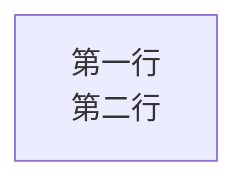
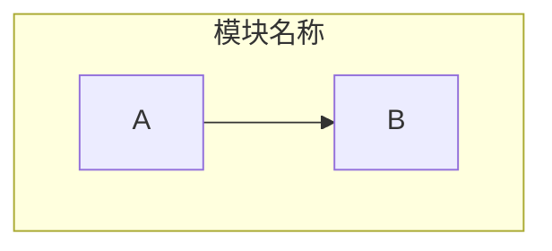

# Marmeid — Mermaid 图表语法规则集

> 所有 `style` 指令必须使用**字面十六进制颜色值**，不要使用 CSS 变量（如 `var(--accent)`）。Mermaid 将 style 渲染为 SVG 内联样式，CSS 变量在内联 SVG 中无法解析。

## 通用规则

### 1. style 指令——永远使用字面颜色


**错误：** `style A fill:var(--accent),stroke:var(--border)` ❌
**正确：** `style A fill:#0891b2,stroke:#0369a1,color:#ffffff` ✅

### 2. 节点文本中的换行

使用 `"<br/>"`（HTML 换行标签），不要用 `\n`：



### 3. 节点形状速查

| 语法 | 形状 | 用途 |
|------|------|------|
| `A["文字"]` | 圆角矩形 | 默认节点 |
| `A{"文字"}` | 菱形 | 决策/条件 |
| `A[["文字"]]` | 圆柱形 | 数据库 |
| `A(("文字"))` | 圆形 | 开始/结束/人员 |
| `A>["文字"]` | 旗帜形 | 异步/输出 |
| `A["文字"]` 无修饰 | 矩形 | 过程/步骤 |
| `A["文字"]` 虚线: `-.-` | 虚线连接 | 可选/弱关系 |

### 4. 子图（Subgraph）



### 5. classDef 批量样式

先定义类，再通过 `:::` 应用到节点：


### 6. 布局方向

- `flowchart TD` — 自上而下（默认，推荐复杂图表）
- `flowchart LR` — 从左到右（仅简单 3-4 节点线性流）
- `flowchart RL` — 从右到左
- `flowchart BT` — 从下到上

### 7. 边缘样式

| 语法 | 样式 | 用途 |
|------|------|------|
| `A --> B` | 实线箭头 | 默认流向 |
| `A --- B` | 实线无箭头 | 连接 |
| `A -.-> B` | 虚线箭头 | 可选流 |
| `A ==> B` | 粗线箭头 | 主要流 |
| `A --x B` | 带叉箭头 | 终止/失败 |
| `A --o B` | 带圈箭头 | 起始 |
| `A -->|"标签"| B` | 带标签 | 描述关系 |

### 8. CDN 初始化

```javascript
mermaid.initialize({
  theme: 'base',
  themeVariables: {
    background: '#ffffff',
    primaryColor: '#0891b2',
    primaryTextColor: '#ffffff',
    primaryBorderColor: '#0369a1',
    lineColor: '#6b7d92',
    fontSize: '14px',
    fontFamily: 'DM Sans, sans-serif',
  }
});
```

> 使用 `theme: 'base'` + 自定义 `themeVariables`，不要使用 `theme: 'default'`（颜色不可控）。

### 9. 常见渲染失败原因

| 症状 | 原因 | 修复 |
|------|------|------|
| 图表空白/不显示 | style 中使用 CSS 变量 | 改成字面十六进制颜色 |
| 节点重叠/位置错乱 | 缺少布局引擎 | 加 `layout: 'elk'` 或减小节点数 |
| 样式不对 | theme 非 `base` | 用 `theme: 'base'` + 自定义 themeVariables |
| Mermaid 报错 Syntax error | 标签含特殊字符 | 给文字加引号 `A["文字"]` |
| 字体与页面不匹配 | themeVariables.fontFamily 未设置 | 在 initialize 中设置 fontFamily |
| 缩放控件不显示 | 缺少 zoom-controls 结构 | 使用 templates/mermaid-flowchart.html 中的完整结构 |
