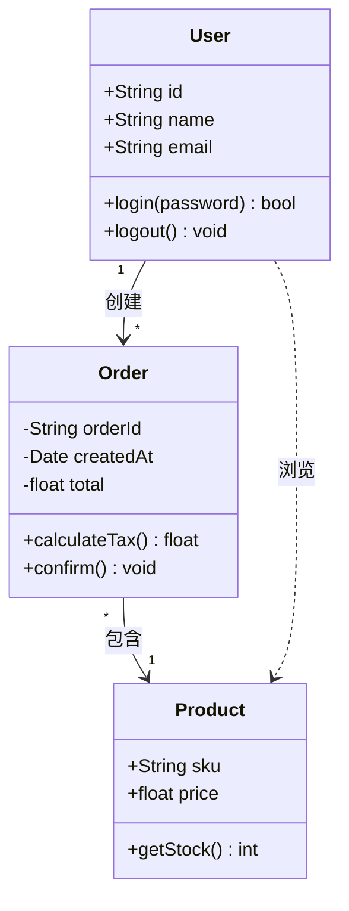
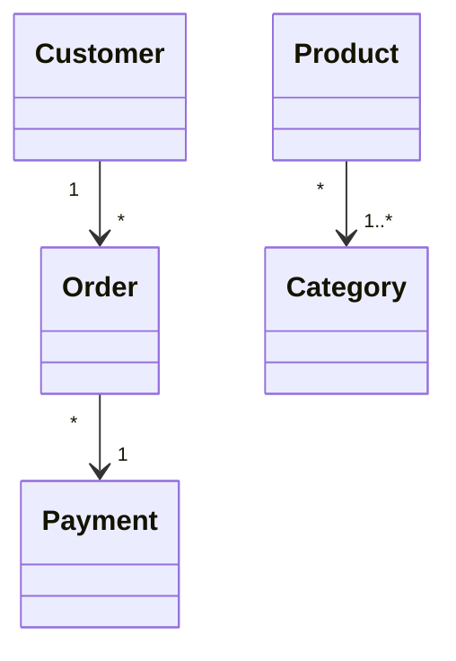
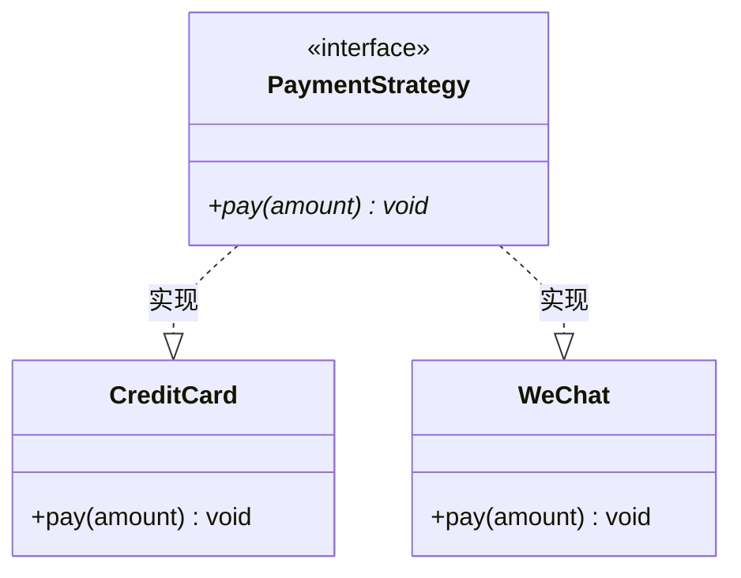
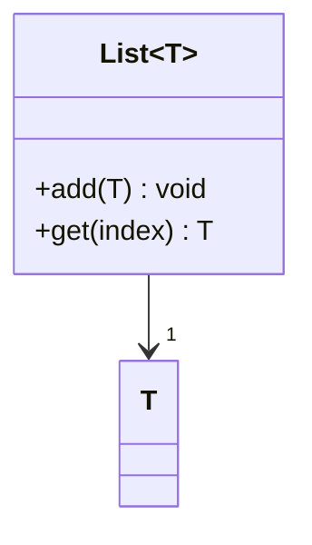

# 类图（Class Diagram / UML）语法规则

用于展示领域模型、类结构、实体关系和接口设计。

## 语法模板

## 可见性标记

| 标记 | 含义 |
|------|------|
| `+` | public |
| `-` | private |
| `#` | protected |
| `~` | package/internal |

## 关系类型

| 语法 | 关系 | 线型 |
|------|------|------|
| `A --> B` | 关联 | 实线箭头 |
| `A -- B` | 关联（无方向） | 实线 |
| `A ..> B` | 依赖 | 虚线箭头 |
| `A --|> B` | 继承 | 空心三角形实线 |
| `A ..|> B` | 实现 | 空心三角形虚线 |
| `A *-- B` | 组合 | 实心菱形实线 |
| `A o-- B` | 聚合 | 空心菱形实线 |

## 多重性标记

## 抽象/接口

## 泛型/参数化类

## 关键规则

1. **类名、属性名、方法名不要使用中文** — Mermaid 类图解析器对中文支持不稳定
2. **不要使用 `style` 指令** — 类图不支持自定义节点样式
3. **方法参数类型不要用泛型嵌套** — 如 `List<String>` 可能解析失败，用 `List~String~`
4. **关系线上的标签用空格包围** — `"1" --> "*"` 而不是 `"1"-->"*"`
5. **接口/抽象标记用 `<<>>` 包裹** — `<<interface>>`、`<<abstract>>`
