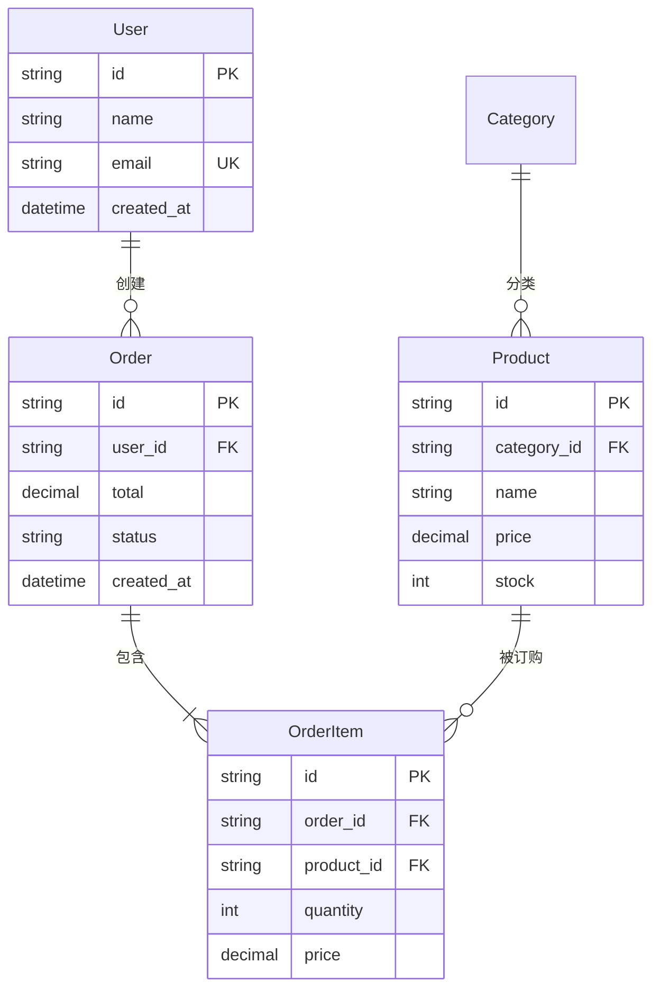

# ER 图（Entity Relationship）语法规则

用于展示数据库表结构、实体关系和字段定义。

## 语法模板



## 关系标记

| 语法 | 含义 |
|------|------|
| `||--o{` | 一对多（可选） |
| `||--||` | 一对一（强制） |
| `}|--o{` | 多对多（可选） |
| `}o--o{` | 零或多对零或多 |
| `||--o{` | 一对多（强制→可选） |

常见的关系线：
```
    |o -- o|  零或一   →  零或一
    || -- ||  且仅一   →  且仅一
    }o -- o{  零或多   →  零或多
    || -- o{  且仅一   →  零或多
    |o -- ||  零或一   →  且仅一
    }o -- ||  零或多   →  且仅一
```

## 字段标记

| 后缀 | 含义 |
|------|------|
| `PK` | 主键 |
| `FK` | 外键 |
| `UK` | 唯一键 |
| `IDX` | 索引 |

## 数据类型

直接写类型名：`string`、`int`、`decimal`、`datetime`、`boolean`、`text`、`json`

## 关键规则

1. **关系线符号不能有空格** — `||--o{` 正确，`|| -- o{` 可能解析失败
2. **实体名/属性名不要用中文** — 类图解析器对中文支持不稳定
3. **不要使用 `style` 指令** — ER 图不支持
4. **字段类型用简单英文** — `string` 而非 `varchar(255)`
5. **支持的关键字后缀** — `PK` `FK` `UK`，多个用空格分隔
