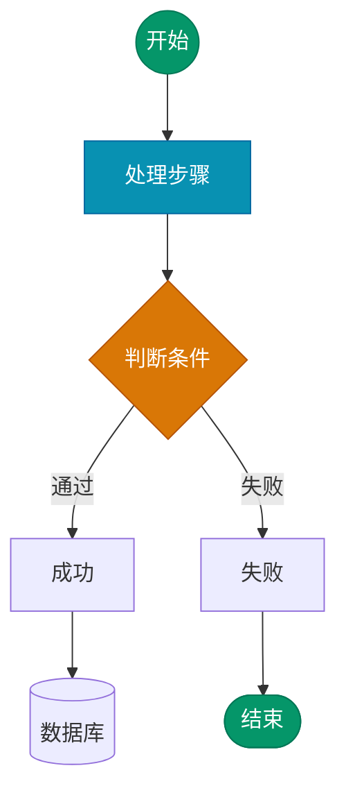
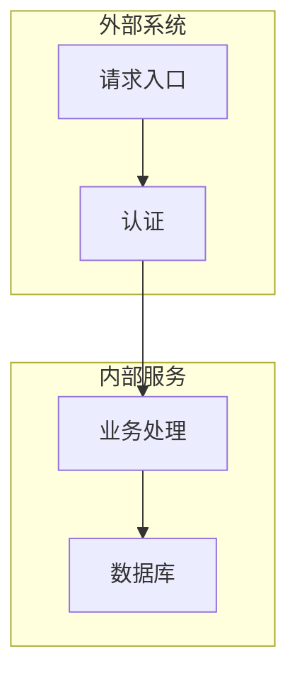

# 流程图（Flowchart）语法规则

Mermaid 中最常用的图表类型，用于展示流程、管道、数据流和系统拓扑。

## 语法模板

## 节点形状对照

| 写法 | 形状 | 语义 |
|------|------|------|
| `A["文字"]` | 圆角矩形 | 默认处理步骤 |
| `A{"文字"}` | 菱形 | 判断/分支 |
| `A(("文字"))` | 圆形 | 起始/结束 |
| `A[["文字"]]` | 圆柱 | 数据库/存储 |
| `A>["文字"]` | 旗帜 | 输出/异步 |
| `A["文字"]` | 矩形 | 通用步骤 |

## 边缘连接

| 写法 | 含义 |
|------|------|
| `A --> B` | 箭头指向 |
| `A -->|"标签"| B` | 带文字标签 |
| `A -.-> B` | 虚线（可选路径） |
| `A ==> B` | 粗线（主要路径） |
| `A --x B` | 叉线（失败路径） |
| `A & B --> C` | 多路汇聚 |

## 子图

## 布局提示

- 10 节点以内：直接使用 `flowchart TD`
- 10-15 节点：加 `layout: 'elk'` 改善自动布局
- 15+ 节点：拆分为混合模式（概览图 + 详细卡片）
- `style` 指令永远不要使用 CSS 变量
