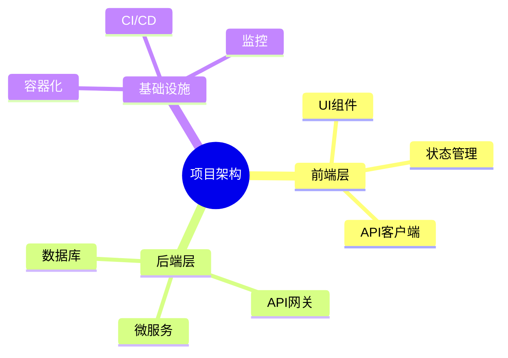
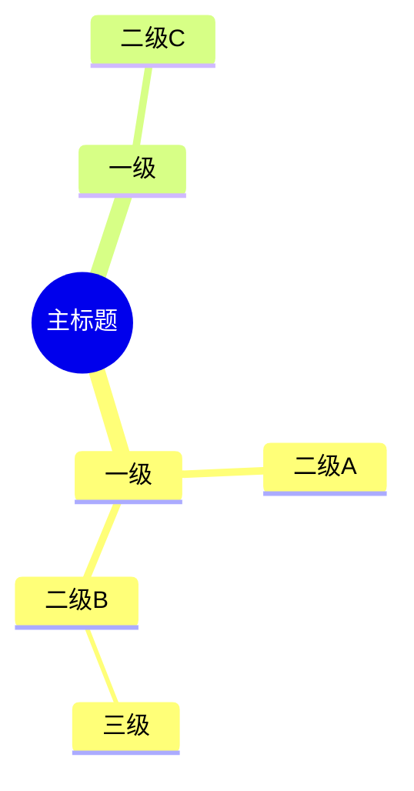

# 思维导图（Mindmap）语法规则

用于展示层级结构、概念分解和头脑风暴结果。

## 语法模板

## 节点形状

| 写法 | 形状 |
|------|------|
| `节点名` | 圆角矩形（默认） |
| `((节点名))` | 圆形 |
| `[节点名]` | 矩形 |
| `>节点名]` | 旗帜形 |
| `)节点名(` | 圆角（右凸） |
| `(节点名)` | 圆角（左凸） |

## 缩进层级

缩进深度控制层级，每个缩进级别产生一个子节点：

## 关键规则

1. **缩进使用 2 空格** — 不要用 tab
2. **根节点用 `((root))` 表示中心主题** — `root` 是关键字(root of the tree)
3. **不要在节点文字中使用 `[ ] { } ( )` 等括号** — 会与形状语法冲突
4. **不要使用 `style` 指令** — 思维导图不支持
5. **节点过多（30+）时使用 `flowchart TD` 替代** — 思维导图渲染大图性能较差
