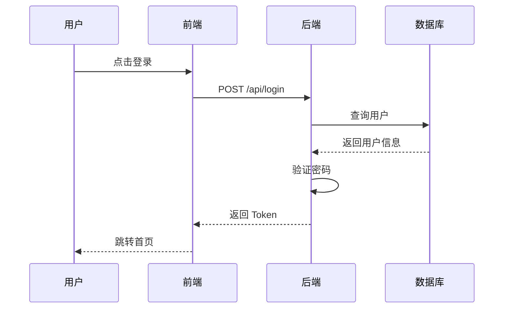
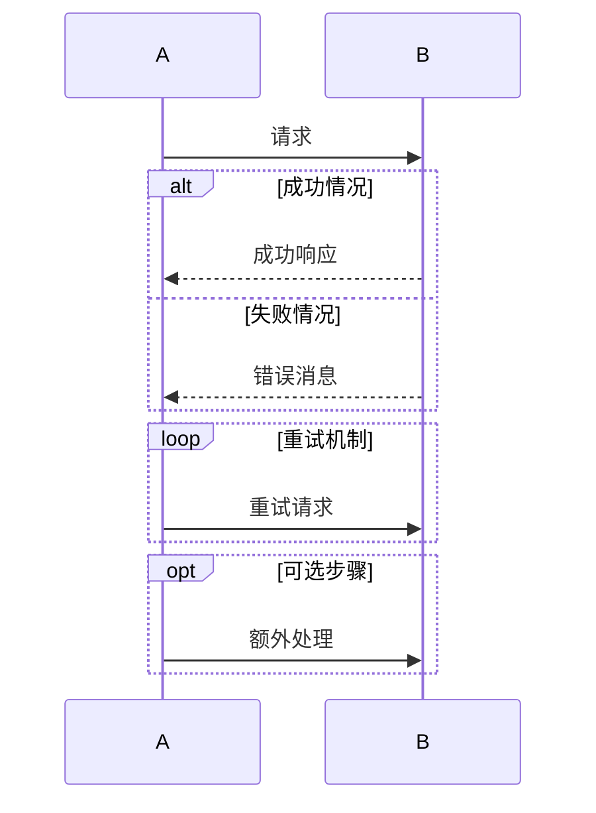
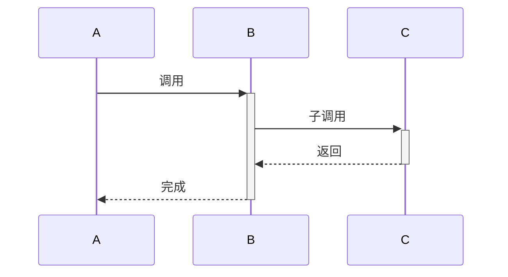
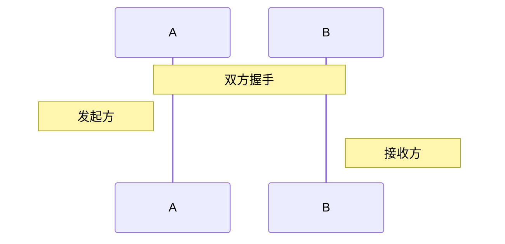

# 时序图（Sequence Diagram）语法规则

用于展示对象之间的交互顺序，适合 API 调用、消息传递、登录流程等场景。

## 语法模板

## 参与者定义

| 写法 | 说明 |
|------|------|
| `participant A` | 定义参与者 A |
| `participant A as 别名` | 定义别名（显示为别名） |
| `actor A` | 角色（人形图标） |

## 消息类型

| 语法 | 线条 | 含义 |
|------|------|------|
| `A->>B` | 实线箭头 | 同步请求 |
| `A-->>B` | 虚线箭头 | 异步/返回 |
| `A->>+B` | 实线箭头+激活 | 激活参与者 |
| `B-->>-A` | 虚线箭头+去激活 | 返回并释放 |
| `A-xB` | 带叉实线 | 失败/错误 |
| `A--xB` | 带叉虚线 | 错误返回 |

## 组合片段

## 激活框

## 注释

## 关键规则

1. **参与者名称不要用中文特殊字符** — 用英文名 + `as` 别名显示中文
2. **`+`/`-` 激活语法在 Mermaid 11 中可能不兼容** — 如果不显示激活框，去掉 `+`/`-`
3. **`alt/else/loop/opt` 后不要用特殊字符** — `alt 成功:` 的冒号可能解析失败
4. **注释中的消息不要使用 style** — 时序图不支持 `style` 指令
5. **时序图不支持自定义 classDef** — 只能通过 CSS 覆盖 `.messageText`、`.actor` 类
