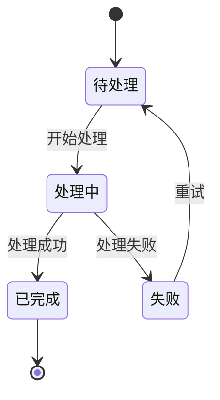
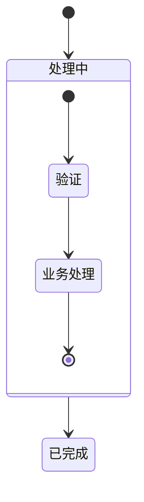
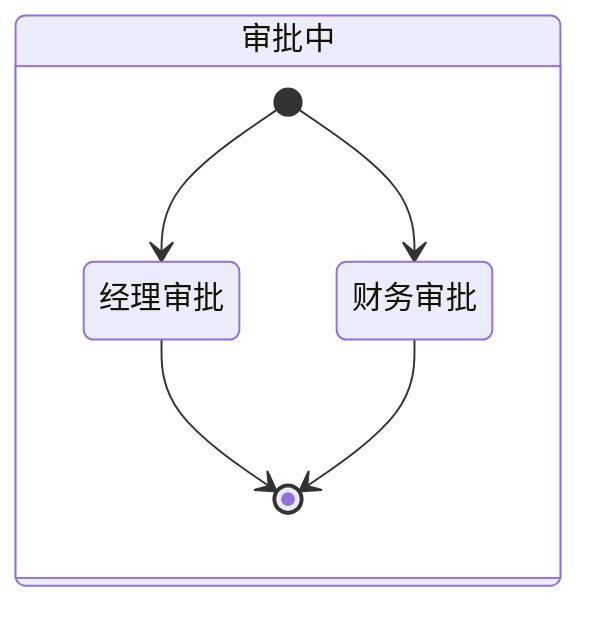
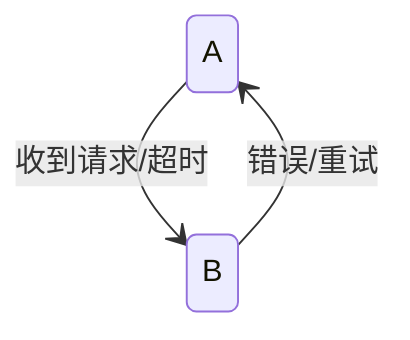

# 状态图（State Diagram）语法规则

用于展示状态机、工作流状态转换和生命周期。

## 语法模板

## 状态类型

| 写法 | 含义 | 说明 |
|------|------|------|
| `[*]` | 起始/终止 | 伪状态 |
| `状态名` | 普通状态 | 矩形 |
| `state "显示名" as 别名` | 别名状态 | 避免中文特殊字符 |
| `state 嵌套状态` | 复合状态 | 含内部子状态 |

## 复合状态

## 并行状态（Fork/Join）

## 转换标签

## 关键规则

1. **`stateDiagram-v2` 的标签解析器很严格** — 冒号 `:`、括号 `()`、多行文本都会导致静默解析失败
2. **如果标签需要特殊字符，改用 `flowchart TD`** — 用圆角节点模拟状态图
3. **不要使用 `style` 指令** — 状态图不支持自定义节点样式
4. **状态名间隔符用 `state "显示名" as 别名`** — 当状态名含空格或特殊字符时
5. **`[*]` 是特殊伪状态** — 表示起始/终止节点，不能用于其他语义
