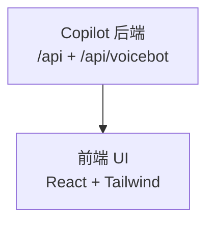

# HTML 图表库指南

外部库和字体资源指南，用于自包含 HTML 图表。

## Google Fonts CDN

通过 `<link>` 加载字体。包含系统回退以确保离线可用性。

### 推荐字体配对

| 配对 | 用途 | 回退 |
|---------|------|---------|
| DM Sans + Fira Code | 技术、精确 | system-ui, monospace |
| Instrument Serif + JetBrains Mono | 编辑、精致 | serif, monospace |
| IBM Plex Sans + IBM Plex Mono | 可靠、可读 | system-ui, monospace |
| Bricolage Grotesque + Fragment Mono | 大胆、有特色 | system-ui, monospace |
| Plus Jakarta Sans + Azeret Mono | 圆润、亲切 | system-ui, monospace |
| Outfit + Space Mono | 现代、干净 | system-ui, monospace |
| Sora + DM Mono | 当代、清晰 | system-ui, monospace |
| Newsreader + JetBrains Mono | 长文阅读 | serif, monospace |
| Cabinet Grotesk + JetBrains Mono | 紧凑、高效 | system-ui, monospace |

### 加载示例

```html
<link rel="preconnect" href="https://fonts.googleapis.com">
<link rel="preconnect" href="https://fonts.gstatic.com" crossorigin>
<link href="https://fonts.googleapis.com/css2?family=DM+Sans:opsz,wght@9..40,400;9..40,500;9..40,600;9..40,700&family=Fira+Code:wght@400;500;600&display=swap" rel="stylesheet">
<style>
  :root {
    --font-body: 'DM Sans', system-ui, sans-serif;
    --font-mono: 'Fira Code', 'SF Mono', Consolas, monospace;
  }
</style>
```

## Mermaid.js

通过 CDN 加载以实现自包含图表的 Mermaid 渲染。

### 基本加载

```html
<script src="https://cdn.jsdelivr.net/npm/mermaid@11/dist/mermaid.min.js"></script>
<script>
  mermaid.initialize({
    theme: 'base',
    themeVariables: {
      background: 'var(--surface)',
      primaryColor: 'var(--node-a-dim)',
      primaryTextColor: 'var(--text)',
      primaryBorderColor: 'var(--node-a)',
      secondaryColor: 'var(--node-b-dim)',
      secondaryTextColor: 'var(--text)',
      secondaryBorderColor: 'var(--node-b)',
      tertiaryColor: 'var(--node-c-dim)',
      tertiaryTextColor: 'var(--text)',
      tertiaryBorderColor: 'var(--node-c)',
      lineColor: 'var(--border-bright)',
      fontSize: '14px',
      fontFamily: 'var(--font-body)',
    }
  });
</script>
```

### 主题变量控制

关键 themeVariables：
- `background`: 图表背景
- `primaryColor` / `primaryBorderColor`: 主要节点（流程步、处理节点）
- `secondaryColor` / `secondaryBorderColor`: 次要节点（数据库、文件）
- `tertiaryColor` / `tertiaryBorderColor`: 第三级节点（边界、注释）
- `lineColor`: 边缘线颜色
- `fontSize`: 节点文字大小
- `fontFamily`: 图表字体

### ELK 布局（复杂图表）

> 5 个以上节点的图表推荐使用 ELK 布局引擎。

```html
<script src="https://cdn.jsdelivr.net/npm/mermaid@11/dist/mermaid.min.js"></script>
<script src="https://cdn.jsdelivr.net/npm/@mermaid-js/layout-elk@0.1/dist/mermaid-layout-elk.min.js"></script>
<script>
  mermaid.initialize({
    layout: 'elk', // 使用 ELK 布局引擎
    elk: {
      // ELK 特定选项
      nodePlacementStrategy: 'BRANDES_KOEPF',
    },
    // ... themeVariables
  });
</script>
```

### 布局方向：TD vs LR

| 方向 | 何时使用 | 原因 |
|-----------|-----------|---------|
| `flowchart TD` | 大多数情况 | 自上而下，处理宽节点更好 |
| `flowchart LR` | 3-4 节点线性流 | 简单流程的紧凑水平布局 |

复杂图表始终使用 TD。LR 使图表水平展开，多节点时标签不可读。

### Mermaid 流程图标签换行

在引号标签内部使用 `<br/>`。不要使用转义换行 `\n`（Mermaid 将其渲染为文字文本）。



## Chart.js

用于仪表盘和指标页面中的柱状图、折线图和饼图。

```html
<script src="https://cdn.jsdelivr.net/npm/chart.js@4/dist/chart.umd.min.js"></script>
<script>
  new Chart(ctx, {
    type: 'bar', // 'line', 'pie', 'doughnut', 'radar'
    data: { /* ... */ },
    options: {
      responsive: true,
      maintainAspectRatio: false,
      plugins: {
        legend: { display: true, labels: { color: 'var(--text)' } }
      },
      scales: {
        x: { ticks: { color: 'var(--text-dim)' } },
        y: { ticks: { color: 'var(--text-dim)' } }
      }
    }
  });
</script>
```

## ECharts（增强型图表）

用于桑基图、雷达图等 Chart.js 无法覆盖的复杂图表场景。

### 基本加载

```html
<script src="https://cdn.jsdelivr.net/npm/echarts@5/dist/echarts.min.js"></script>
<script>
  const chart = echarts.init(document.getElementById('chart'));
  chart.setOption({ /* 配置 */ });
</script>
```

### 双主题模式

不使用 ECharts 内置 dark 主题，通过监听 `prefers-color-scheme` 重新设置 Option：

```javascript
function createThemeChart(el, renderFn) {
  const chart = echarts.init(el);
  function apply() {
    const dark = matchMedia('(prefers-color-scheme: dark)').matches;
    chart.setOption(renderFn(dark));
  }
  apply();
  matchMedia('(prefers-color-scheme: dark)').addEventListener('change', apply);
  return chart;
}
```

### ECharts vs Chart.js 选型

| 场景 | 选择 | 原因 |
|------|------|------|
| 柱状图/折线图/饼图 | Chart.js | 更轻量（~70KB vs ~800KB） |
| 雷达图 | ECharts | radar 类型原生支持更好 |
| 桑基图 | ECharts | Chart.js 不支持 |
| 仅需要 1 种简单图表 | Chart.js | 加载更小 |
| 需要 2+ 种复杂图表 | ECharts | 一次加载覆盖多种需求 |

## anime.js（高级动画）

用于协调的多元素动画序列（非必需——CSS 处理大多数情况）。

```html
<script src="https://cdn.jsdelivr.net/npm/animejs@3/lib/anime.min.js"></script>
<script>
  anime.timeline({
    easing: 'easeOutExpo',
  })
  .add({ targets: '.ve-card', translateY: [20, 0], opacity: [0, 1], delay: anime.stagger(50) })
  .add({ targets: '.flow-arrow', scaleY: [0, 1], opacity: [0, 1], delay: anime.stagger(100), duration: 400 }, '-=200');
</script>
```

## 语义颜色映射（图表节点类型）

将语义含义映射到 CSS 自定义属性：

| 节点类型 | 变量 | 用途 |
|-----------|--------|---------|
| 源/输入 | `--node-a` | 数据源、外部系统、用户输入 |
| 处理/转换 | `--node-b` | 函数、服务、处理步骤 |
| 存储/持久化 | `--node-c` | 数据库、缓存、文件系统 |
| 输出/目标 | `--node-a`（重用） | UI、API 端点、导出 |
| 外部系统 | `--text-dim` | 边界外的系统（虚线边框） |
| 错误/异常 | `--accent`（红/玫瑰） | 错误处理、异常路径 |
