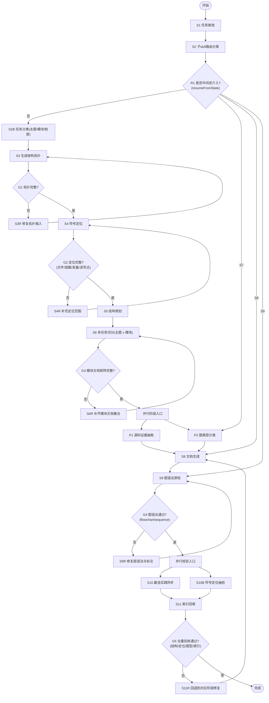

# gen-README 技能体系（父子编排版）

本目录提供一套面向 `microfb` 文档工程化生成的技能体系，支持：

- 父 skill 统一编排
- 多子 skill 并行执行
- “主题 × 模块”多文件产出
- 架构拓扑 + 符号定位强约束
- Mermaid / sequenceDiagram 自动分类与质检

---

## 1. 目录结构

```text
gen-README/
├─ SKILL.md                        # 父skill（编排器）
├─ README.md                       # 使用说明（本文件）
├─ docs/
│  ├─ Mermaid.md                   # flowchart 规范
│  └─ sequenceDiagram.md           # sequenceDiagram 规范
├─ template/
│  └─ microfb/                     # 会话产物模板副本
└─ subskills/
   ├─ subskill-router-classifier/
   ├─ microfb-topology-mapper/
   ├─ microfb-symbol-locator/
   ├─ diagram-type-classifier/
   ├─ microfb-source-extract/
   ├─ microfb-doc-structure-planner/
   ├─ microfb-doc-writer/
   ├─ mermaid-lint-fixer/
   ├─ readme-index-maintainer/
   └─ web-best-practice-sync/
```

---

## 2. 父子协同状态机（执行流程）



### 2.1 并行与回退说明

- **并行阶段 1（S6 之后）**：`源码证据抽取` 与 `图类型分类` 可并行，汇合后进入文档生成。
- **并行阶段 2（S9 之后）**：`最佳实践同步` 与 `符号定位抽检` 可并行，汇合后再做索引回填。
- **中间态恢复**：当 `resumeFromState` 为 `S7/S8/S9` 时，可从对应节点直接进入后续链路。
- **循环回退 1**：`G1/G2/G3/G4` 任一不通过，回退到对应修复态重试。
- **循环回退 2**：最终验收 `G5` 不通过，统一回退到文档生成阶段修复后再走后续步骤。

---

## 3. 子 skill 职责速览

| 子 skill | 作用 |
| --- | --- |
| `subskill-router-classifier` | 根据任务意图选择子skill调用路径（串行/并行/回退） |
| `microfb-topology-mapper` | 先生成架构/运行时拓扑草图 |
| `microfb-symbol-locator` | 定位文件/函数/变量/读写点 |
| `diagram-type-classifier` | 判定 `flowchart TD` 或 `sequenceDiagram` |
| `microfb-source-extract` | 从模板与源码提炼事实证据 |
| `microfb-doc-structure-planner` | 规划“主题 × 模块”多文件矩阵 |
| `microfb-doc-writer` | 落地文档并插入符号定位段 |
| `mermaid-lint-fixer` | 按图类型执行语法质检修复 |
| `readme-index-maintainer` | 回填 README/主题索引 |
| `web-best-practice-sync` | WebSearch 同步外部最佳实践 |

---

## 4. 核心约束（必须满足）

1. 每个模块最少输出 6 类文档：
   - 架构拓扑
   - 运行时拓扑
   - 状态驱动说明
   - 单一状态链路
   - 说明文档
   - 使用手册
2. 每份文档必须包含“符号定位”小节（文件 + 函数/变量 + 读写点）。
3. 每张图必须先过 `diagram-type-classifier`，再由 `mermaid-lint-fixer` 校验。
4. 每个子 skill 必须先读取本 skill 内定义的 `Template Anchors（相对引用）` 后才能执行。
5. 锚点缺失时必须先报错并停机，禁止无模板自由发挥。

---

## 5. 如何触发

- 自动触发（语义相关时）：父 skill 会根据用户任务选择是否编排子 skill。
- 显式触发：在对话中使用 `/gen-readme` 或直接指定子 skill 名称（例如 `/diagram-type-classifier`）。

---

## 6. 路由决策示例（含中间态介入）

### 6.1 示例输入（你给的场景）

```json
{
  "taskIntent": "优化",
  "moduleScope": ["认证", "路由", "子应用"],
  "docScope": "全量",
  "qualityLevel": "严格",
  "timeBudget": "常规",
  "resumeFromState": "S7",
  "recheckScope": "全局",
  "manualFindings": [
    {
      "docFile": "docs/mvp/状态链路/页面显示链路_登录-路由-守卫-组件.md",
      "diagramId": "login-route-guard",
      "finding": "渲染图更适合强调交互顺序"
    }
  ],
  "overrideDecisions": [
    {
      "docFile": "docs/mvp/状态链路/页面显示链路_登录-路由-守卫-组件.md",
      "diagramId": "login-route-guard",
      "forceType": "sequenceDiagram",
      "reason": "存在并行分支，需明确消息时序"
    }
  ]
}
```

### 6.2 期望路由输出（routingPlan）

```json
{
  "resumeFromState": "S7",
  "selectedPath": [
    "diagram-type-classifier",
    "microfb-doc-writer",
    "mermaid-lint-fixer",
    "readme-index-maintainer"
  ],
  "parallelGroups": [],
  "gates": [
    "G4 图语法通过",
    "G5 全量验收通过"
  ],
  "rollbackMap": {
    "G4_FAIL": "回到 mermaid-lint-fixer",
    "G5_FAIL": "回到 microfb-doc-writer"
  },
  "appliedOverrides": [
    {
      "diagramId": "login-route-guard",
      "effectiveType": "sequenceDiagram"
    }
  ],
  "auditTrail": [
    "检测到 resumeFromState=S7，跳过 S1-S6",
    "合并人工覆盖决策后重跑图类型判定",
    "执行写作、质检与索引回填并完成全局复检"
  ],
  "mvpScope": "仅变更受影响图块与引用段落，不重写无关模块正文"
}
```

---

## 7. 故障排查

- **问题：图渲染失败**
  - 检查是否按图类型应用对应规范：
    - `docs/Mermaid.md`
    - `docs/sequenceDiagram.md`
- **问题：文档没有符号定位**
  - 检查是否执行了 `microfb-symbol-locator`，以及写作阶段是否消费了其输出。
- **问题：README 未收录新文档**
  - 检查 `readme-index-maintainer` 是否执行成功。

---

## 8. 最佳实践来源（WebSearch 同步）

- Cursor Skills 官方文档（skills 目录、frontmatter、按需加载）
- Mermaid 官方文档（flowchart 语法、theming、sequence 规范）

建议：当工具链升级或渲染规则变化时，优先运行 `web-best-practice-sync` 更新硬规则。
