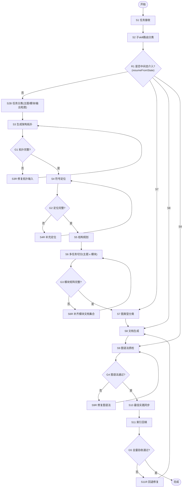

# gen-README 父技能（编排器）

## When to Use

- 用户要求基于源码生成一整套文档（不是单文件临时说明）。
- 需要“父 skill 编排 + 多子 skill 并行落点”。
- 需要先做架构拓扑与符号定位，再做文档写作。
- 需要自动判断图类型（`flowchart TD` / `sequenceDiagram`）。
- 需要按“主题 × 模块”拆成多文件并维护索引。

## 输入约束

默认输入目录（由用户已准备）：

- 模板副本：`template/microfb/`
- 绘图规则：`docs/Mermaid.md`、`docs/sequenceDiagram.md`

若用户未明确输出目录，默认输出到当前项目 `docs` 对应主题目录。

## 模板锚点总约束（降低自由发挥）

- 每个子 skill 必须声明并读取自己的相对引用锚点（Template Anchors）。
- 若锚点缺失，先报告缺失并暂停生成，不允许猜测性补全。
- 子 skill 输出不得突破锚点定义的目录层级、命名风格和状态机阶段。

## 强制流程（状态机）

## 子技能调度顺序

按以下顺序执行，允许标记为“可并行”的步骤并行执行：

1. `/subskill-router-classifier`
2. `/microfb-topology-mapper`
3. `/microfb-symbol-locator`
4. `/microfb-doc-structure-planner`
5. `/microfb-source-extract`（可与步骤 6 并行）
6. `/diagram-type-classifier`
7. `/microfb-doc-writer`
8. `/mermaid-lint-fixer`
9. `/web-best-practice-sync`
10. `/readme-index-maintainer`

## 模块输出矩阵（S6 硬约束）

每个模块最少输出以下 6 类文档（可一类多文件）：

1. 架构拓扑
2. 运行时拓扑
3. 状态驱动说明
4. 单一状态链路
5. 说明文档
6. 使用手册

模块建议：认证、菜单、路由、子应用、会话、配置（可按项目扩展）。

## 图类型选择规则（调用分类子 skill）

- 简单结构图、单链路：优先 `flowchart TD`
- 并行分支多、强调交互顺序：优先 `sequenceDiagram`

## 必须包含的“符号定位”段

每份文档都要有“符号定位”小节，最少包含：

- 关键文件路径
- 关键函数/变量
- 关键读写点或调用点

不允许只给抽象叙述，不给源码落点。

## 质量门禁

- 门禁 1：拓扑完整（系统边界 + 模块关系 + 调用链）
- 门禁 2：定位完整（文件 + 函数/变量 + 读写点）
- 门禁 3：模块矩阵完整（六类文档齐全）
- 门禁 4：图语法通过（遵循 `docs/Mermaid.md` 与 `docs/sequenceDiagram.md`）
- 门禁 5：索引可用（README 能导航到全部产物）
