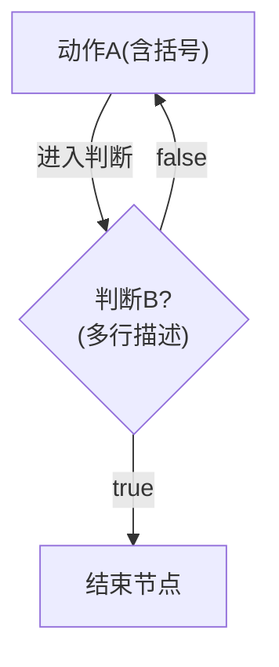
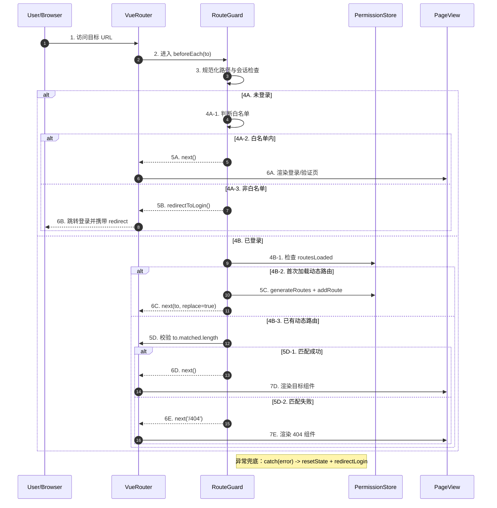

# Mermaid 编写规范（LLM 友好版）

## 1. 文档目标
- 目标：提供一组可被 LLM 稳定解析、可直接复用的 Mermaid 编写规则。
- 适用范围：`flowchart` 语法（含节点、连线、条件判断）。
- 核心原则：低歧义、强约束、可复制。

## 2. 快速规则（MVP）
1. 所有节点文本都用双引号包裹：`A["text"]`。
2. 所有连线标签都用双引号包裹：`A -->|"text"| B`。
3. 节点内换行统一使用 `<br/>`，禁止直接回车换行。
4. 节点 ID 使用短英文（如 `LOADCFG`、`WRITE`），不要使用长中文句子作为 ID。
5. 图方向显式声明：`flowchart TD` 或 `flowchart LR`。

## 3. 常见错误对照（错误 -> 正确）

### 3.1 括号导致解析中断
- 错误：`WRITE[writeMenuCache(latestMenus)]`
- 正确：`WRITE["writeMenuCache(latestMenus)"]`
- 原因：未加引号时，`(`、`)` 可能被解析器误判为语法边界。

### 3.2 节点内直接换行
- 错误：
```mermaid
LOADCFG[loadConfig()
失败内部会回退]
```
- 正确：`LOADCFG["loadConfig()<br/>失败内部会回退"]`
- 原因：`flowchart` 节点文本不支持裸换行。

### 3.3 连线标签包含特殊符号
- 错误：`DEV -->|import.meta.env.DEV?| LOADCFG`
- 正确：`DEV -->|"import.meta.env.DEV?"| LOADCFG`
- 原因：`.`、`?` 等字符在未加引号时容易触发解析冲突。

### 3.4 连线标签包含逗号和等号
- 错误：`QK -->|setMicroAppProps(menuList=[], userInfo=null)| RELOAD`
- 正确：`QK -->|"setMicroAppProps(menuList=[], userInfo=null)"| RELOAD`
- 原因：复杂表达式应整体视为字符串标签。

## 4. 推荐优先级（按收益排序）
1. **统一加引号**：收益最高，能规避大多数解析错误。
2. **统一 `<br/>` 换行**：保证布局可控，避免节点文本断裂。
3. **显式方向声明**：减少图结构随机性，提升可读性。
4. **短 ID 命名**：降低维护成本，减少连线输入错误。

## 5. 标准模板（可直接复用）


## 6. LLM 生成指令模板
可将以下指令直接提供给 LLM：

```text
请生成 Mermaid flowchart，必须满足：
1) 节点文本使用双引号；
2) 连线标签使用双引号；
3) 节点内换行使用 <br/>；
4) 使用短英文节点 ID；
5) 显式声明 flowchart 方向（TD 或 LR）。
输出仅包含 Mermaid 代码块，不要额外解释。
```

## 7. 输出前检查清单
- [ ] 是否所有节点文本都已加双引号？
- [ ] 是否所有连线标签都已加双引号？
- [ ] 是否不存在节点内部裸换行？
- [ ] 是否使用短英文 ID？
- [ ] 是否声明了图方向？

## 8. sequenceDiagram 模板（登录-路由-守卫-组件）

### 8.1 图例（Legend）
- `1..N`：主链路阅读顺序，优先按编号自上而下阅读。
- `->>`：发起调用/请求（过程动作）。
- `-->>`：返回结果、跳转结果或重进结果（结果动作）。
- `alt / else`：互斥分支，不代表并发执行。
- `Note right of X`：补充说明，不新增执行链路。

### 8.2 Template（可直接复用）
