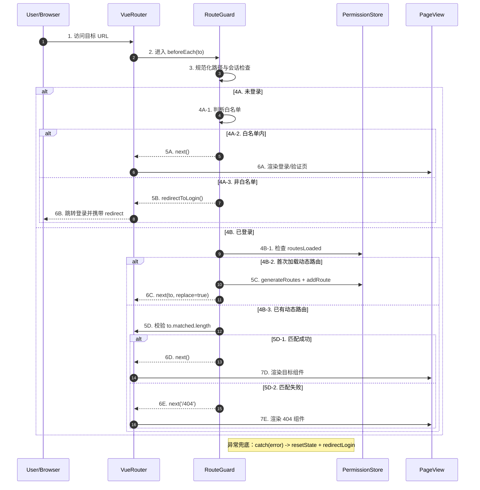
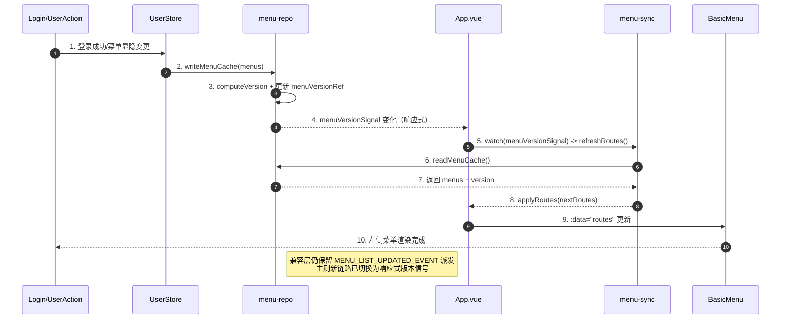

# sequenceDiagram 绘制经验总结（登录-路由-守卫-组件）

基于 `microfb/docs/microfb/状态链路/页面显示链路_登录-路由-守卫-组件.md` 的实战沉淀，本文重点解决两个问题：

- 如何把原先偏“结构展开”的 `flowchart TD`，改写为更贴近“时序阅读”的 `sequenceDiagram`。
- 如何避免 `alt/else` 被误读成“并行同时发生”。

## 1) 方案（MVP 与增强）

### MVP（先保证可读与可维护）

- 用 `sequenceDiagram` 承载“单主链 + 条件分支”的页面显示链路。
- 开启 `autonumber`，并在消息文本中保留手工编号（如 `5A-1`、`7E-2`）。
- 增加独立 `Legend`，明确箭头语义、分支语义、阅读顺序。

### 可选增强（复杂链路再启用）

- 用 `rect rgba(...)` 给不同阶段着色（登录判断、动态路由、兜底处理）。
- 给关键分支补 `Note right of`，说明“条件含义”而不是再扩展一条子链路。
- 同一图中保持“1 条主成功路径 + 若干互斥失败路径”，避免分支过多导致视觉噪音。

## 2) 实现（落图规则）

### 2.1 从 `flowchart TD` 到 `sequenceDiagram` 的映射经验

- `flowchart` 的“节点关系”先还原成“参与者之间的调用关系”（Browser、Router、Guard、Store、View）。
- 菱形判断改为 `alt / else`，并将判断条件写到 `alt` 标题中（如“已登录/未登录”）。
- 回跳与重定向统一用返回箭头 `-->>` 表达结果态，减少“调用中断”误读。

### 2.2 顺序表达：`autonumber + 手工编号`

- `autonumber` 负责全图自然递增，保证眼睛可按编号快速扫读。
- 手工编号负责业务语义分组（`5A` 未登录分支，`5B` 已登录分支），在文档评审时更容易对齐口径。
- 分支层级建议：`N`（主步骤）→ `NA/NB`（互斥大分支）→ `NA-1/NA-2`（分支内子步骤）。

### 2.3 分支误读治理

- 在图例中明确：`alt / else` 是互斥关系，不是并发关系。
- 将“补充说明”放在 `Note`，不要再画额外箭头，否则容易被误解为独立执行链路。
- 能合并的同类异常统一收敛到“异常兜底”注释，避免图面碎裂。

### 2.4 图例（Legend，独立维护）

- `1..N`：主链路阅读顺序，优先按编号自上而下阅读。
- `->>`：发起调用/请求（过程动作）。
- `-->>`：返回结果、跳转结果或重进结果（结果动作）。
- `alt / else`：互斥分支，同一时刻只进入一个分支。
- `Note right of X`：解释条件或约束，不表示新增执行链。

## 3) 自检（类型 / 边界 / 错误处理）

- **类型一致性**：参与者命名是否稳定（如 `R` 始终代表 `VueRouter`）。
- **边界完整性**：是否覆盖未登录、已登录、无匹配路由、异常兜底四类关键边界。
- **错误处理可见性**：是否显式标注 catch/重定向，避免“静默失败”。

## 4) Template（可直接复用）

> 使用建议：保留 `autonumber` 与手工编号并存；评审时可直接按 `4A/4B` 分支口径逐段走查。

## 5) 菜单刷新链路渲染图（本次改造）

### 5.1 参与者变量定义（浏览器语义 + 源码定位）

| 图中变量 | 浏览器中是什么 | 源码定位（文件） | 具体变量/函数 |
| --- | --- | --- | --- |
| `L` (`Login/UserAction`) | 触发菜单变更的业务动作来源（登录成功、菜单显隐操作） | `microfb/src/views/login/components/Login.vue`、`microfb/src/plugins/qiankun/actions.ts` | `handleLoginSubmit()` / `submitMfaVerification()`（登录链路）；`applyMenuVisibilityIntentToMainMenu()`（菜单显隐链路） |
| `US` (`UserStore`) | Pinia 用户状态容器，承接登录后菜单落库与用户态同步 | `microfb/src/store/modules/user/user.store.ts` | `finalizeV2Login()`、`refreshCurrentUserMenus()` |
| `MR` (`menu-repo`) | 菜单缓存仓储与菜单版本信号中心 | `microfb/src/services/menu/menu-repo.ts` | `writeMenuCache()`、`readMenuCache()`、`computeVersion()`、`menuVersionRef` |
| `APP` (`App.vue`) | 基座根组件，负责把菜单路由结果喂给左侧菜单组件 | `microfb/src/App.vue` | `routes`、`refreshRoutes()`、`menuVersionSignal`、`watch(menuVersionSignal, refreshRoutes, ...)` |
| `MS` (`menu-sync`) | 菜单同步服务，负责把缓存菜单转成可渲染路由并回写 | `microfb/src/services/menu/menu-sync.ts` | `syncMenuRefresh()` |
| `BM` (`BasicMenu`) | 左侧菜单渲染组件（最终 UI 呈现层） | `microfb/src/layout/menu/index.vue`（或同目录实际入口） | `:data="routes"` 输入渲染 |

### 5.2 图中关键字段定义

| 字段/符号 | 浏览器中含义 | 源码定位（文件） | 具体变量/函数 |
| --- | --- | --- | --- |
| `menus` | 当前用户可见菜单树（缓存态） | `microfb/src/services/menu/menu-repo.ts` | `writeMenuCache(menus)` 入参；`readMenuCache()` 返回值中的 `menus` |
| `version` | 菜单树内容哈希后的版本号（用于变更判定） | `microfb/src/services/menu/menu-repo.ts` | `computeVersion()` 结果；`readMenuCache()` 返回值中的 `version` |
| `menuVersionRef` | 菜单版本的响应式状态源 | `microfb/src/services/menu/menu-repo.ts` | `const menuVersionRef = ref("0")` |
| `menuVersionSignal` | 暴露给页面层订阅的只读版本信号 | `microfb/src/services/menu/menu-repo.ts`、`microfb/src/App.vue` | `useMenuVersionSignal()` 返回值；`const menuVersionSignal = useMenuVersionSignal()` |
| `routes` | 给左侧菜单组件消费的路由树 | `microfb/src/App.vue` | `const routes = ref<RouteRecordRaw[]>([])`，由 `applyRoutes(nextRoutes)` 更新 |
| `MENU_LIST_UPDATED_EVENT` | 历史兼容事件广播（非主刷新驱动） | `microfb/src/services/menu/menu-repo.ts` | `MENU_LIST_UPDATED_EVENT` 常量与 `dispatchMenuUpdated()` |

### 5.3 说明（防误读）

- `MR -->> APP: menuVersionSignal 变化` 在浏览器里不是 DOM 事件，而是 **Vue 响应式依赖触发**。
- 图中的“主链路”是：`writeMenuCache -> menuVersionRef 更新 -> App watch -> syncMenuRefresh -> routes 更新`。
- `MENU_LIST_UPDATED_EVENT` 仍存在，但定位为兼容层通知，不再是左侧菜单刷新的唯一触发源。
