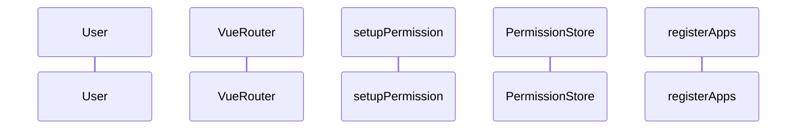

# 来源摘录

来源文件：`template/microfb/运行时拓扑_登录到首屏.md`

关键摘录：

```mermaid
sequenceDiagram
  participant User as User
  participant Router as VueRouter
  participant Guard as setupPermission
  participant Perm as PermissionStore
  participant Qiankun as registerApps
```

该片段是节点真实修复对象的最小来源。
