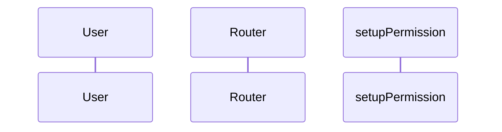
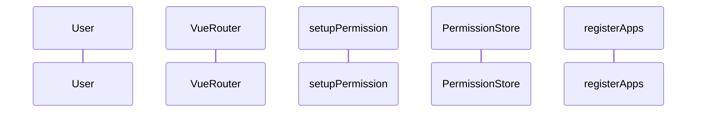

# 真实输出

输入图块问题：

- 参与者命名不统一
- 注释和节点说明混在图块里时容易影响渲染

原图块样板：

```mermaid
sequenceDiagram
  participant User as User
  participant Router as Router
  participant Guard as setupPermission
```

修复后图块示例：

```mermaid
sequenceDiagram
  participant User as User
  participant Router as VueRouter
  participant Guard as setupPermission
  participant Perm as PermissionStore
  participant Qiankun as registerApps
```
