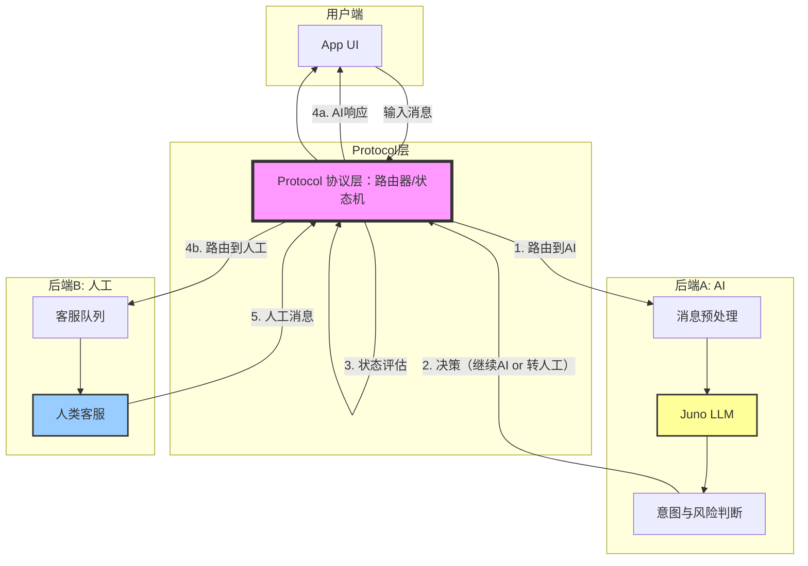

# **工程级的拆解**

我要给你的是一个**工程级的拆解**，而不是一段新闻复述。我们把它当成一个真实的、要你来设计的系统来对待。

---

## 1. 概念解构：本质与边界

### 第一性原理定义

剥离掉“苹果”、“Claude”、“客服”这些修饰词，这个设计的本质是什么？

**本质：一个“统一路由 + 异构处理”的消息系统。**

- **统一路由**：所有消息（用户的、AI的、人工的）进入同一个消息管道，由一个中心协议层决定如何处理和转发。
- **异构处理**：消息的“生产者”是完全不同的——一端是概率性的LLM (Juno/Claude)，另一端是确定性的真人 (Live Agents)。但“消费者”（用户的上层UI）不需要知道它们的区别。

换言之，它的物理基础是一个**消息队列**（Message Queue）或**事件流**，加上一个**策略路由器**。Juno和Live Agents是两个独立的“处理单元”，Protocol层是两者之间的“交换机”。

### 能力边界

| 它能做什么 | 它不能做什么（非目标） |
| :--- | :--- |
| **实现状态的无缝转移**：AI答不了的问题，能在同一个会话中平滑转真人，上下文不丢失。 | **保证AI的准确性**：Protocol层只关心消息的“到达”和“分发”，不关心消息“内容的正确性”。 |
| **隐藏系统复杂性**：UI开发者只需实现一个`sendMessage(text)`接口，不需要管消息是被AI还是人类处理的。 | **处理异步的非即时消息**：比如发送邮件、生成报告等长时间任务。它是一个“即时对话”系统，不是“工单”系统。 |
| **提供A/B测试或灰度切换**：可以在协议层决定，10%的流量走V2版Juno，90%走V1版。 | **替代传统的工单系统**：它专注于“对话状态”的管理，而不是“问题生命周期”的管理（如派单、SLA、升级）。 |

---

## 2. 范式对比：选型辩证法

### 参照系选择

我们要对比的不是“双后端 vs 单后端”，而是“**如何让AI和人协作**”的两种根本不同的哲学。

- **参照系A：传统的“纯人工客服”系统** (如 Zendesk, Freshdesk)
    - 哲学：系统是人和规则的延伸。AI最多是一个“搜索助手”，帮助客服查知识库。所有消息必须由人工发送和审核。
- **参照系B：当前多数“AI+人工”的拼接方案** (如 Intercom 的 Fin AI + 人工，或者直接在系统里接入 ChatGPT)
    - 哲学：AI是一个“独立的聊天机器人”，当AI搞不定时，它调用API创建一个“新工单”，把用户**转接**给人工。转接意味着会话会断开，用户可能重复描述问题。

### 博弈分析

#### 为什么选择 [双后端系统] (Apple 的方法)？

1.  **核心获益：消除“转接损耗”**
    - 传统的“AI -> 人工”切换是一次“车祸现场”：上下文丢失，用户需重复信息，体验断崖式下跌。双后端系统通过**协议层**保证：AI的历史推理、已收集的信息(如序列号、症状描述)“一次性提交”给人工客服。用户看到的还是一条连贯的对话。
2.  **核心获益：完全掌控切换时机和策略**
    - 系统可以决定什么时候切。不仅仅是AI“不知道”时才切，可以基于用户情绪检测、对话轮次、甚至是**AB测试**来决定：这个用户在10%的“高价值用户”组里，我们给他更好的真人服务。

#### 机会成本（我们牺牲了什么？）

1.  **牺牲了系统简洁性**：你必须维护一个双倍的后端系统(Juno + Live Agent接口)。Juno不仅仅是LLM，它需要能理解session状态、决定何时触发切换。复杂度指数级上升。
2.  **牺牲了“人工客服自主权”**：在传统系统里，人工客服想做什么就做什么。但在双后端系统里，他们被协议层“框住”了——他们必须遵循前序AI产生的对话状态。如果他们忽略AI给出的诊断结果，系统会混乱。
3.  **牺牲了数据一致性的可审计性**：在“切换”的那一刹那，如果AI和人工同时收到同一条消息怎么办？是让AI闭嘴等人工，还是强制结束AI？这里有一个 **“双写/状态冲突”** 的风险。

---

## 3. 度量衡构建：定义其“第一性指标”

我们需要三个核心指标来评估这个系统的健康度。我们不能只说“好”或“快”，要说清楚**快在哪里**。

### 核心指标1：`切换成功率 (Handoff Success Rate)`
- **定义**：从AI的最后一条消息，到人工客服发出一条有效响应，用户**不需要**重复输入任何关键信息（如设备序列号、问题描述）的比例。
- **为什么**：这是“双后端”存在的唯一理由。如果这个指标低，整个架构就是废的。

**实战场景与代码片段**：

```python
# 伪代码：切换时的状态传递
class SessionState:
    intent: str  # "查找Apple Care购买记录"
    priority: int # "high" (用户情绪已激怒)
    collected_params: dict = {
        "serial_number": "C02XXXXX",
        "purchase_date": "2024-01-15"
    }

# Protocol层切换时，必须传递这个state
def handoff_to_live_agent(session_id: str, state: SessionState):
    # 数据流转：Protocol -> 人工客服的工作台
    agent_workbench.show(session_id, state)
    # 人工客服打开对话，第一句话是AI预写的草稿：
    # "用户[用户ID]，需要帮忙绑定Apple Care到序列号C02XXXX上，对吗？"
    # 如果用户回复"是的"，则 handoff success.
    # 如果用户说"我刚才说的是XX型号，不是这个"，则 handoff failure.
```

**数据流**：`用户输入 -> Juno解析 -> SessionState -> 切换触发器 -> Protocol层 -> 人工客服工作台` -> 客服根据`SessionState`给出响应。

### 核心指标2：`AI完成率 (AI Resolution Rate)`
- **定义**：在**没有**触发人工切换、完全由AI结束对话的会话占比。
- **量级预估**：一个好的通用客服AI，完成率应在 **60% - 80%**。低于40%说明Juno根本没用，高于90%说明Juno只处理了最简单的问题（但你没有统计到它该转人工却没转的损失）。

**实战场景**：

```python
# 判断一个会话是否被AI解决
def is_ai_resolved(session: Session):
    # 关键：检查session的最后一个action是否由AI发出，且用户没有触发“转人工”等负面反馈
    if session.last_action.type == "AI_RESPONSE" and not session.has_nagetive_feedback:
        # 成功：用户满意度至少不是负面
        ...
    else:
        # 失败：要么转人工了，要么用户给了差评
        ...
```

### 核心指标3：`切换时延 (Handoff Latency)`
- **定义**：从用户输入“转人工”（或AI判定需要转人工）的那一刻起，到人工客服的第一条消息出现在用户聊天窗口里的时间差。
- **量级预估**：超时用户会崩溃。**目标：< 10秒**。如果超过30秒，80%的用户会关掉App或给出差评。

**实战场景**：

```python
import time

def handle_handoff(user_message, session):
    time_triggered = time.now()
    # ...[系统内部：通知人工客服池，选取空闲客服，传递sessionState]...
    agent_first_message = live_agent_respond(session)
    time_responded = time.now()
    
    handoff_latency = time_responded - time_triggered
    # 指标：handoff_latency 应 < 10s
    log_metric("handoff_latency", handoff_latency)
```

---

## 4. 工程演进：从 Demo 到生产

### 关键链路图示 (Mermaid)



### 失效模式分析

这个系统最**脆弱**的点，不在于Juno或Live Agent本身，而在于**协议层 (Protocol)** 的“切换逻辑”。

**失效场景：切换风暴 (Handoff Storm)**
- **描述**：突然涌入大量复杂问题（如：新品发布后服务器崩了，所有用户的提问都触发了“转人工”）。
- **后果**：
    1.  `B1 (客服队列)` 瞬间被成千上万个请求打满，人工客服根本接不过来。
    2.  `切换时延 (Handoff Latency)` 从 5 秒飙升至 5 分钟。
    3.  用户等待时重复发送“有人在吗？”，这些消息又会被`P (Protocol层)` 路由到`B2 (人工)`，进一步淹没他们。
    4.  **系统雪崩**：`P`的数据库因为同时处理大量切换状态的写入而崩溃。整个支持应用不可用。

**如何加固？**
1.  **链路的“熔断器”**：
    - 在`P`引入一个**阻尼器 (Damper)**。当检测到每秒钟的切换请求超过阈值时，`P`不再将新请求路由到`B`，而是向用户统一响应：“当前人工客服繁忙，您的请求已记录，稍后我们将致电您（或推送通知）。”
    - 保护 `B2 (人工客服)` 不被无限淹没，让他们能处理完积压再说。
2.  **状态写入的“异步化”**：
    - 将`SessionState`的存储从同步调用改为异步。`P`收到切换信号后，先将状态写入 Kafka/Redis，然后返回给用户“排队中...”。客服端异步拉取状态。
    - 代价：用户从“无缝转移”降级为“有等待的转移”。但**系统不崩溃 > 用户体验稍微下降**。
[Timestamp: 2026/05/02 22:21:12]
# 费曼学习法

**双后端系统，说白了就是一个“假厨房”和“真厨房”共用一个传菜窗口。**

苹果这个客服App，用户（就是你）在手机上和“客服”聊天。但你看不见对面是谁——可能是一个特别厉害的AI机器人，也可能是一个坐在苹果办公室里的真人。这个设计把两者拼在了一起，关键就在那个“传菜窗口”（文章里叫Protocol层）。

想象餐厅：

- **Juno AI** = 一个超快的机器人厨师，能做100种菜，很快，但遇到没见过的菜谱就傻眼。
- **Live Agent真人** = 一个真正的大厨，什么都会做，但比较慢，一天只能做50份。
- **Protocol传菜窗口** = 一个聪明的服务员，手里有一张单子。服务员对着厨房喊：“客人点了蛋炒饭，机器人来做！”过一会儿机器人做好了，服务员直接端出去。客人没发现是机器人做的。

如果客人突然说：“蛋炒饭不要葱，加双蛋。”机器人厨师翻遍数据库没找到这个做法，就报告服务员。服务员立刻对另一边喊：“客人要定制！大厨你来！”真大厨接过单子，看着机器人之前做了一半的记录（没放葱的步骤），直接继续加双蛋炒完端出去。客人从头到尾觉得只是同一个厨师正常改单，根本不知道自己面前换了一个人。

**现在想象这幅画面（闭上眼睛）：**

一个三层楼房。

- **顶楼**：顾客在窗前点餐，窗口只有一个，上面写着“客服”。
- **一楼左边**：一个蓝色像冰箱一样发着蓝光的机器，正在疯狂炒蛋炒饭，手臂上有“Juno”标记。
- **一楼右边**：一张木头凳子，坐着一个戴耳机的叔叔，面前有块屏幕，屏幕上就是他刚才接到的菜谱。
- **中间一楼的走廊**：站着一个穿白衬衫的经理，胸前别着对讲机。他手里拿着一张黏黏的纸条，写着“蛋炒饭不要葱加双蛋”。

**关键画面**：经理把纸条同时给左右递了一下，但最后只让右边的叔叔开始做。左边的蓝光机器看到纸条后，自动变暗，不再动手。经理站在中间，像交通警察——他塞住所有“这是谁做的”这种问题，永远只对顾客说一句话：“厨房正在为您做。”顾客看到的是：一个完整的、流畅的聊天。没有“已转接”，没有重复问题。

这就是那个设计。你懂的——经理才是那个让一切看起来简单的家伙。就是这个穿白衬衫的角色，决定了这个双后端系统是神奇的魔法，还是灾难性的烂尾楼。
[Timestamp: 2026/05/02 22:25:18]

# 总结
基于 {{activeNote}} 的内容，以下是实战专家的三个输出：

---

### 1. 场景模拟：你明天可能遇到的真实问题

**场景**：你是某中型电商平台的客服系统负责人。明天早会，产品经理拿着用户投诉数据来找你——用户反馈说在App里问“我的订单为什么还没发货”，AI客服给了标准回复“请稍等”，然后用户说“我要转人工”，结果聊天窗口突然断开，用户被迫重新选择工单分类，再排队等真人客服，而且真人客服不知道用户刚才说了什么，用户又得重复一遍订单号和问题。

**老板的要求**：下个迭代必须解决这个“转接记忆丢失”的问题，让AI和人工无缝衔接，用户感觉不到换了人。

**你必须用到的本文知识**：
1. **双后端系统**：设计两个后端——一个AI自动应答（像Juno），一个人工坐席（像Live Agents），它们共享一个**协议层**（Protocol），负责统一路由和状态传递。
2. **三角色消息结构**：消息体系中引入三个角色：client（用户）、agent（真人客服）、assistant（AI）。所有消息走同一处理流程，不暴露消息来源，从而让“切换”对用户透明。
3. **Protocol层是关键**：切换时，AI必须把已收集的信息（如订单号、历史上下文、用户意图）打包成一个“会话状态”，通过协议层传递给人工坐席的界面，人工坐席打开聊天时已经能看到所有信息。

**具体做法**：你需要在后端增加一个会话状态管理器（Session State），在AI判断需要转人工时，冻结AI处理，将状态通过Protocol层传递到人工坐席队列。人工坐席接入时，系统自动显示AI已收集的所有字段，并且人工的第一条消息可以基于这些上下文生成（比如“您提到的订单XXXX，我查了一下，预计明天发货”）。用户不需要重复任何信息。

---

### 2. 反直觉点：文中最容易被误解或忽略的观点

**最反直觉的点**：**问题不是“该不该提交Claude.md”，而是“提交了之后怎么又进了发布包”** ——整个流程审查失效了。

大多数人会争论“Claude.md该不该进版本控制”，这其实根本不是重点。真正可怕的是：苹果这样级别的公司，在代码提交、代码审查、构建、打包、测试、发布审批的完整流水线中，**没有任何一个环节拦住一个不应该出现的文件被推送到生产环境的App里**。

更反直觉的是：**问题可能出在Claude Code自己身上**。文章指出“它经常选择性无视指示，重复多少遍也没用”——这意味着AI编码助手可能不遵守你设定的.gitignore规则或构建指令，这才是事故的根源。你信任它，但它没按照你说的做。这种“AI的不可控性”才是行业最该警醒的。

---

### 3. Flashcard（闪卡）问题

**Flashcard 1**  
Q: 苹果泄露的Claude.md中，客服系统的两个后端分别叫什么名字？  
A: Juno AI（负责自动应答）和 Live Agents（负责真人客服接管）。

**Flashcard 2**  
Q: 苹果在自家服务器上运行定制版Claude模型，这样做保留了哪项核心原则？  
A: 数据不出苹果的基础设施，完全符合苹果一贯的隐私立场（用AI可以，数据不能出去）。  

**Flashcard 3**  
Q: 文章中指出，最先曝光苹果App夹带Claude.md文件的分析师是谁？  
A: MacRumors的分析师 Aaron Perris。
[Timestamp: 2026/05/02 22:27:12]