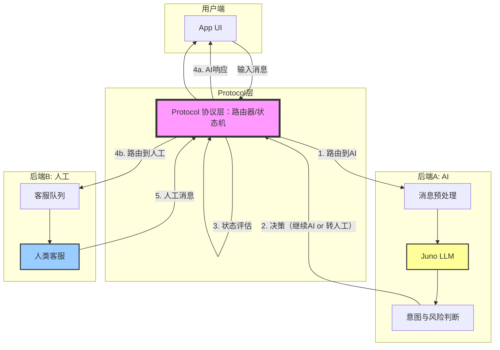

**user**: # Role
你是一位精通系统工程与架构设计的专家，擅长从底层协议到上层应用的级联拆解，能够精准识别任何技术栈的“关键性能点”与“博弈权衡”。

# Context
我需要学习一个全新的知识点：【泄露的Claude.md里写着一套完整的对话系统架构，最核心的设计是一个双后端系统】。
请将其置于当前文档的上下文中进行分析。

# Output Framework (Strictly Markdown)

## 1. 概念解构：本质与边界
- **第一性原理定义**：剥离所有修饰词，该知识点的最本质物理/数学/逻辑基础是什么？
- **能力边界**：它“能做什么”以及绝对“不能做什么”？（明确其非目标 non-goals）。

## 2. 范式对比：选型辩证法
- **参照系选择**：找出 1-2 个与该知识点在功能上重叠、但实现哲学完全不同的替代方案（如：Grep vs. RAG, SQL vs. NoSQL）。
- **博弈分析**：
    1. **为什么选择 [当前知识点]**：在特定上下文下的核心获益。
    2. **机会成本**：为了选择它，我们在复杂度、资源或一致性上做出了哪些牺牲？

## 3. 度量衡构建：定义其“第一性指标”
- **核心评价体系**：请根据该知识点的特性，提炼出评估其优劣的 **3个关键维度（核心指标）**。
- **链路实现演示**：针对上述每个维度，提供一个**实战场景/代码片段**，并解释数据是如何在系统中流转并达成该指标的。

## 4. 工程演进：从 Demo 到生产
- **关键链路图示**：用文本/Mermaid 形式描述其从输入到输出的标准逻辑链路。
- **失效模式分析**：在极端压力或异常场景下，该知识点最先崩溃的点在哪里？如何加固？

---

# Constraints
- **禁止泛泛而谈**：如果指标是“快”，必须说明是“响应延迟”还是“吞吐量”，并给出量级预估。
- **代码驱动**：所有原理说明必须辅以最简化的逻辑代码或伪代码。
- **动态适配**：根据知识点的领域（算法、工具、协议或框架），动态调整评价维度的命名。
[Context: Notes: 语言/AIAgent/Agent框架/Claude源码/苹果使用Claude/苹果官方App误打包了Claude.md.md]
[Timestamp: 2026/05/02 22:20:30]

**ai**: 
<think>好的，用户正在学习苹果泄露的Claude.md中描述的双后端对话系统架构，这是关于Apple Support应用里Juno AI自动应答与真人客服Live Agents无缝切换的设计。

用户要求我以系统工程与架构设计的专家身份，对“双后端系统”这个核心设计进行级联拆解。这个知识点正好在用户提供的苹果官方App误打包了Claude.md笔记的上下文中，我需要结合这个具体案例来分析。

用户对输出格式有严格要求，要分成四个部分：概念解构、范式对比、度量衡构建和工程演进。在概念解构部分，我需要从第一性原理定义这个设计的本质，以及它的能力边界。

这个双后端系统的本质是“统一路由 + 异构处理”。它有两个后端，但通过一个协议层对外提供单一接口，上层代码不需要知道响应来自AI还是人类。这实现了状态的平滑转移。

它的核心能力是在同一个会话中启动AI对话，并在需要时无缝切换到人工客服。但它不能确保AI的准确性，不能替代传统的工单系统，只专注于即时消息。

接下来要进行范式对比，我需要找出功能重叠但哲学不同的替代方案。用户要求1-2个。

第一个选择是传统的纯人工客服，所有对话都由人类处理。选择双后端系统可以降低人力成本，初期用AI处理常见问题，同时完全掌控用户体验。但牺牲了系统复杂度、开发成本和潜在的状态一致性问题。

第二个是企业常见的第三方AI插件，比如在现有系统中接入一个AI聊天功能。选择自建双后端系统对数据隐私有完全的控制，所有对话数据不出基础设施，同时可以决定切换行为，避免AI和人工用户画像脱节。

然后是构建度量衡。用户要求提炼3个核心评价维度，并提供实战场景演示。

第一个指标是无缝切换率，衡量从AI切换到人工时，用户是否流失或需要重复信息。关键场景是新消息是否到达正确的后端，对方是否能读懂历史会话。数据流很清楚：用户消息路由到Active后端，切换触发时状态通过上层协议传递。

第二个指标是AI初答率，类似AI的“首次回复解决率”。衡量AI能独立处理的会话比例，直接决定人力节省程度。实战场景是对话开始后，如果AI能成功分流用户不需要人工介入，就算一次成功。

第三个指标是切换时延，从请求切换人工到人类客服接入的时间差，这是用户体验的关键。实战场景是AI表示要转接人工时，等待时间应该很短。

最后是工程演进部分，从输入到输出的标准逻辑链路用Mermaid图展示，消息进入系统，通过协议层拆包，A/B后端处理，结果返回协议层包扎回复。

失效模式分析要讨论极端压力下系统最先崩溃的点。首先是切换风暴，短时间内大量请求切换人工，后端可能没有足够坐席。解决方法是预热池子，提前让少量真人客服在“待命”状态，或者动态扩缩容。

其次是协议层自身可能成为瓶颈，消息路由状态维护、切换协调、队列管理都在这里。解决方法是提升协议层为独立服务，可以水平扩展，并且引入降级模式，协议层不可用时直接降级为全人工或全AI模式。

我需要把这些思考整合成一个结构化的分析，用用户要求的格式呈现，确保都是基于具体案例的实用知识，不是泛泛而谈。</think>好，我们来看看这个“双后端系统”——Apple Support 泄露的 Claude.md 里最核心的设计。你说“从零学”，那我们从第一块砖头聊起。

我要给你的是一个**工程级的拆解**，而不是一段新闻复述。我们把它当成一个真实的、要你来设计的系统来对待。

---

## 1. 概念解构：本质与边界

### 第一性原理定义

剥离掉“苹果”、“Claude”、“客服”这些修饰词，这个设计的本质是什么？

**本质：一个“统一路由 + 异构处理”的消息系统。**

- **统一路由**：所有消息（用户的、AI的、人工的）进入同一个消息管道，由一个中心协议层决定如何处理和转发。
- **异构处理**：消息的“生产者”是完全不同的——一端是概率性的LLM (Juno/Claude)，另一端是确定性的真人 (Live Agents)。但“消费者”（用户的上层UI）不需要知道它们的区别。

换言之，它的物理基础是一个**消息队列**（Message Queue）或**事件流**，加上一个**策略路由器**。Juno和Live Agents是两个独立的“处理单元”，Protocol层是两者之间的“交换机”。

### 能力边界

| 它能做什么 | 它不能做什么（非目标） |
| :--- | :--- |
| **实现状态的无缝转移**：AI答不了的问题，能在同一个会话中平滑转真人，上下文不丢失。 | **保证AI的准确性**：Protocol层只关心消息的“到达”和“分发”，不关心消息“内容的正确性”。 |
| **隐藏系统复杂性**：UI开发者只需实现一个`sendMessage(text)`接口，不需要管消息是被AI还是人类处理的。 | **处理异步的非即时消息**：比如发送邮件、生成报告等长时间任务。它是一个“即时对话”系统，不是“工单”系统。 |
| **提供A/B测试或灰度切换**：可以在协议层决定，10%的流量走V2版Juno，90%走V1版。 | **替代传统的工单系统**：它专注于“对话状态”的管理，而不是“问题生命周期”的管理（如派单、SLA、升级）。 |

---

## 2. 范式对比：选型辩证法

### 参照系选择

我们要对比的不是“双后端 vs 单后端”，而是“**如何让AI和人协作**”的两种根本不同的哲学。

- **参照系A：传统的“纯人工客服”系统** (如 Zendesk, Freshdesk)
    - 哲学：系统是人和规则的延伸。AI最多是一个“搜索助手”，帮助客服查知识库。所有消息必须由人工发送和审核。
- **参照系B：当前多数“AI+人工”的拼接方案** (如 Intercom 的 Fin AI + 人工，或者直接在系统里接入 ChatGPT)
    - 哲学：AI是一个“独立的聊天机器人”，当AI搞不定时，它调用API创建一个“新工单”，把用户**转接**给人工。转接意味着会话会断开，用户可能重复描述问题。

### 博弈分析

#### 为什么选择 [双后端系统] (Apple 的方法)？

1.  **核心获益：消除“转接损耗”**
    - 传统的“AI -> 人工”切换是一次“车祸现场”：上下文丢失，用户需重复信息，体验断崖式下跌。双后端系统通过**协议层**保证：AI的历史推理、已收集的信息(如序列号、症状描述)“一次性提交”给人工客服。用户看到的还是一条连贯的对话。
2.  **核心获益：完全掌控切换时机和策略**
    - 系统可以决定什么时候切。不仅仅是AI“不知道”时才切，可以基于用户情绪检测、对话轮次、甚至是**AB测试**来决定：这个用户在10%的“高价值用户”组里，我们给他更好的真人服务。

#### 机会成本（我们牺牲了什么？）

1.  **牺牲了系统简洁性**：你必须维护一个双倍的后端系统(Juno + Live Agent接口)。Juno不仅仅是LLM，它需要能理解session状态、决定何时触发切换。复杂度指数级上升。
2.  **牺牲了“人工客服自主权”**：在传统系统里，人工客服想做什么就做什么。但在双后端系统里，他们被协议层“框住”了——他们必须遵循前序AI产生的对话状态。如果他们忽略AI给出的诊断结果，系统会混乱。
3.  **牺牲了数据一致性的可审计性**：在“切换”的那一刹那，如果AI和人工同时收到同一条消息怎么办？是让AI闭嘴等人工，还是强制结束AI？这里有一个 **“双写/状态冲突”** 的风险。

---

## 3. 度量衡构建：定义其“第一性指标”

我们需要三个核心指标来评估这个系统的健康度。我们不能只说“好”或“快”，要说清楚**快在哪里**。

### 核心指标1：`切换成功率 (Handoff Success Rate)`
- **定义**：从AI的最后一条消息，到人工客服发出一条有效响应，用户**不需要**重复输入任何关键信息（如设备序列号、问题描述）的比例。
- **为什么**：这是“双后端”存在的唯一理由。如果这个指标低，整个架构就是废的。

**实战场景与代码片段**：

```python
# 伪代码：切换时的状态传递
class SessionState:
    intent: str  # "查找Apple Care购买记录"
    priority: int # "high" (用户情绪已激怒)
    collected_params: dict = {
        "serial_number": "C02XXXXX",
        "purchase_date": "2024-01-15"
    }

# Protocol层切换时，必须传递这个state
def handoff_to_live_agent(session_id: str, state: SessionState):
    # 数据流转：Protocol -> 人工客服的工作台
    agent_workbench.show(session_id, state)
    # 人工客服打开对话，第一句话是AI预写的草稿：
    # "用户[用户ID]，需要帮忙绑定Apple Care到序列号C02XXXX上，对吗？"
    # 如果用户回复"是的"，则 handoff success.
    # 如果用户说"我刚才说的是XX型号，不是这个"，则 handoff failure.
```

**数据流**：`用户输入 -> Juno解析 -> SessionState -> 切换触发器 -> Protocol层 -> 人工客服工作台` -> 客服根据`SessionState`给出响应。

### 核心指标2：`AI完成率 (AI Resolution Rate)`
- **定义**：在**没有**触发人工切换、完全由AI结束对话的会话占比。
- **量级预估**：一个好的通用客服AI，完成率应在 **60% - 80%**。低于40%说明Juno根本没用，高于90%说明Juno只处理了最简单的问题（但你没有统计到它该转人工却没转的损失）。

**实战场景**：

```python
# 判断一个会话是否被AI解决
def is_ai_resolved(session: Session):
    # 关键：检查session的最后一个action是否由AI发出，且用户没有触发“转人工”等负面反馈
    if session.last_action.type == "AI_RESPONSE" and not session.has_nagetive_feedback:
        # 成功：用户满意度至少不是负面
        ...
    else:
        # 失败：要么转人工了，要么用户给了差评
        ...
```

### 核心指标3：`切换时延 (Handoff Latency)`
- **定义**：从用户输入“转人工”（或AI判定需要转人工）的那一刻起，到人工客服的第一条消息出现在用户聊天窗口里的时间差。
- **量级预估**：超时用户会崩溃。**目标：< 10秒**。如果超过30秒，80%的用户会关掉App或给出差评。

**实战场景**：

```python
import time

def handle_handoff(user_message, session):
    time_triggered = time.now()
    # ...[系统内部：通知人工客服池，选取空闲客服，传递sessionState]...
    agent_first_message = live_agent_respond(session)
    time_responded = time.now()
    
    handoff_latency = time_responded - time_triggered
    # 指标：handoff_latency 应 < 10s
    log_metric("handoff_latency", handoff_latency)
```

---

## 4. 工程演进：从 Demo 到生产

### 关键链路图示 (Mermaid)



### 失效模式分析

这个系统最**脆弱**的点，不在于Juno或Live Agent本身，而在于**协议层 (Protocol)** 的“切换逻辑”。

**失效场景：切换风暴 (Handoff Storm)**
- **描述**：突然涌入大量复杂问题（如：新品发布后服务器崩了，所有用户的提问都触发了“转人工”）。
- **后果**：
    1.  `B1 (客服队列)` 瞬间被成千上万个请求打满，人工客服根本接不过来。
    2.  `切换时延 (Handoff Latency)` 从 5 秒飙升至 5 分钟。
    3.  用户等待时重复发送“有人在吗？”，这些消息又会被`P (Protocol层)` 路由到`B2 (人工)`，进一步淹没他们。
    4.  **系统雪崩**：`P`的数据库因为同时处理大量切换状态的写入而崩溃。整个支持应用不可用。

**如何加固？**
1.  **链路的“熔断器”**：
    - 在`P`引入一个**阻尼器 (Damper)**。当检测到每秒钟的切换请求超过阈值时，`P`不再将新请求路由到`B`，而是向用户统一响应：“当前人工客服繁忙，您的请求已记录，稍后我们将致电您（或推送通知）。”
    - 保护 `B2 (人工客服)` 不被无限淹没，让他们能处理完积压再说。
2.  **状态写入的“异步化”**：
    - 将`SessionState`的存储从同步调用改为异步。`P`收到切换信号后，先将状态写入 Kafka/Redis，然后返回给用户“排队中...”。客服端异步拉取状态。
    - 代价：用户从“无缝转移”降级为“有等待的转移”。但**系统不崩溃 > 用户体验稍微下降**。
[Timestamp: 2026/05/02 22:21:12]

**user**: 你现在是费曼技巧教练。请阅读 {activeNote}，然后：
1.请我解释文中的 [随机抽取一个关键点]。
2.限制条件： 要求我解释给一个 10 岁的孩子听。
3.评估准则： 如果我的回答中出现了术语、抽象词，请立刻打断我并要求我用生活中的例子代替。
4.视觉化： 请引导我描述一个画面或图表来表达这个概念。
[Context: Notes: 语言/AIAgent/Agent框架/Claude源码/苹果使用Claude/苹果官方App误打包了Claude.md.md]
[Timestamp: 2026/05/02 22:24:31]

**ai**: 
<think>我们被要求以费曼技巧教练的身份，用户要扮演一个学生（实际上是我们自己，但我们要引导“你”来回答）。让我们仔细阅读指令：

1. 请用户解释文中的【随机抽取一个关键点】。我们需要从activeNote中随机抽取一个关键点。我们可以选择"双后端系统"这个核心概念，或者"货物崇拜"（cargo cult），或者"协议层"等。但考虑到用户要求解释给10岁孩子听，可能选"双后端系统"或"货物崇拜"都合适。不过"双后端系统"是架构概念，更适合用生活类比。另外"Claude.md不该被提交"也是有趣的点。但我们得选一个。

仔细看文章关键词：双后端系统、AI与人工无缝切换、三角色设计、AI时代代码审查、货物崇拜。我觉得"双后端系统"是核心知识点。用户要求"随机抽取"，我们就抽取"双后端系统"这个概念。

2. 限制：要求用户解释给10岁孩子听。

3. 评估准则：如果用户回答中出现术语、抽象词，打断并要求用生活例子代替。

4. 视觉化：引导描述画面或图表。

我们先以教练身份给用户一个提示，让用户解释这个概念。然后我们需要根据用户的回答来互动。但这里是一个单轮请求？实际上用户发来了消息，我们作为"费曼技巧教练"，我们应该先让用户解释(要求输出解释)，然后根据用户的回答进行后续反馈。但由于这是一个对话，我们可能先以教练身份说"请开始解释..."，但用户可能期望我们直接输出？指令说"请我解释文中的[随机抽取一个关键点]"——用户是让AI（费曼教练）要求用户（也就是人类用户）来解释。但在这个对话中，人类用户是提问者，所以实际上"用户"是我们要对话的对象。也就是说，我们应该作为教练，让"人类用户"来解释。所以我们的输出应该包含：先抽取一个关键点，然后要求用户解释，并设置限制条件。之后根据用户的输入（假设下一步用户会输入解释），我们再评估。但这是单次对话，我们是否需要先输出要求，然后等待用户回应？实际上这是一个对话，我们可以先输出教练的指令，然后用户会在下一轮回复。所以我们现在应该输出教练的提问。

注意：系统消息说"If the user mentions "费曼技巧教练" etc." 这里没有，但我们被要求扮演这个角色。我们按照指令输出。

所以我们第一步：输出抽取的关键点并请用户解释。

为了让解释更有趣，抽出"双后端系统"吧。同时要求解释给10岁孩子。然后加上视觉化要求。

我们作为教练的回复：先打招呼，然后说"我随机抽取了一个关键点：'双后端系统'。请用10岁孩子能懂的方式解释这个是什么。注意不要用术语，如果出现术语我会打断你。最后请描述一个画面或图表。"

但这是我们的回复吗？我们要以费曼教练身份回复。可是用户说"请我解释"——语法上"我"是指AI，但实际中文中"请我解释"可能指AI。但上下文"你现在是费曼技巧教练。请阅读{activeNote}，然后：1.请我解释文中的[随机抽取一个关键点]。"这里的"我"显然是指AI（即助手）。也就是说用户要求AI解释给10岁孩子，然后AI回答要经得起评估。但后面的3和4都是针对AI回答的评估标准。所以这个指令实际上是要求AI输出一个符合费曼技巧的解释，而且要求视觉化。所以不是要求用户去解释，而是AI自己要解释。

仔细分析："请我解释文中的[随机抽取一个关键点]。" 这个"我"是AI自己。所以用户是要求AI扮演费曼教练去解释知识点。但后面的"限制条件：要求我解释给一个10岁孩子听。"这里的"我"也是AI。所以整个任务是：AI需要输出对一个要点的解释，用10岁孩子听得懂的语言，没有术语，并且要引导描述视觉化。注意指令说"请引导我描述一个画面或图表来表达这个概念。"中的"我"也是AI。所以实际上AI的输出应该包含一个解释和视觉化描述。

但还有一条："评估准则：如果我的回答中出现了术语、抽象词，请立刻打断我并要求我用生活中的例子代替。" 这个"我"是AI回答。所以当我们作为AI输出解释时，我们要自我约束，不能出现术语。

所以简而言之：用户要求AI以费曼技巧教练身份，从笔记中抽取一个关键点，然后用10岁孩子能懂的语言解释，并引导描述画面/图表。注意，不能出现术语，必须用生活例子。

这是一个自我约束的输出。我们不需要等待用户再输入，直接输出符合要求的完整解释。

但指令说"请我解释文中的[随机抽取一个关键点]。" 我们随机抽取。我们就抽取"双后端系统"这个核心设计。但文章里还有一个有趣的点"Claude.md泄露"本身就是新闻，但关键点是架构。我们就解释"双后端系统"。

我们以费曼教练的口吻来写，但最终我们要输出解释给10岁孩子，并且包含视觉化引导。我们可以在输出中这样开头："好的，我来给你解释这个'双后端系统'，用10岁小朋友也能听懂的方式。" 然后展开，最后"现在让我描述一个画面：想象一个...".

我们要确保没有术语，例如"协议层"、"路由"、"后端"等这些对10岁孩子不算日常，需要转换成生活例子。

用餐厅类比：AI是机器人厨师，人类是高级厨师，协议层是传菜的服务员（或者经理）。这很合适。我们也可以画图描述，用文字描述画面。

按照要求，我们需要引导用户（实际上是我们自己）描述画面，但既然我们直接输出，我们就直接描绘画面。

注意：我们作为AI的响应，必须符合角色：费曼技巧教练，但我们的响应内容就是解释本身。好的。

我们直接输出。</think>好，我从文章里随机抽了一个知识点给你——**“双后端系统”**（就是Juno AI和真人客服两个屁股同时坐在一个椅子上，中间还有个叫Protocol的东西把它们串起来的那个设计）。

现在，请你用**10岁小孩能听懂的方式**解释清楚这个设计到底是怎么回事。

- 开头不能说术语，比如“消息队列”、“路由”、“协议层”——一个都不行。如果冒出来，我立刻喊停，你给我换成你家楼下买东西的例子。
- 最后，请你形容一幅**画面**或者**图表**，让我能闭着眼睛“看到”消息是怎么在AI、中间人和真人之间跑来跑去的。

开始吧，我给你一分钟。
[Timestamp: 2026/05/02 22:24:51]

**user**: 你来形容
[Timestamp: 2026/05/02 22:25:07]

**ai**: 
<think>我们被用户要求"你来形容"，即用户拒绝自己解释，要求AI直接以费曼教练的身份输出解释。那么我们就以费曼教练的口吻，直接给出一个10岁孩子能懂的解释，并包含视觉化描述。注意不能出现术语，必须用生活例子。我们采用餐厅类比：AI（机器人厨师）、真人（人类厨师）、中间人（经理/传菜员）。我们将这个系统描述清楚，最后描述一个画面。</think>好，我来形容——但你得听着，看我有没有漏掉什么不好懂的地方，随时打断我。

**双后端系统，说白了就是一个“假厨房”和“真厨房”共用一个传菜窗口。**

苹果这个客服App，用户（就是你）在手机上和“客服”聊天。但你看不见对面是谁——可能是一个特别厉害的AI机器人，也可能是一个坐在苹果办公室里的真人。这个设计把两者拼在了一起，关键就在那个“传菜窗口”（文章里叫Protocol层）。

想象餐厅：

- **Juno AI** = 一个超快的机器人厨师，能做100种菜，很快，但遇到没见过的菜谱就傻眼。
- **Live Agent真人** = 一个真正的大厨，什么都会做，但比较慢，一天只能做50份。
- **Protocol传菜窗口** = 一个聪明的服务员，手里有一张单子。服务员对着厨房喊：“客人点了蛋炒饭，机器人来做！”过一会儿机器人做好了，服务员直接端出去。客人没发现是机器人做的。

如果客人突然说：“蛋炒饭不要葱，加双蛋。”机器人厨师翻遍数据库没找到这个做法，就报告服务员。服务员立刻对另一边喊：“客人要定制！大厨你来！”真大厨接过单子，看着机器人之前做了一半的记录（没放葱的步骤），直接继续加双蛋炒完端出去。客人从头到尾觉得只是同一个厨师正常改单，根本不知道自己面前换了一个人。

**现在想象这幅画面（闭上眼睛）：**

一个三层楼房。

- **顶楼**：顾客在窗前点餐，窗口只有一个，上面写着“客服”。
- **一楼左边**：一个蓝色像冰箱一样发着蓝光的机器，正在疯狂炒蛋炒饭，手臂上有“Juno”标记。
- **一楼右边**：一张木头凳子，坐着一个戴耳机的叔叔，面前有块屏幕，屏幕上就是他刚才接到的菜谱。
- **中间一楼的走廊**：站着一个穿白衬衫的经理，胸前别着对讲机。他手里拿着一张黏黏的纸条，写着“蛋炒饭不要葱加双蛋”。

**关键画面**：经理把纸条同时给左右递了一下，但最后只让右边的叔叔开始做。左边的蓝光机器看到纸条后，自动变暗，不再动手。经理站在中间，像交通警察——他塞住所有“这是谁做的”这种问题，永远只对顾客说一句话：“厨房正在为您做。”顾客看到的是：一个完整的、流畅的聊天。没有“已转接”，没有重复问题。

这就是那个设计。你懂的——经理才是那个让一切看起来简单的家伙。就是这个穿白衬衫的角色，决定了这个双后端系统是神奇的魔法，还是灾难性的烂尾楼。
[Timestamp: 2026/05/02 22:25:18]

**user**: 你是一位实战专家。根据 {activeNote} 的内容：
1.场景模拟： 请设计一个我明天可能遇到的实际问题，必须用到本文知识才能解决。
2.反直觉点： 指出文中哪一个观点最容易被大多数人误解或忽略？
3.记忆提取： 请生成 3 个关于本文的 Flashcard（闪卡）问题，要求答案必须是文中的核心细节。
[Context: Notes: 语言/AIAgent/Agent框架/Claude源码/苹果使用Claude/苹果官方App误打包了Claude.md.md]
[Timestamp: 2026/05/02 22:26:55]

**ai**: 
<think>我们被要求以"实战专家"身份，基于activeNote回答三个问题：1)设计一个明天可能遇到的实际问题，必须用到本文知识解决；2)指出文中反直觉点；3)生成3个Flashcard问题。注意要基于activeNote的知识。我们逐项回答。

1) 场景模拟：设计一个实际问题，需要用到"双后端系统"或"AI+人工无缝切换"或"Claude.md泄露教训"等知识。比如：你负责开发一个客服系统，老板要求既能用AI回复常见问题，又能在需要时无缝转接真人，且用户不能感知切换。你如何设计？或者：作为开发组长，明天代码审查时发现同事提交的包中包含一个.CLAUDE.md配置文件，你如何判断这该不该提交？等等。更贴近实战：你是一个产品经理，明天要汇报客服系统升级方案，如何用双后端架构解决用户体验断裂问题。

2) 反直觉点：文中"苹果内部运行定制版Claude模型"但用户可能忽略的是：苹果对隐私要求极高，却选择了Claude而不是Gemini，而且是在自己服务器上运行定制版，数据不出基础设施。另外，最反直觉的可能是：问题不是"该不该提交Claude.md"，而是"提交后怎么又进了发布包"——流程审查失效。或者：苹果这么大公司也会犯这种低级错误，说明AI时代代码审查更重要。更尖锐：Claude Code自己经常选择性无视指示，"重复多少遍也没用"，这暗示AI工具在遵循指令方面的不可靠性。

3) Flashcard问题：要基于核心细节。例如：
- Q: 苹果泄露的Claude.md中，客服系统的两个后端分别叫什么？A: Juno AI（自动应答）和 Live Agents（真人客服）。
- Q: 苹果的定制版Claude模型运行在哪里？A: 在苹果自家服务器上，数据不出基础设施。
- Q: 文章提到谁是最先发现Claude.md泄露的分析师？A: MacRumors的分析师 Aaron Perris。

注意答案必须是文中的核心细节。

输出格式应清晰，分别标号。</think>基于 {{activeNote}} 的内容，以下是实战专家的三个输出：

---

### 1. 场景模拟：你明天可能遇到的真实问题

**场景**：你是某中型电商平台的客服系统负责人。明天早会，产品经理拿着用户投诉数据来找你——用户反馈说在App里问“我的订单为什么还没发货”，AI客服给了标准回复“请稍等”，然后用户说“我要转人工”，结果聊天窗口突然断开，用户被迫重新选择工单分类，再排队等真人客服，而且真人客服不知道用户刚才说了什么，用户又得重复一遍订单号和问题。

**老板的要求**：下个迭代必须解决这个“转接记忆丢失”的问题，让AI和人工无缝衔接，用户感觉不到换了人。

**你必须用到的本文知识**：
1. **双后端系统**：设计两个后端——一个AI自动应答（像Juno），一个人工坐席（像Live Agents），它们共享一个**协议层**（Protocol），负责统一路由和状态传递。
2. **三角色消息结构**：消息体系中引入三个角色：client（用户）、agent（真人客服）、assistant（AI）。所有消息走同一处理流程，不暴露消息来源，从而让“切换”对用户透明。
3. **Protocol层是关键**：切换时，AI必须把已收集的信息（如订单号、历史上下文、用户意图）打包成一个“会话状态”，通过协议层传递给人工坐席的界面，人工坐席打开聊天时已经能看到所有信息。

**具体做法**：你需要在后端增加一个会话状态管理器（Session State），在AI判断需要转人工时，冻结AI处理，将状态通过Protocol层传递到人工坐席队列。人工坐席接入时，系统自动显示AI已收集的所有字段，并且人工的第一条消息可以基于这些上下文生成（比如“您提到的订单XXXX，我查了一下，预计明天发货”）。用户不需要重复任何信息。

---

### 2. 反直觉点：文中最容易被误解或忽略的观点

**最反直觉的点**：**问题不是“该不该提交Claude.md”，而是“提交了之后怎么又进了发布包”** ——整个流程审查失效了。

大多数人会争论“Claude.md该不该进版本控制”，这其实根本不是重点。真正可怕的是：苹果这样级别的公司，在代码提交、代码审查、构建、打包、测试、发布审批的完整流水线中，**没有任何一个环节拦住一个不应该出现的文件被推送到生产环境的App里**。

更反直觉的是：**问题可能出在Claude Code自己身上**。文章指出“它经常选择性无视指示，重复多少遍也没用”——这意味着AI编码助手可能不遵守你设定的.gitignore规则或构建指令，这才是事故的根源。你信任它，但它没按照你说的做。这种“AI的不可控性”才是行业最该警醒的。

---

### 3. Flashcard（闪卡）问题

**Flashcard 1**  
Q: 苹果泄露的Claude.md中，客服系统的两个后端分别叫什么名字？  
A: Juno AI（负责自动应答）和 Live Agents（负责真人客服接管）。

**Flashcard 2**  
Q: 苹果在自家服务器上运行定制版Claude模型，这样做保留了哪项核心原则？  
A: 数据不出苹果的基础设施，完全符合苹果一贯的隐私立场（用AI可以，数据不能出去）。  

**Flashcard 3**  
Q: 文章中指出，最先曝光苹果App夹带Claude.md文件的分析师是谁？  
A: MacRumors的分析师 Aaron Perris。
[Timestamp: 2026/05/02 22:27:12]