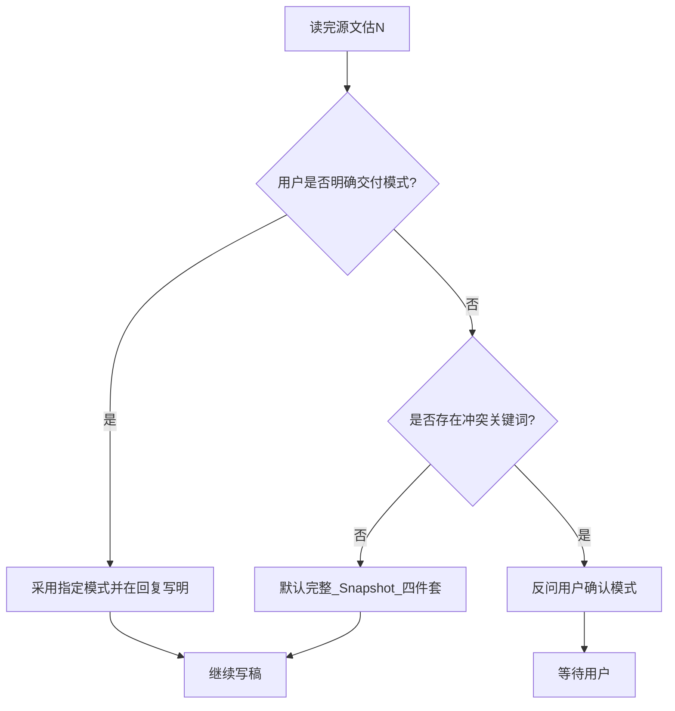

# 文档转播客（技术 MD → U 型搭档播客）

> Skill ID：`文档转播客`（原 `tech-doc-to-podcast`）。目录：`.cursor/md-skills/文档转播客/`

## 命名说明（必读）

| 用户说法 | 本 skill 实际产出 | 不做 |
| --- | --- | --- |
| 「转播客」「转播客」 | **双人听记对话稿**（可朗读）+ 可选 MP3/SRT/书面详细解答 | 纯静态技术博文、单人旁白 |
| 「只要文字」 | 轻量模式：仅 `播客朗读稿-*.md` | 轻量模式不跑 TTS |

## 生成前必读（Few-shot）

| 交付模式 | 必读模板 | 目录 |
| --- | --- | --- |
| **轻量**（用户已选仅朗读稿） | **MVP** | [`template/mvp/真实输出.md`](template/mvp/真实输出.md) |
| **完整** / **半量** | **Snapshot** | [`template/snapshot/`](template/snapshot/) |

**按 doc_type 选读（Snapshot 内）**：

| doc_type | 优先读 |
| --- | --- |
| 面经 / 技术方案 | [`真实输出-朗读稿摘录.md`](template/snapshot/真实输出-朗读稿摘录.md) |
| 教程 / 参考 | [`真实输出-教程朗读稿摘录.md`](template/snapshot/真实输出-教程朗读稿摘录.md) |

路由：[`assets/few-shot-example/SKILL.md`](assets/few-shot-example/SKILL.md)

## 目标

任意中文技术 Markdown → **主播 × 嘉宾** 对话稿，听记友好。

| 交付模式 | 产物 |
| --- | --- |
| **完整**（默认） | 朗读稿 + 详细解答 + MP3 + SRT |
| **半量** | 朗读稿 + 详细解答 |
| **轻量** | 仅朗读稿 |

**禁止**：单人旁白；口播四段标签（`定义/问题/解决/价值`）；写死某公司。

## 何时不用

纯静态技术播客（非对话体）→ 先确认是否改做听记稿；非 `.md` 且非 URL → 停止；非中文 → TTS 仅 zh-CN。

## 入参

`[技术文档.md]`、`[URL]`、`[输出目录]`、`交付模式`、`文档类型`（可自动判定）。

### 输入类型检测

| 输入 | 动作 |
|------|------|
| `.md` 文件路径 | 直接作为源文处理 |
| HTTP(S) URL | → 先触发「Obsidian-剪藏网页」skill 将网页保存到 Obsidian，再用生成的 `.md` 作为源文 |
| 其他 | 停止并提示仅支持 .md 或 URL |

### 输出目录（默认）

源文路径 `{dir}/{basename}.md` 时：

- `stem` = `basename` 去掉 `.md`
- **默认** `[输出目录]` = `{dir}/{stem}/`
- **禁止**在未指定时创建名为 `podcast` 的目录
- 用户显式给出 `[输出目录]` 时以用户为准

示例：源文 `…/在字节食堂打饭….md` → 产物写入 `…/在字节食堂打饭…/`（与源文 stem 同名子目录）。

**N/K / doc_type / 检查点 A**：以 [`../../_shared/references/技术文档-NK与doc_type契约.md`](../../_shared/references/技术文档-NK与doc_type契约.md) 为准（下文不重复长表）。**检查点 B 以本文件 §检查点 B 为准**；`_shared` 仅为摘要。

## 文档类型 → 场景钩子

见契约「doc_type 与场景钩子」表。

## U 型 + 时长弹性

- **N** → `knowledge_points`；**K** → `quick_qa_count`（公式见契约）
- 卷首：1–2 条结论 + **场景钩子**（泛称，不写死公司）
- 正文：铺垫 → 嘉宾解释 → 主播追问（苏格拉底）→ 块末金句
- 卷尾：**快问快答** K 题，与 N 对齐；不写死秒数，由 N/K 自然伸缩

## 费曼与口播（主流程内执行）

| 规则 | 要求 |
| --- | --- |
| 降维 | 嘉宾用类比/数字；主播用「等等，XXX 是不是…」拉回 |
| 禁忌 | 不用 `**定义**：` 等四段标签；长表/大段代码放详细解答 |
| 停顿 | 块末一行 `[停顿]`；快问之间也保留 |

## 边界条件

| 条件 | 动作 |
| --- | --- |
| N>7 | **检查点 A**（契约 + [`template/snapshot/任务输入-超长方案.md`](template/snapshot/任务输入-超长方案.md)） |
| 用户已选轻量 / 「只要稿」 | 读 MVP；跳过 TTS |
| N≤2 且用户未指定模式 | **不**自动降级；仍默认 **完整**（见检查点 B） |
| 源文 <500 字 | 篇幅可收紧；K=3，卷首 1 条结论即可；不因篇幅单独询问模式 |
| 无 edge-tts / TTS 失败 | **检查点 C**：交付稿+解答，见 [`references/tools.md`](references/tools.md) |
| 用户明确要静态博文 | 停止本 skill，勿强行生成对话体 |

## 交付模式判定（检查点 B）

读完源文并估 N 后判定模式；**不因 N 大小或篇幅单独询问用户**。

| 用户表述 | 模式 |
| --- | --- |
| 「只要朗读稿」「只要稿」「只要文字」 | **轻量**（MVP） |
| 「不要音频」「不要字幕」「不要 MP3」 | **半量** |
| 「要 MP3/字幕/详细解答」，或 **未提模式**（含 `$文档转播客` + 文档路径、`default_prompt`） | **完整**（Snapshot） |

- 用户已明确 `交付模式` 时：**不询问**，回复中写明所选模式。
- 仅当表述**互相矛盾**（如同时要 MP3 又只要稿）时反问确认。

## 产物命名

| 文件 | 模式 |
| --- | --- |
| `播客朗读稿-[主题].md` | 全部 |
| `详细解答-[主题].md` | 完整/半量 |
| `完整版-[主题]-搭档聊天.mp3` / `.srt` | 完整 |

## Tool 节点（主 agent 调用 · 非子 agent）

| Tool ID | 脚本 | 前置 | 禁止 |
| --- | --- | --- | --- |
| `validate_podcast_md` | [`scripts/validate-podcast-md.py`](scripts/validate-podcast-md.py) | 步骤 7 写稿完成 | 未通过不得 TTS |
| `podcast_md_to_mp3_srt` | [`scripts/md-podcast-to-mp3.py`](scripts/md-podcast-to-mp3.py) | validate 通过 + 完整模式 | 口述「已合成」代替跑脚本 |

命令与排障：[`references/tools.md`](references/tools.md)

## Darwin 评测（本仓库默认）

| eval_mode | 说明 |
| --- | --- |
| `main_agent_dual_track` | **默认**：主 agent 分轨 with_skill / baseline，产物 `test-run/` |
| `script_gated` | 仅 validate + 检查点 A 文件 |
| `subagent_blind` | 可选；Task 双 agent，非必需 |

不要求 Task 子 agent。详见 [`test-run/README.md`](test-run/README.md)。

## 执行步骤

0. **输入检测**：判断输入是 `.md` 路径还是 HTTP(S) URL。
   - 如果是 URL → 加载 `common-skills/探索skills/feature-skills/Obsidian-剪藏网页/SKILL.md` 执行剪藏 → 得到 `.md` 文件路径作为源文
   - 如果是 `.md` 路径 → 直接使用
1. 解析 `[技术文档.md]` → 计算默认 `[输出目录]` = `{dir}/{stem}/`（除非用户覆盖）；必要时创建目录。
2. Web 检索（2+ 来源）。
3. 读源文 → `doc_type`、N。
4. **检查点 B**：判定交付模式（默认 **完整**；仅含糊时询问；见上）。
5. **读 MVP 或 Snapshot**（对齐交付模式）。
6. N>7 → **检查点 A**（先输出合并/拆集二选一话术，**等用户确认**后再写稿；示例见 `任务输入-超长方案.md`）。
7. 在 `[输出目录]` 写 `播客朗读稿-[主题].md`（YAML 含 N、K、doc_type）。
8. **Tool** `validate_podcast_md`（必过，见 `references/tools.md`）。
9. 写 `详细解答-[主题].md`（完整/半量）。
10. **Tool** `podcast_md_to_mp3_srt`（仅完整模式，`--srt`；MP3/SRT 与朗读稿同目录）。
11. TTS 失败 → **检查点 C**（[`references/tools.md`](references/tools.md)）。
12. 反馈 **实际输出目录**、交付模式、N、K、预估时长。

## 资源索引

| 路径 | 用途 |
| --- | --- |
| [`template/mvp/`](template/mvp/) | 轻量 few-shot |
| [`template/snapshot/`](template/snapshot/) | 完整 few-shot |
| [`references/参考.md`](references/参考.md) | 分类型钩子 |
| [`references/tools.md`](references/tools.md) | 脚本 Tool 契约与排障 |
| [`test-run/`](test-run/) | Darwin 双轨评测产物 |
